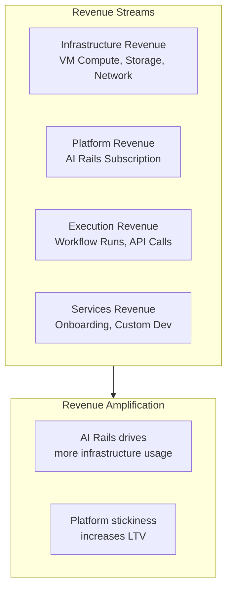
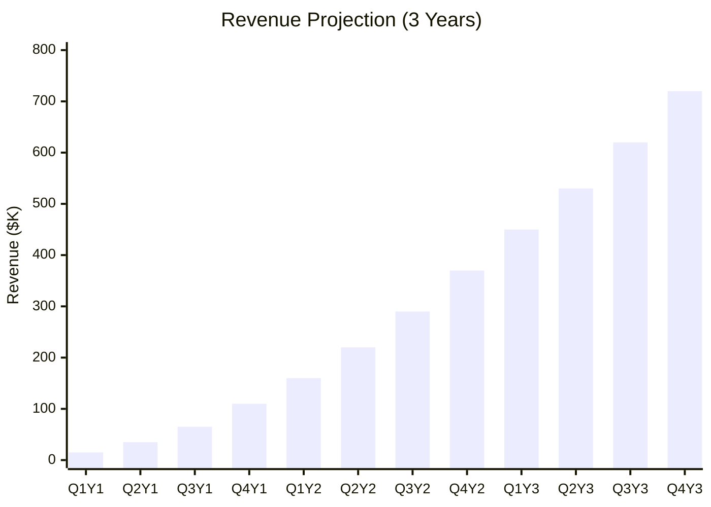
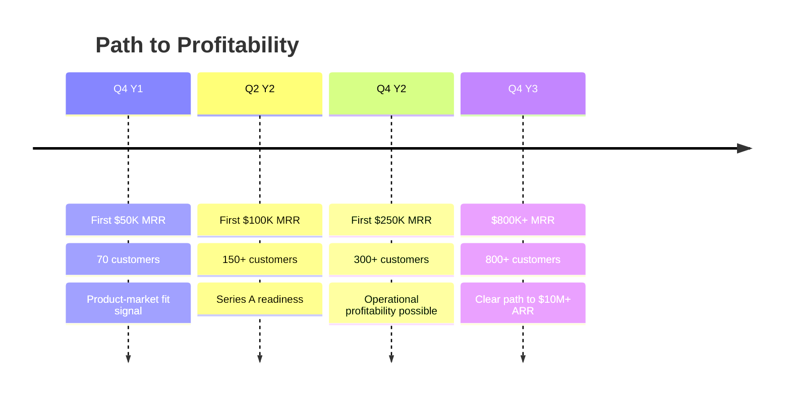

# Secret AI Rails — Financial Model

## Executive Summary

This document outlines the revenue model, unit economics, and financial projections for Secret AI Rails. The model demonstrates a capital-efficient path to profitability leveraging our existing confidential cloud infrastructure.

---

## Business Model Overview

### Revenue Streams

| Stream | Model | % of Revenue (Mature) |
|--------|-------|----------------------|
| **Infrastructure** | Usage-based (compute hours, storage GB) | 35-40% |
| **Platform** | Subscription tiers (monthly/annual) | 40-45% |
| **Execution** | Usage-based (workflow runs, API calls) | 15-20% |
| **Services** | One-time + retainer (optional) | 5-10% |

---

## Pricing Structure

### Platform Tiers

| Tier | Monthly Price | Annual Price | Target Customer |
|------|---------------|--------------|-----------------|
| **Starter** | $99 | $990 | Solo/micro-business testing AI |
| **Growth** | $499 | $4,990 | SMB automating operations |
| **Scale** | $1,499 | $14,990 | Growing SMB, regulated industries |
| **Enterprise** | Custom | Custom | Mid-market and enterprise |

### What's Included

| Feature | Starter | Growth | Scale | Enterprise |
|---------|---------|--------|-------|------------|
| **Workflow Studio** | Basic | Full | Full | Full + Custom |
| **Workflows** | 2 | 10 | Unlimited | Unlimited |
| **Workflow Runs/mo** | 1,000 | 10,000 | 100,000 | Unlimited |
| **Component Packs** | Core only | Core + 2 | All | All + Custom |
| **Dashboard** | Basic | Full | Full | Full + API |
| **Proof Retention** | 30 days | 90 days | 1 year | Custom |
| **Support** | Community | Email | Priority | Dedicated |
| **SLA** | — | 99.5% | 99.9% | 99.99% |

### Usage-Based Pricing (Beyond Tier Limits)

| Resource | Unit | Price |
|----------|------|-------|
| **Additional Workflow Runs** | per 1,000 | $10 |
| **Confidential VM Compute** | per hour | $0.15 - $0.50 |
| **GPU Compute (H100 CC)** | per hour | $3.50 - $5.00 |
| **Storage** | per GB/month | $0.10 |
| **Proof Ledger Storage** | per GB/month | $0.15 |
| **API Calls** | per 10,000 | $5 |

---

## Unit Economics

### Customer Acquisition

| Metric | Starter | Growth | Scale | Enterprise |
|--------|---------|--------|-------|------------|
| **CAC (Est.)** | $50 | $500 | $2,000 | $15,000 |
| **Sales Cycle** | Self-serve | 2 weeks | 4-6 weeks | 3-6 months |
| **Acquisition Channel** | Organic, content | Organic, sales | Sales, referral | Enterprise sales |

### Customer Lifetime Value

| Metric | Starter | Growth | Scale | Enterprise |
|--------|---------|--------|-------|------------|
| **Monthly Revenue** | $99 | $499 | $1,499 | $5,000+ |
| **Avg. Usage Revenue** | $20 | $150 | $500 | $2,000+ |
| **Total Monthly** | $119 | $649 | $1,999 | $7,000+ |
| **Gross Margin** | 70% | 75% | 78% | 80% |
| **Churn (Monthly)** | 8% | 4% | 2% | 1% |
| **Avg. Lifetime** | 12 mo | 25 mo | 50 mo | 100 mo |
| **LTV** | $1,000 | $12,175 | $78,000 | $560,000 |
| **LTV:CAC Ratio** | 20:1 | 24:1 | 39:1 | 37:1 |

### Payback Period

| Tier | CAC | Monthly GM | Payback Period |
|------|-----|-----------|----------------|
| **Starter** | $50 | $83 | <1 month |
| **Growth** | $500 | $487 | ~1 month |
| **Scale** | $2,000 | $1,559 | ~1.3 months |
| **Enterprise** | $15,000 | $5,600 | ~2.7 months |

---

## Cost Structure

### Infrastructure Costs (Per Customer)

| Component | Cost Driver | Est. Cost/Customer/Month |
|-----------|-------------|-------------------------|
| **Confidential VM** | Compute hours | $15 - $100 |
| **Storage** | Data + proofs | $5 - $25 |
| **Network** | Egress | $2 - $10 |
| **KMS Operations** | Key operations | $1 - $5 |
| **AI Inference** | LLM API calls | $10 - $100 |

**Key Advantage**: We own the infrastructure, so our marginal costs are significantly lower than competitors renting from hyperscalers.

### Operating Costs

| Category | Year 1 | Year 2 | Year 3 |
|----------|--------|--------|--------|
| **Engineering** | $600K | $1.2M | $2.0M |
| **Sales & Marketing** | $200K | $600K | $1.2M |
| **Customer Success** | $100K | $300K | $600K |
| **G&A** | $150K | $300K | $500K |
| **Infrastructure** | $200K | $400K | $800K |
| **Total OpEx** | $1.25M | $2.8M | $5.1M |

---

## Revenue Projections

### Assumptions

| Assumption | Value | Rationale |
|------------|-------|-----------|
| **Starting Customers** | 3 pilots | Current state |
| **Pilot Conversion** | 67% | Industry benchmark |
| **Monthly Growth (Y1)** | 15% | Conservative SMB SaaS |
| **Monthly Growth (Y2)** | 12% | Scaling with sales |
| **Monthly Growth (Y3)** | 8% | Market maturation |
| **Avg. Revenue/Customer** | $600 → $1,200 | Mix shift to higher tiers |
| **Churn (Blended)** | 5% → 3% | Improving with product-market fit |

### Three-Year Projection

### Detailed Projections

#### Year 1: Foundation

| Quarter | Customers | New | Churned | MRR | ARR |
|---------|-----------|-----|---------|-----|-----|
| **Q1** | 5 | 5 | 0 | $3K | $36K |
| **Q2** | 15 | 12 | 2 | $10K | $120K |
| **Q3** | 35 | 24 | 4 | $24K | $288K |
| **Q4** | 70 | 42 | 7 | $50K | $600K |

**Year 1 Total Revenue**: ~$260K
**Year 1 Ending ARR**: $600K

#### Year 2: Growth

| Quarter | Customers | New | Churned | MRR | ARR |
|---------|-----------|-----|---------|-----|-----|
| **Q1** | 110 | 50 | 10 | $85K | $1.0M |
| **Q2** | 165 | 70 | 15 | $135K | $1.6M |
| **Q3** | 235 | 90 | 20 | $200K | $2.4M |
| **Q4** | 320 | 110 | 25 | $290K | $3.5M |

**Year 2 Total Revenue**: ~$2.1M
**Year 2 Ending ARR**: $3.5M

#### Year 3: Scale

| Quarter | Customers | New | Churned | MRR | ARR |
|---------|-----------|-----|---------|-----|-----|
| **Q1** | 420 | 130 | 30 | $400K | $4.8M |
| **Q2** | 540 | 160 | 40 | $530K | $6.4M |
| **Q3** | 680 | 190 | 50 | $680K | $8.2M |
| **Q4** | 850 | 230 | 60 | $870K | $10.4M |

**Year 3 Total Revenue**: ~$7.4M
**Year 3 Ending ARR**: $10.4M

---

## Customer Mix Evolution

### By Tier

| Tier | Year 1 | Year 2 | Year 3 |
|------|--------|--------|--------|
| **Starter** | 50% | 35% | 25% |
| **Growth** | 40% | 45% | 45% |
| **Scale** | 10% | 18% | 25% |
| **Enterprise** | 0% | 2% | 5% |

### By Industry (Target)

| Industry | Year 1 | Year 2 | Year 3 |
|----------|--------|--------|--------|
| **Professional Services** | 40% | 30% | 25% |
| **E-Commerce/Retail** | 30% | 25% | 20% |
| **SaaS/Tech** | 20% | 25% | 25% |
| **Legal** | 5% | 10% | 15% |
| **Healthcare Admin** | 5% | 8% | 10% |
| **Financial Services** | 0% | 2% | 5% |

---

## Path to Profitability

### Key Milestones

### Burn & Runway

| Scenario | Monthly Burn | Runway Needed | Funding |
|----------|-------------|---------------|---------|
| **Conservative** | $100K | 24 months | $2.4M |
| **Base** | $150K | 18 months | $2.7M |
| **Aggressive** | $200K | 18 months | $3.6M |

### Break-Even Analysis

| Metric | Calculation | Target |
|--------|-------------|--------|
| **Monthly OpEx** | ~$150K (Year 2 avg) | — |
| **Gross Margin** | 75% | — |
| **Break-Even MRR** | $150K / 0.75 = $200K | Q3 Year 2 |
| **Customers Needed** | ~250-300 | — |

---

## Scenario Analysis

### Conservative Case

| Metric | Year 1 | Year 2 | Year 3 |
|--------|--------|--------|--------|
| **Ending ARR** | $400K | $2.0M | $6.0M |
| **Customers** | 50 | 200 | 500 |
| **Growth Rate** | — | 5x | 3x |

*Assumptions*: Slower sales cycle, higher churn, lower conversion

### Base Case

| Metric | Year 1 | Year 2 | Year 3 |
|--------|--------|--------|--------|
| **Ending ARR** | $600K | $3.5M | $10.4M |
| **Customers** | 70 | 320 | 850 |
| **Growth Rate** | — | 5.8x | 3x |

*Assumptions*: Model projections as stated

### Optimistic Case

| Metric | Year 1 | Year 2 | Year 3 |
|--------|--------|--------|--------|
| **Ending ARR** | $900K | $5.5M | $18M |
| **Customers** | 100 | 500 | 1,400 |
| **Growth Rate** | — | 6x | 3.3x |

*Assumptions*: Faster adoption, enterprise deals, lower churn

---

## Investment Efficiency

### Capital Efficiency Metrics

| Metric | Year 1 | Year 2 | Year 3 |
|--------|--------|--------|--------|
| **ARR per Employee** | $100K | $175K | $260K |
| **Burn Multiple** | 4.0x | 1.5x | 0.5x |
| **Magic Number** | 0.3 | 0.7 | 1.1 |
| **Net Revenue Retention** | 95% | 110% | 120% |

### Comparison to SaaS Benchmarks

| Metric | Our Model | Top Quartile SaaS | Median SaaS |
|--------|-----------|-------------------|-------------|
| **LTV:CAC** | 25-40x | >3x | 3x |
| **Gross Margin** | 75-80% | >75% | 70% |
| **Payback Period** | 1-3 mo | <12 mo | 18 mo |
| **Net Revenue Retention** | 110-120% | >120% | 100% |
| **Burn Multiple** | <1.5x | <1.5x | 2-3x |

---

## Funding Requirements

### Use of Funds

| Category | Amount | % | Purpose |
|----------|--------|---|---------|
| **Engineering** | $1.2M | 48% | V1 completion, team expansion |
| **Sales & Marketing** | $600K | 24% | Go-to-market, demand generation |
| **Infrastructure** | $400K | 16% | Capacity expansion, reliability |
| **Operations** | $300K | 12% | Support, legal, compliance |
| **Total** | $2.5M | 100% | 18-month runway |

### Milestone-Based Deployment

| Milestone | Funding Released | Target |
|-----------|------------------|--------|
| **M1**: V1 Launch | $800K | Month 4 |
| **M2**: 50 Customers | $600K | Month 8 |
| **M3**: $100K MRR | $600K | Month 12 |
| **M4**: Break-even Path | $500K | Month 18 |

---

## Key Metrics Dashboard

### Monthly Tracking

| Metric | Definition | Target (M12) |
|--------|------------|--------------|
| **MRR** | Monthly recurring revenue | $50K |
| **ARR** | Annual recurring revenue | $600K |
| **Customers** | Total paying customers | 70 |
| **ARPU** | Average revenue per user | $700 |
| **CAC** | Customer acquisition cost | <$500 |
| **LTV** | Lifetime value | >$12K |
| **Gross Margin** | Revenue - COGS | >75% |
| **Net Revenue Retention** | Expansion - Churn | >100% |
| **Burn Multiple** | Net Burn / Net New ARR | <2x |

### Cohort Analysis Template

| Cohort | M0 | M3 | M6 | M12 | M24 |
|--------|-----|-----|-----|------|------|
| **Jan Cohort** | 100% | 92% | 85% | 78% | 72% |
| **Revenue Retention** | 100% | 98% | 102% | 110% | 125% |

---

## Risks to Financial Model

| Risk | Impact | Probability | Mitigation |
|------|--------|-------------|------------|
| **Slower sales cycles** | Lower customer acquisition | Medium | Focus on self-serve SMB motion |
| **Higher churn** | Lower LTV | Medium | Invest in customer success |
| **Pricing pressure** | Lower ARPU | Low | Differentiate on trust/proof |
| **Infrastructure costs rise** | Lower margin | Low | We own the infrastructure |
| **Competition** | Slower growth | Medium | First-mover, vertical integration |

---

## Appendix: Financial Model Assumptions

### Revenue Assumptions

| Parameter | Value | Source |
|-----------|-------|--------|
| Starting customers | 3 | Current pilots |
| Pilot conversion rate | 67% | Conservative estimate |
| Monthly growth rate (Y1) | 15% | SMB SaaS benchmark |
| Monthly growth rate (Y2) | 12% | Scaling benchmark |
| Monthly growth rate (Y3) | 8% | Market maturation |
| Avg. starting ARPU | $600 | Tier mix estimate |
| ARPU growth rate | 10%/year | Upsell + tier migration |

### Cost Assumptions

| Parameter | Value | Source |
|-----------|-------|--------|
| Gross margin | 75% | Infrastructure ownership |
| Engineering cost/head | $150K | Market rate |
| Sales cost/head | $120K | Market rate |
| CAC (blended) | $400 | Channel mix estimate |
| Infrastructure cost/customer | $50/mo | Internal data |

### Churn Assumptions

| Parameter | Value | Source |
|-----------|-------|--------|
| Monthly churn (Y1) | 5% | Early-stage typical |
| Monthly churn (Y2) | 4% | Product maturity |
| Monthly churn (Y3) | 3% | Stickiness at scale |

---

*Document Version: 1.0*
*Last Updated: Jan 20, 2026*
*Model Basis: 3-Year Projection*
*Review Cycle: Quarterly*
