# React Development Tutorial

A comprehensive guide to React development using the JurisAI CRM frontend as a learning reference. This tutorial assumes no prior React or advanced JavaScript knowledge.

## Table of Contents

1. [Introduction to React](#1-introduction-to-react)
2. [JavaScript/TypeScript Fundamentals](#2-javascripttypescript-fundamentals)
3. [Project Structure](#3-project-structure)
4. [Components: The Building Blocks](#4-components-the-building-blocks)
5. [JSX: Writing HTML in JavaScript](#5-jsx-writing-html-in-javascript)
6. [Props: Passing Data to Components](#6-props-passing-data-to-components)
7. [State: Making Components Interactive](#7-state-making-components-interactive)
8. [Hooks: React's Superpowers](#8-hooks-reacts-superpowers)
9. [Context: Sharing Data Globally](#9-context-sharing-data-globally)
10. [Routing: Navigating Between Pages](#10-routing-navigating-between-pages)
11. [Styling with Tailwind CSS](#11-styling-with-tailwind-css)
12. [Working with External Libraries](#12-working-with-external-libraries)
13. [Best Practices and Patterns](#13-best-practices-and-patterns)

---

## 1. Introduction to React

### What is React?

React is a JavaScript library for building user interfaces. Created by Facebook (now Meta), React allows developers to build complex UIs from small, isolated pieces of code called "components."

### Why React?

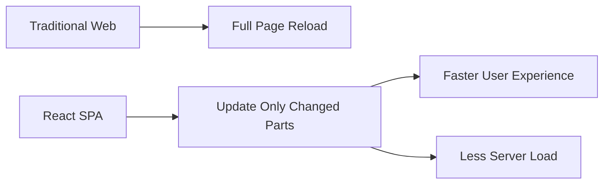

**Key Benefits:**

- **Component-Based**: Build encapsulated components that manage their own state
- **Declarative**: Describe what you want, React figures out how to do it
- **Virtual DOM**: Only updates what actually changed, making it fast
- **Large Ecosystem**: Thousands of libraries and tools available

### How Our JurisAI CRM Uses React

Our application is a Single Page Application (SPA) that provides a workflow studio for legal professionals. The entire frontend is built with React components.

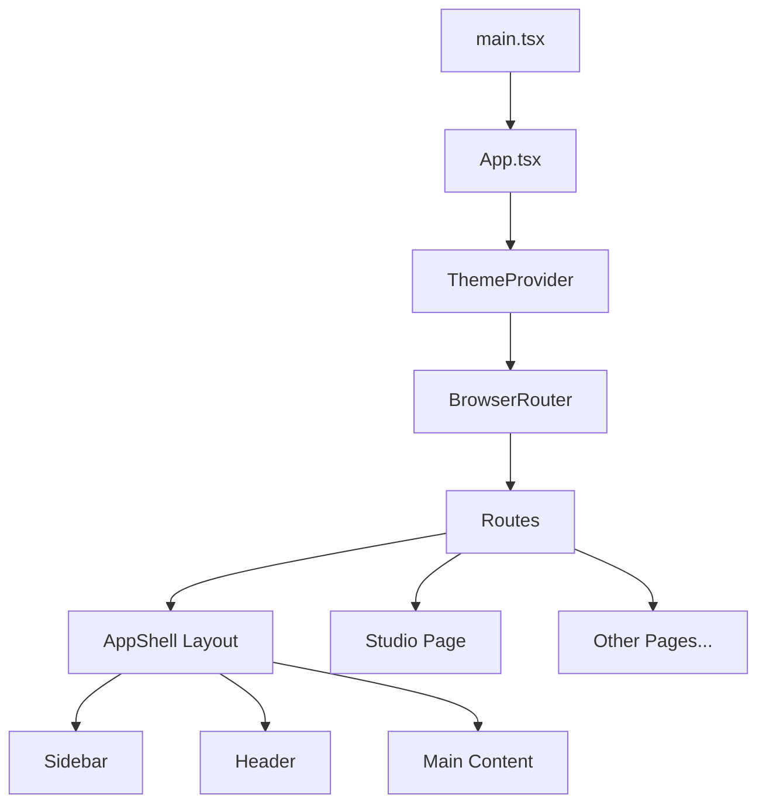

---

## 2. JavaScript/TypeScript Fundamentals

Before diving into React, let's cover essential JavaScript/TypeScript concepts used throughout our codebase.

### Variables and Constants

```typescript
// const - cannot be reassigned (preferred)
const appName = 'JurisAI CRM'

// let - can be reassigned
let currentPage = 'Dashboard'
currentPage = 'Studio' // OK

// const with objects - object itself can't be reassigned, but properties can change
const user = { name: 'John' }
user.name = 'Jane' // OK
// user = { name: 'Bob' } // ERROR - can't reassign const
```

### Arrow Functions

Arrow functions are a shorter syntax for writing functions:

```typescript
// Traditional function
function add(a, b) {
  return a + b
}

// Arrow function (equivalent)
const add = (a, b) => {
  return a + b
}

// Even shorter for single expressions
const add = (a, b) => a + b

// From our Sidebar.tsx - arrow function for navigation items
const navigation = [
  { name: 'Dashboard', href: '/', icon: LayoutDashboard },
  { name: 'Studio', href: '/studio', icon: Sparkles },
]
```

### Array Methods

React heavily uses array methods for rendering lists:

```typescript
// map - transform each item in an array
const numbers = [1, 2, 3]
const doubled = numbers.map(n => n * 2) // [2, 4, 6]

// filter - keep only items that match a condition
const workflows = mockWorkflows.filter(w => w.status === 'deployed')

// From Dashboard.tsx
const recentWorkflows = mockWorkflows.slice(0, 4)
const deployedCount = mockWorkflows.filter((w) => w.status === 'deployed').length
```

### Destructuring

Extracting values from objects and arrays:

```typescript
// Object destructuring
const workflow = { id: '1', name: 'Assessment', status: 'draft' }
const { id, name, status } = workflow
// Now id = '1', name = 'Assessment', status = 'draft'

// Array destructuring (common with React hooks)
const [count, setCount] = useState(0)
// count is the current value, setCount is a function to update it

// From Studio.tsx
const { id } = useParams() // Extract 'id' from URL parameters
```

### Spread Operator

Copying and merging objects/arrays:

```typescript
// Spread array
const arr1 = [1, 2]
const arr2 = [...arr1, 3, 4] // [1, 2, 3, 4]

// Spread object
const baseConfig = { theme: 'dark', language: 'en' }
const userConfig = { ...baseConfig, language: 'es' } // Override language

// From Studio.tsx - creating edge with spread
const edge: Edge = {
  ...connection,
  id: `e-${connection.source}-${connection.target}-${Date.now()}`,
  style: { stroke: edgeColor, strokeWidth: 2 },
}
```

### Template Literals

String interpolation with backticks:

```typescript
const name = 'JurisAI'
const greeting = `Welcome to ${name}!` // "Welcome to JurisAI!"

// From Dashboard.tsx
<Link to={`/studio/${workflow.id}`}>
```

### TypeScript Types

TypeScript adds type safety to JavaScript:

```typescript
// Basic types
const count: number = 5
const name: string = 'Workflow'
const isActive: boolean = true

// Arrays
const ids: string[] = ['1', '2', '3']

// Objects with interfaces
interface Workflow {
  id: string
  name: string
  status: 'draft' | 'deployed' | 'archived' // Union type - only these values allowed
  nodeCount: number
  deployedInstances?: number // Optional property (?)
}

// From workflows.ts
export type WorkflowStatus = 'draft' | 'deployed' | 'archived'

export interface Workflow {
  id: string
  name: string
  description: string
  status: WorkflowStatus
  version: string
  lastModified: string
  createdAt: string
  nodeCount: number
  deployedInstances?: number
}
```

---

## 3. Project Structure

Understanding how our project is organized:

```text
frontend/
├── src/
│   ├── main.tsx              # Application entry point
│   ├── App.tsx               # Root component with routing
│   ├── index.css             # Global styles and Tailwind
│   │
│   ├── app/
│   │   ├── layout/           # Shared layout components
│   │   │   ├── AppShell.tsx  # Main app wrapper
│   │   │   ├── Sidebar.tsx   # Navigation sidebar
│   │   │   └── Header.tsx    # Top header
│   │   │
│   │   ├── routes/           # Page components
│   │   │   ├── Dashboard.tsx
│   │   │   ├── Studio.tsx
│   │   │   └── ...
│   │   │
│   │   └── layouts/          # Alternative layout experiments
│   │
│   ├── components/
│   │   └── ui/               # Reusable UI components (shadcn/ui)
│   │       ├── button.tsx
│   │       ├── card.tsx
│   │       └── ...
│   │
│   ├── hooks/                # Custom React hooks
│   │   └── use-theme.tsx
│   │
│   ├── lib/                  # Utility functions
│   │   └── utils.ts
│   │
│   └── mock-data/            # Static data for prototyping
│       ├── workflows.ts
│       ├── components.ts
│       └── sample-workflow.ts
│
├── package.json              # Dependencies and scripts
├── vite.config.ts            # Build configuration
└── tailwind.config.ts        # Tailwind CSS configuration
```

### Entry Point: main.tsx

This is where React starts:

```tsx
// main.tsx
import { StrictMode } from 'react'
import { createRoot } from 'react-dom/client'
import './index.css'
import App from './App.tsx'

createRoot(document.getElementById('root')!).render(
  <StrictMode>
    <App />
  </StrictMode>,
)
```

**What's happening:**

1. `createRoot` connects React to the HTML element with id "root"
2. `render` tells React to display the `<App />` component
3. `StrictMode` enables additional checks during development

---

## 4. Components: The Building Blocks

Components are the heart of React. They're reusable pieces of UI.

### Anatomy of a Component

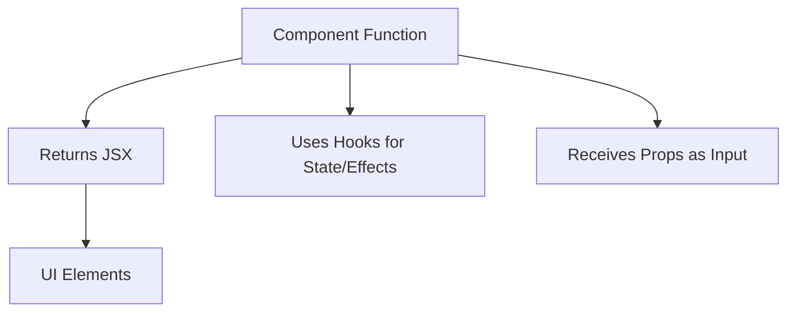

### Function Components

Modern React uses function components:

```tsx
// Simple component - no props, no state
function WelcomeMessage() {
  return <h1>Welcome to JurisAI CRM</h1>
}

// Component with props
function Greeting({ name }: { name: string }) {
  return <h1>Hello, {name}!</h1>
}

// Using the components
<WelcomeMessage />
<Greeting name="Legal Team" />
```

### Real Example: AppShell Component

From our codebase, `AppShell.tsx` is a layout component:

```tsx
// AppShell.tsx
import { Outlet } from 'react-router-dom'
import { Sidebar } from './Sidebar'
import { Header } from './Header'

export function AppShell() {
  return (
    <div className="flex h-screen overflow-hidden">
      <Sidebar />
      <div className="flex-1 flex flex-col overflow-hidden">
        <Header />
        <main className="flex-1 overflow-auto bg-muted/30 p-6">
          <Outlet />
        </main>
      </div>
    </div>
  )
}
```

**Component Structure:**

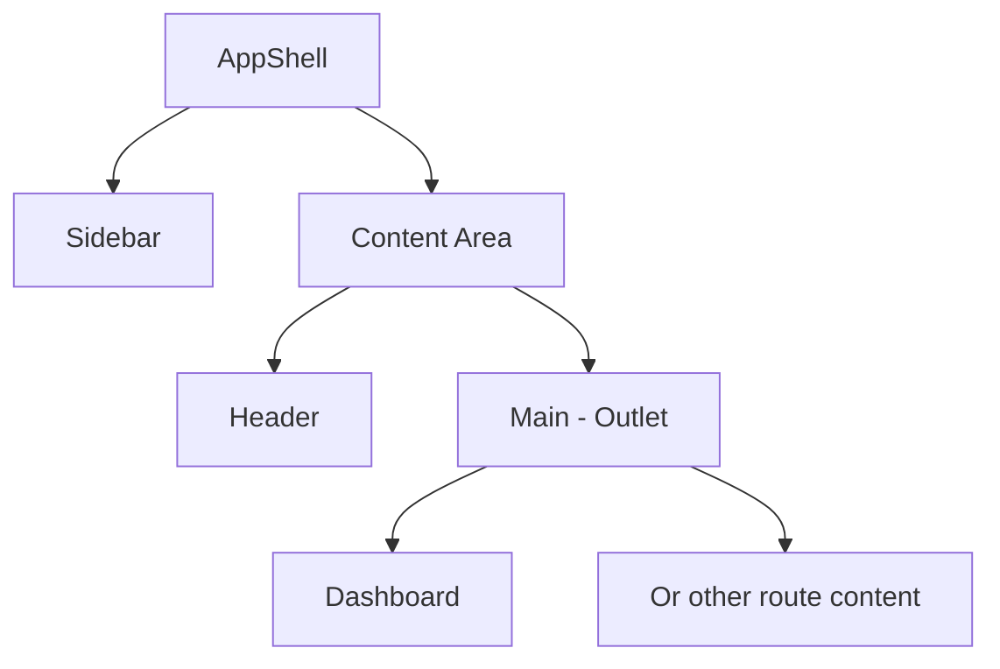

**Key points:**

- `export function AppShell()` - A function that returns JSX
- Components compose other components (`<Sidebar />`, `<Header />`)
- `<Outlet />` is a special component from React Router that renders child routes

---

## 5. JSX: Writing HTML in JavaScript

JSX is a syntax extension that looks like HTML but works inside JavaScript.

### Basic JSX Rules

```tsx
// 1. Must return a single root element
// ❌ Wrong
function Bad() {
  return (
    <h1>Title</h1>
    <p>Content</p>
  )
}

// ✅ Correct - wrap in a div or fragment
function Good() {
  return (
    <div>
      <h1>Title</h1>
      <p>Content</p>
    </div>
  )
}

// ✅ Also correct - use a Fragment (no extra DOM element)
function AlsoGood() {
  return (
    <>
      <h1>Title</h1>
      <p>Content</p>
    </>
  )
}
```

### JavaScript in JSX

Use curly braces `{}` to embed JavaScript:

```tsx
function WorkflowCard({ workflow }) {
  const isDeployed = workflow.status === 'deployed'

  return (
    <div>
      {/* Variable */}
      <h2>{workflow.name}</h2>

      {/* Expression */}
      <p>Nodes: {workflow.nodeCount * 2}</p>

      {/* Function call */}
      <p>Modified: {formatDate(workflow.lastModified)}</p>

      {/* Conditional rendering */}
      {isDeployed && <span>Live!</span>}

      {/* Ternary for if/else */}
      <span>{isDeployed ? 'Active' : 'Inactive'}</span>
    </div>
  )
}
```

### Real Example: Dashboard Stats Cards

From `Dashboard.tsx`:

```tsx
<Card>
  <CardHeader className="pb-2">
    <CardDescription>Total Workflows</CardDescription>
    <CardTitle className="text-3xl">{mockWorkflows.length}</CardTitle>
  </CardHeader>
  <CardContent>
    <div className="flex items-center gap-2 text-sm text-muted-foreground">
      <GitBranch className="h-4 w-4" />
      <span>Across all statuses</span>
    </div>
  </CardContent>
</Card>
```

### Rendering Lists

Use `.map()` to render arrays:

```tsx
// From Sidebar.tsx
const navigation = [
  { name: 'Dashboard', href: '/', icon: LayoutDashboard },
  { name: 'Studio', href: '/studio', icon: Sparkles },
  { name: 'Components', href: '/components', icon: Puzzle },
]

// In the component
<nav className="flex-1 p-2 space-y-1">
  {navigation.map((item) => (
    <NavLink
      key={item.name}  {/* Always provide a unique key! */}
      to={item.href}
      className="flex items-center gap-3 px-3 py-2"
    >
      <item.icon className="h-5 w-5" />
      <span>{item.name}</span>
    </NavLink>
  ))}
</nav>
```

**Important:** Always include a `key` prop when rendering lists. React uses this to efficiently update the DOM.

---

## 6. Props: Passing Data to Components

Props (properties) are how you pass data from parent to child components.

### Basic Props

```tsx
// Define the component with typed props
interface GreetingProps {
  name: string
  role?: string  // Optional prop
}

function Greeting({ name, role = 'User' }: GreetingProps) {
  return <p>Hello, {name}! You are a {role}.</p>
}

// Using the component
<Greeting name="Alice" />                    // Uses default role
<Greeting name="Bob" role="Admin" />         // Custom role
```

### Props Flow Diagram

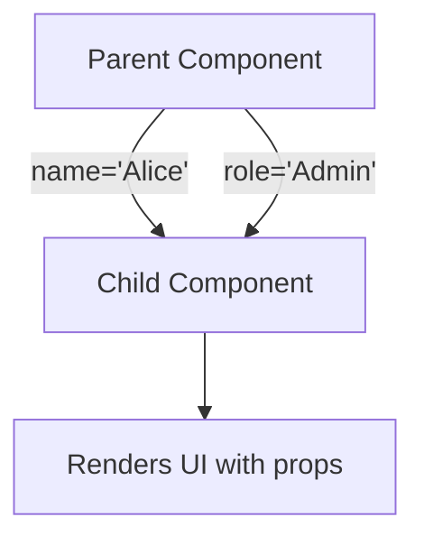

### Real Example: Sidebar with collapsed prop

From `Sidebar.tsx`:

```tsx
export function Sidebar() {
  const [collapsed, setCollapsed] = useState(false)

  return (
    <aside className={cn(
      'bg-sidebar flex flex-col border-r',
      collapsed ? 'w-16' : 'w-64'  // Width changes based on state
    )}>
      {/* ... */}

      {/* Passing collapsed state to ThemeSwitcher */}
      <ThemeSwitcher collapsed={collapsed} />

      {/* ... */}
    </aside>
  )
}
```

The `ThemeSwitcher` component receives `collapsed` as a prop and adjusts its display accordingly.

### Children Prop

A special prop for nested content:

```tsx
// Component that wraps children
function Card({ children, title }: { children: ReactNode; title: string }) {
  return (
    <div className="border rounded-lg p-4">
      <h2>{title}</h2>
      <div>{children}</div>  {/* Whatever is nested inside <Card> */}
    </div>
  )
}

// Using it
<Card title="My Workflow">
  <p>This content becomes `children`</p>
  <button>Click me</button>
</Card>
```

---

## 7. State: Making Components Interactive

State is data that changes over time and affects what the component displays.

### useState Hook

```tsx
import { useState } from 'react'

function Counter() {
  // Declare state: [currentValue, setterFunction] = useState(initialValue)
  const [count, setCount] = useState(0)

  return (
    <div>
      <p>Count: {count}</p>
      <button onClick={() => setCount(count + 1)}>
        Increment
      </button>
    </div>
  )
}
```

### State Update Flow

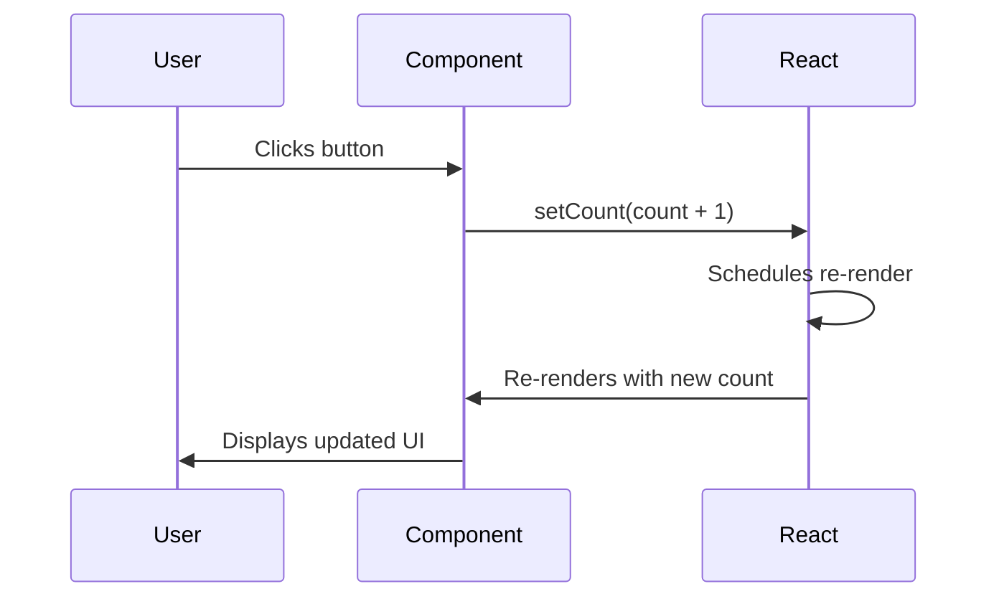

### Real Example: Collapsible Sidebar

From `Sidebar.tsx`:

```tsx
export function Sidebar() {
  // State to track if sidebar is collapsed
  const [collapsed, setCollapsed] = useState(false)

  return (
    <aside className={cn(
      'bg-sidebar flex flex-col border-r transition-all duration-300',
      collapsed ? 'w-16' : 'w-64'  // Conditional width
    )}>
      {/* ... navigation ... */}

      {/* Toggle button */}
      <button onClick={() => setCollapsed(!collapsed)}>
        {collapsed ? (
          <ChevronRight className="h-5 w-5" />
        ) : (
          <>
            <ChevronLeft className="h-5 w-5" />
            <span>Collapse</span>
          </>
        )}
      </button>
    </aside>
  )
}
```

### Multiple State Variables

```tsx
// From Studio.tsx - multiple state variables for different purposes
export function Studio() {
  // UI state
  const [showGrid, setShowGrid] = useState(true)
  const [leftCollapsed, setLeftCollapsed] = useState(false)
  const [rightCollapsed, setRightCollapsed] = useState(false)

  // Selection state
  const [selectedNode, setSelectedNode] = useState<Node | null>(null)
  const [selectedEdge, setSelectedEdge] = useState<Edge | null>(null)

  // Filter state
  const [searchQuery, setSearchQuery] = useState('')
  const [activeCategory, setActiveCategory] = useState<string | null>(null)

  // ... rest of component
}
```

### State with Objects

```tsx
// State can hold objects
const [user, setUser] = useState({ name: 'John', age: 30 })

// When updating, always create a new object (don't mutate!)
// ❌ Wrong - mutating state directly
user.name = 'Jane'

// ✅ Correct - create new object with spread
setUser({ ...user, name: 'Jane' })
```

---

## 8. Hooks: React's Superpowers

Hooks are special functions that let you "hook into" React features.

### useState (Review)

For managing state within a component.

```tsx
const [value, setValue] = useState(initialValue)
```

### useEffect: Side Effects

For code that should run after render (data fetching, subscriptions, DOM updates).

```tsx
import { useEffect } from 'react'

function Example() {
  const [data, setData] = useState(null)

  // Runs after every render
  useEffect(() => {
    console.log('Component rendered!')
  })

  // Runs only once (on mount) - empty dependency array
  useEffect(() => {
    fetchData().then(setData)
  }, [])

  // Runs when 'id' changes
  useEffect(() => {
    fetchItem(id).then(setItem)
  }, [id])

  // Cleanup function (runs before next effect or unmount)
  useEffect(() => {
    const subscription = subscribe()
    return () => subscription.unsubscribe()  // Cleanup
  }, [])
}
```

### Real Example: useEffect in Studio

From `Studio.tsx`:

```tsx
export function Studio() {
  const { id } = useParams()
  const workflowData = useMemo(() => getWorkflowData(id), [id])

  const [nodes, setNodes, onNodesChange] = useNodesState(workflowData.nodes)
  const [edges, setEdges, onEdgesChange] = useEdgesState(workflowData.edges)

  // Update nodes/edges when workflow ID changes
  useEffect(() => {
    setNodes(workflowData.nodes)
    setEdges(workflowData.edges)
    setSelectedNode(null)
    setSelectedEdge(null)
  }, [id, workflowData, setNodes, setEdges])

  // ... rest of component
}
```

### useEffect Dependency Array

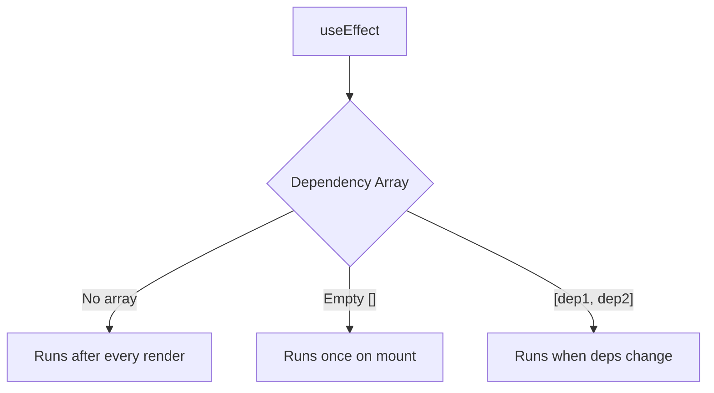

### useCallback: Memoizing Functions

Prevents function recreation on every render:

```tsx
import { useCallback } from 'react'

// From Studio.tsx
const onConnect = useCallback(
  (connection: Connection) => {
    let edgeColor = '#000000'
    let label = ''

    if (connection.sourceHandle === 'true') {
      edgeColor = '#22c55e'
      label = 'Yes'
    } else if (connection.sourceHandle === 'false') {
      edgeColor = '#ef4444'
      label = 'No'
    }

    // ... create edge
    setEdges((eds) => addEdge(edge, eds))
  },
  [setEdges]  // Only recreate if setEdges changes
)
```

### useMemo: Memoizing Values

Caches expensive calculations:

```tsx
import { useMemo } from 'react'

// From Studio.tsx
const workflowData = useMemo(() => getWorkflowData(id), [id])
// Only recalculates when 'id' changes
```

### useRef: Persistent Values Without Re-renders

```tsx
import { useRef } from 'react'

function Example() {
  // Reference to a DOM element
  const inputRef = useRef<HTMLInputElement>(null)

  // Reference to a value that persists across renders
  const renderCount = useRef(0)
  renderCount.current += 1  // Doesn't cause re-render

  const focusInput = () => {
    inputRef.current?.focus()
  }

  return <input ref={inputRef} />
}

// From Studio.tsx
const reactFlowWrapper = useRef<HTMLDivElement>(null)
```

### Custom Hooks

You can create your own hooks to share logic:

```tsx
// From use-theme.tsx
export function useTheme() {
  const context = useContext(ThemeContext)
  if (context === undefined) {
    throw new Error('useTheme must be used within a ThemeProvider')
  }
  return context
}

// Using it in any component
function MyComponent() {
  const { theme, setTheme } = useTheme()

  return (
    <button onClick={() => setTheme('cool-indigo')}>
      Current theme: {theme}
    </button>
  )
}
```

---

## 9. Context: Sharing Data Globally

Context provides a way to pass data through the component tree without manually passing props at every level.

### The Problem Context Solves

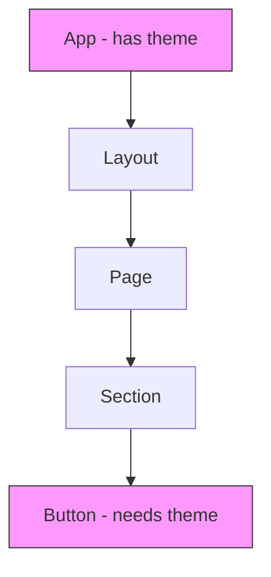

Without Context: You'd have to pass `theme` through Layout → Page → Section → Button.

With Context: Button can access `theme` directly.

### Creating and Using Context

From `use-theme.tsx`:

```tsx
import { createContext, useContext, useState, type ReactNode } from 'react'

// 1. Define the type for context value
type ThemeContextType = {
  theme: Theme
  setTheme: (theme: Theme) => void
}

// 2. Create the context with undefined default
const ThemeContext = createContext<ThemeContextType | undefined>(undefined)

// 3. Create a Provider component
export function ThemeProvider({ children }: { children: ReactNode }) {
  // State lives in the provider
  const [theme, setTheme] = useState<Theme>(() => {
    const saved = localStorage.getItem('jurisai-theme')
    return (saved as Theme) || 'slate-professional'
  })

  // Side effect to apply theme to DOM
  useEffect(() => {
    const root = document.documentElement
    root.removeAttribute('data-theme')
    if (theme !== 'slate-professional') {
      root.setAttribute('data-theme', theme)
    }
    localStorage.setItem('jurisai-theme', theme)
  }, [theme])

  // Provide value to all descendants
  return (
    <ThemeContext.Provider value={{ theme, setTheme }}>
      {children}
    </ThemeContext.Provider>
  )
}

// 4. Create a custom hook for easy access
export function useTheme() {
  const context = useContext(ThemeContext)
  if (context === undefined) {
    throw new Error('useTheme must be used within a ThemeProvider')
  }
  return context
}
```

### Using the Provider

From `App.tsx`:

```tsx
function App() {
  return (
    <ThemeProvider>  {/* Everything inside can use useTheme() */}
      <BrowserRouter>
        <Routes>
          {/* All routes have access to theme */}
        </Routes>
      </BrowserRouter>
    </ThemeProvider>
  )
}
```

### Context Flow Diagram

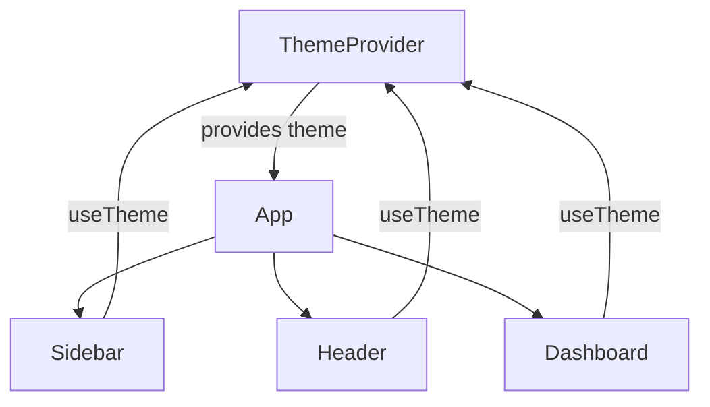

---

## 10. Routing: Navigating Between Pages

React Router enables navigation between different views in your single-page application.

### Basic Concepts

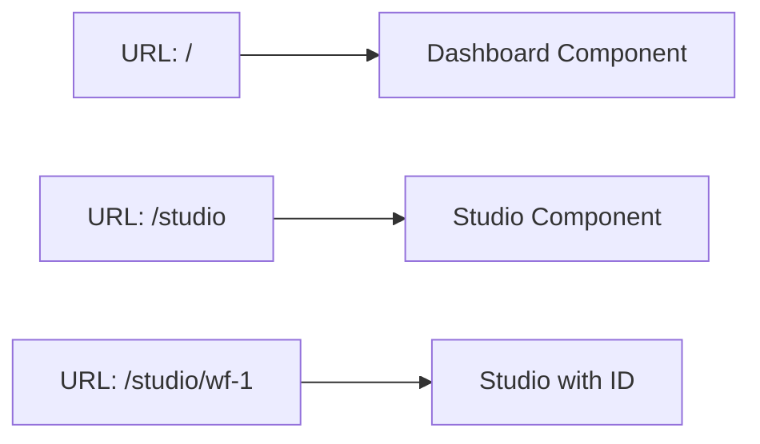

### Setting Up Routes

From `App.tsx`:

```tsx
import { BrowserRouter, Routes, Route } from 'react-router-dom'

function App() {
  return (
    <ThemeProvider>
      <BrowserRouter>
        <Routes>
          {/* Simple routes */}
          <Route path="/studio" element={<Studio />} />

          {/* Route with parameter */}
          <Route path="/studio/:id" element={<Studio />} />

          {/* Nested routes with layout */}
          <Route element={<AppShell />}>
            <Route path="/" element={<Dashboard />} />
            <Route path="/workflows" element={<Dashboard />} />
            <Route path="/components" element={<ComponentLibrary />} />
            <Route path="/settings" element={<WorkflowSettings />} />
            <Route path="/deploy" element={<DeployMonitor />} />
          </Route>
        </Routes>
      </BrowserRouter>
    </ThemeProvider>
  )
}
```

### Route Parameters

```tsx
// Route definition
<Route path="/studio/:id" element={<Studio />} />

// Accessing the parameter in the component
import { useParams } from 'react-router-dom'

function Studio() {
  const { id } = useParams()  // If URL is /studio/wf-1, id = "wf-1"

  const workflow = mockWorkflows.find((w) => w.id === id)
  // ...
}
```

### Navigation Links

```tsx
import { Link, NavLink } from 'react-router-dom'

// Simple link
<Link to="/studio">Open Studio</Link>

// Link with dynamic path
<Link to={`/studio/${workflow.id}`}>{workflow.name}</Link>

// NavLink - adds styling for active route
<NavLink
  to={item.href}
  className={({ isActive }) =>
    cn(
      'flex items-center gap-3 px-3 py-2 rounded-lg',
      isActive
        ? 'bg-sidebar-active text-sidebar'      // Active style
        : 'text-sidebar-muted'                   // Inactive style
    )
  }
>
  {item.name}
</NavLink>
```

### Nested Routes and Outlet

The `<Outlet />` component renders child routes:

```tsx
// AppShell.tsx - Layout with Outlet
export function AppShell() {
  return (
    <div className="flex h-screen">
      <Sidebar />
      <div className="flex-1 flex flex-col">
        <Header />
        <main className="flex-1 overflow-auto p-6">
          <Outlet />  {/* Child routes render here */}
        </main>
      </div>
    </div>
  )
}
```

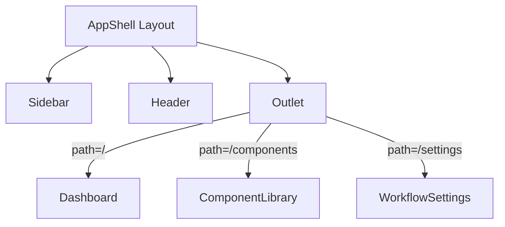

---

## 11. Styling with Tailwind CSS

Tailwind CSS is a utility-first CSS framework. Instead of writing CSS, you apply utility classes directly in your HTML/JSX.

### Basic Concept

```tsx
// Traditional CSS approach
<div className="card">Content</div>
// Requires separate .card { ... } definition

// Tailwind approach - styles right in the markup
<div className="bg-white rounded-lg shadow-md p-4">Content</div>
```

### Common Utilities

```tsx
// Layout
<div className="flex">            {/* display: flex */}
<div className="flex-1">          {/* flex: 1 */}
<div className="flex-col">        {/* flex-direction: column */}
<div className="items-center">    {/* align-items: center */}
<div className="justify-between"> {/* justify-content: space-between */}
<div className="gap-4">           {/* gap: 1rem */}

// Spacing (p = padding, m = margin)
<div className="p-4">             {/* padding: 1rem */}
<div className="px-4">            {/* padding-left/right: 1rem */}
<div className="py-2">            {/* padding-top/bottom: 0.5rem */}
<div className="mt-4">            {/* margin-top: 1rem */}
<div className="space-y-4">       {/* gap between children */}

// Sizing
<div className="w-64">            {/* width: 16rem */}
<div className="h-screen">        {/* height: 100vh */}
<div className="min-h-[200px]">   {/* min-height: 200px */}

// Colors (bg = background, text = text color)
<div className="bg-white">
<div className="bg-primary">      {/* Uses CSS variable */}
<div className="text-gray-600">
<div className="text-muted-foreground">

// Borders
<div className="border">          {/* border: 1px solid */}
<div className="border-2">        {/* border: 2px solid */}
<div className="rounded-lg">      {/* border-radius: 0.5rem */}
<div className="rounded-full">    {/* border-radius: 50% */}

// Typography
<p className="text-sm">           {/* font-size: 0.875rem */}
<p className="text-lg">           {/* font-size: 1.125rem */}
<p className="font-semibold">     {/* font-weight: 600 */}
<p className="truncate">          {/* text-overflow: ellipsis */}
```

### Real Example: Sidebar Styling

```tsx
<aside
  className={cn(
    'bg-sidebar flex flex-col border-r border-sidebar transition-all duration-300',
    collapsed ? 'w-16' : 'w-64'
  )}
>
```

Breaking it down:
- `bg-sidebar` - Background color from theme
- `flex flex-col` - Flexbox, vertical direction
- `border-r` - Right border
- `border-sidebar` - Border color from theme
- `transition-all duration-300` - Smooth transitions
- `w-16` or `w-64` - Width based on collapsed state

### Responsive Design

Tailwind uses breakpoint prefixes:

```tsx
<div className="
  grid
  grid-cols-1          {/* 1 column on mobile */}
  md:grid-cols-2       {/* 2 columns on medium screens */}
  lg:grid-cols-3       {/* 3 columns on large screens */}
  gap-4
">
```

### The cn() Utility

We use a helper function `cn()` (from `lib/utils.ts`) to conditionally combine classes:

```tsx
import { cn } from '@/lib/utils'

// Conditionally apply classes
<button
  className={cn(
    'px-4 py-2 rounded-lg',           // Always applied
    isActive && 'bg-primary',          // Applied if isActive is true
    disabled && 'opacity-50 cursor-not-allowed'
  )}
>
```

---

## 12. Working with External Libraries

Our project uses several important libraries.

### React Flow for Workflow Diagrams

```tsx
import {
  ReactFlow,
  Background,
  Controls,
  MiniMap,
  useNodesState,
  useEdgesState,
  type Node,
  type Edge,
} from '@xyflow/react'

function WorkflowEditor() {
  // Special hooks from React Flow for managing nodes/edges
  const [nodes, setNodes, onNodesChange] = useNodesState(initialNodes)
  const [edges, setEdges, onEdgesChange] = useEdgesState(initialEdges)

  return (
    <ReactFlow
      nodes={nodes}
      edges={edges}
      onNodesChange={onNodesChange}
      onEdgesChange={onEdgesChange}
      nodeTypes={nodeTypes}  // Custom node components
      fitView
    >
      <Background />      {/* Grid background */}
      <Controls />        {/* Zoom controls */}
      <MiniMap />         {/* Overview minimap */}
    </ReactFlow>
  )
}
```

### Custom Node Components

```tsx
// Define a custom node type
function WorkflowNode({ data, selected }: { data: WorkflowNodeData; selected: boolean }) {
  return (
    <div className={cn(
      'bg-background border-2 rounded-xl p-3',
      selected && 'ring-2 ring-primary'
    )}>
      {/* Input handle (left side) */}
      <Handle
        type="target"
        position={Position.Left}
        className="w-3 h-3 rounded-full"
      />

      {/* Node content */}
      <div className="flex items-center gap-2">
        <Icon className="w-4 h-4" />
        <span>{data.label}</span>
      </div>

      {/* Output handle (right side) */}
      <Handle
        type="source"
        position={Position.Right}
        className="w-3 h-3 rounded-full"
      />
    </div>
  )
}

// Register custom node types
const nodeTypes: NodeTypes = {
  workflowNode: WorkflowNode,
}
```

### Lucide Icons

```tsx
import {
  LayoutDashboard,
  Sparkles,
  ChevronLeft,
  Settings
} from 'lucide-react'

// Use as components
<LayoutDashboard className="h-5 w-5" />
<Sparkles className="h-4 w-4 text-primary" />
```

### shadcn/ui Components

Pre-built, accessible UI components:

```tsx
import { Button } from '@/components/ui/button'
import { Card, CardHeader, CardTitle, CardContent } from '@/components/ui/card'
import { Badge } from '@/components/ui/badge'

// Button variants
<Button>Default</Button>
<Button variant="outline">Outline</Button>
<Button variant="ghost">Ghost</Button>
<Button size="sm">Small</Button>
<Button size="icon"><Settings /></Button>

// Card composition
<Card>
  <CardHeader>
    <CardTitle>Title</CardTitle>
  </CardHeader>
  <CardContent>
    Content here
  </CardContent>
</Card>

// Badge
<Badge variant="secondary">Draft</Badge>
```

---

## 13. Best Practices and Patterns

### Component Organization

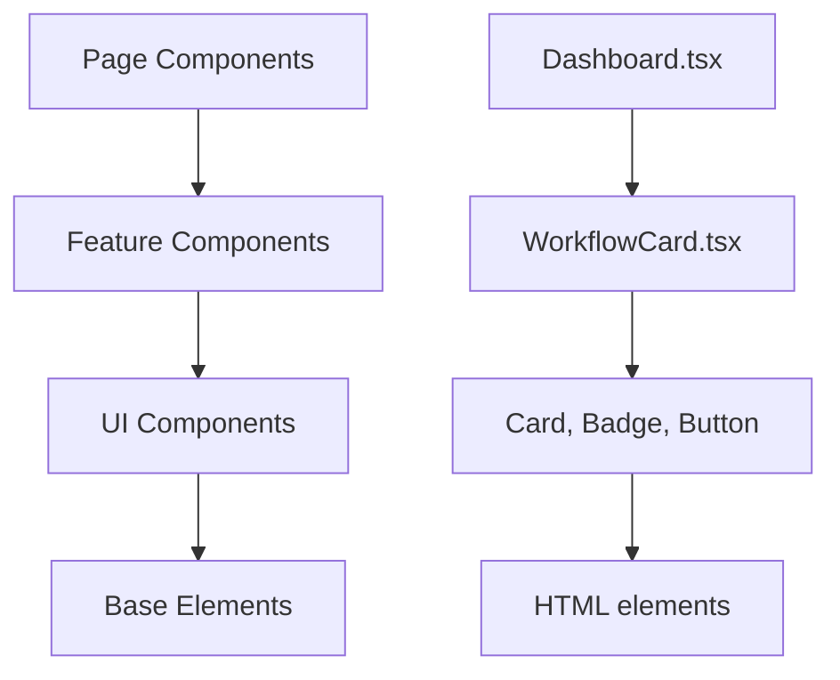

### File Naming Conventions

```text
ComponentName.tsx     # PascalCase for components
use-feature.tsx       # kebab-case with 'use-' prefix for hooks
utils.ts              # lowercase for utilities
sample-workflow.ts    # kebab-case for data files
```

### Single Responsibility Principle

Each component should do one thing well:

```tsx
// ❌ Too many responsibilities
function Dashboard() {
  // Fetching data
  // Filtering data
  // Sorting data
  // Rendering charts
  // Rendering tables
  // Handling all interactions
}

// ✅ Split into focused components
function Dashboard() {
  return (
    <>
      <StatsCards />
      <WorkflowList />
      <QuickActions />
    </>
  )
}
```

### Lifting State Up

When multiple components need the same state, lift it to their common ancestor:

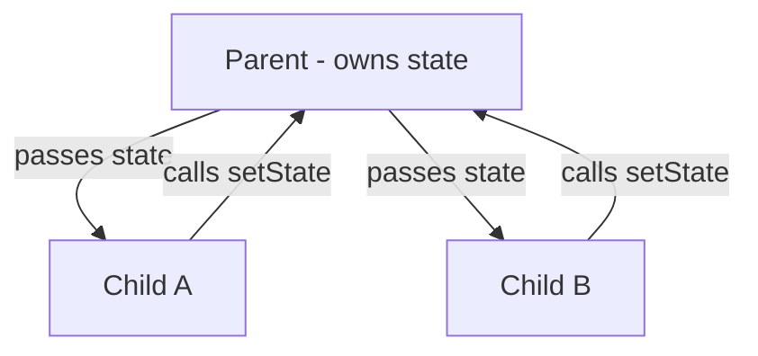

```tsx
function Parent() {
  const [selected, setSelected] = useState(null)

  return (
    <>
      <List items={items} onSelect={setSelected} />
      <Details item={selected} />
    </>
  )
}
```

### Avoid Prop Drilling

When passing props through many layers, consider using Context:

```tsx
// ❌ Prop drilling
<App theme={theme}>
  <Layout theme={theme}>
    <Page theme={theme}>
      <Component theme={theme} />
    </Page>
  </Layout>
</App>

// ✅ Use Context
<ThemeProvider>
  <App>
    <Layout>
      <Page>
        <Component />  {/* Uses useTheme() */}
      </Page>
    </Layout>
  </App>
</ThemeProvider>
```

### Memoization for Performance

```tsx
// Expensive calculation - memoize it
const filteredWorkflows = useMemo(
  () => workflows.filter(w => w.status === filter),
  [workflows, filter]  // Only recalculate when these change
)

// Callback passed to child components - memoize to prevent re-renders
const handleSelect = useCallback(
  (id: string) => setSelectedId(id),
  []  // No dependencies - function never changes
)
```

### Error Handling Pattern

```tsx
function DataComponent() {
  const [data, setData] = useState(null)
  const [error, setError] = useState(null)
  const [loading, setLoading] = useState(true)

  useEffect(() => {
    fetchData()
      .then(setData)
      .catch(setError)
      .finally(() => setLoading(false))
  }, [])

  if (loading) return <LoadingSpinner />
  if (error) return <ErrorMessage error={error} />
  if (!data) return <EmptyState />

  return <DataDisplay data={data} />
}
```

### Conditional Rendering Patterns

```tsx
// Boolean (AND)
{isLoggedIn && <UserMenu />}

// Ternary (if/else)
{isLoading ? <Spinner /> : <Content />}

// Multiple conditions - use early returns
function Status({ status }) {
  if (status === 'loading') return <Spinner />
  if (status === 'error') return <Error />
  return <Success />
}

// Complex conditions - extract to variable
const showAdvancedOptions = isAdmin && hasPermission && !isReadOnly
{showAdvancedOptions && <AdvancedOptions />}
```

---

## Summary

You've learned the core concepts of React development:

1. **Components** - Reusable UI building blocks
2. **JSX** - HTML-like syntax in JavaScript
3. **Props** - Passing data to components
4. **State** - Making components interactive
5. **Hooks** - useState, useEffect, useCallback, useMemo, useRef
6. **Context** - Sharing data globally
7. **Routing** - Navigation between pages
8. **Styling** - Using Tailwind CSS utilities
9. **Libraries** - React Flow, Lucide, shadcn/ui

### Next Steps

1. **Explore the codebase** - Read through the components in `/frontend/src`
2. **Make small changes** - Try modifying styles or adding features
3. **Read the React docs** - https://react.dev for deeper understanding
4. **Build something** - The best way to learn is by doing!

### Quick Reference

| Concept | When to Use |
|---------|-------------|
| `useState` | Component needs to track changing data |
| `useEffect` | Side effects (API calls, DOM updates, subscriptions) |
| `useCallback` | Function passed to child components or in dependency arrays |
| `useMemo` | Expensive calculations that shouldn't run every render |
| `useRef` | DOM references or values that persist without re-renders |
| `useContext` | Accessing global state from Context |
| `useParams` | Getting URL parameters in routes |

Happy coding!
