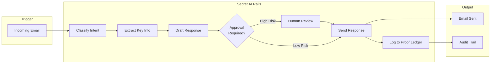
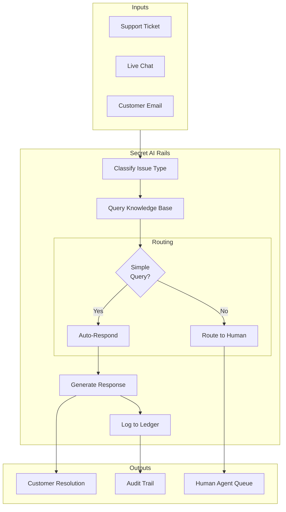
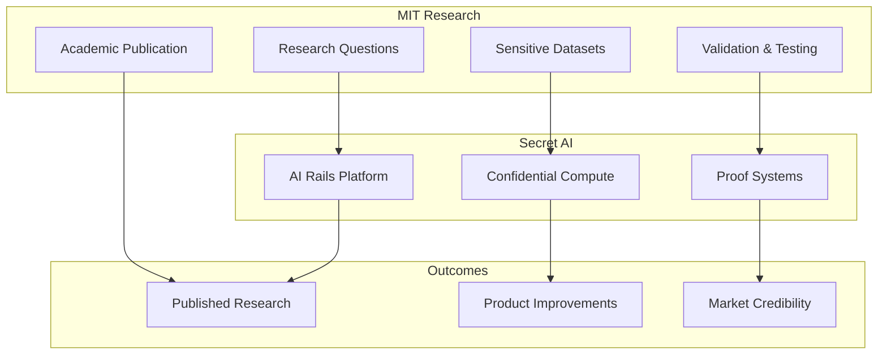

# Secret AI Rails — Pilot Case Studies

## Overview

This document profiles our pilot customers and design partners who are validating Secret AI Rails in production environments. These early adopters demonstrate market demand and provide critical feedback for product development.

---

## Pilot Program Summary

| Metric | Status |
|--------|--------|
| **Active Pilots** | 2-3 SMB customers |
| **Design Partners** | MIT (academic/research) |
| **Pilot Duration** | 3-6 months |
| **Focus Areas** | Business communications, document processing, customer operations |

---

## Case Study Template

> *Use this template for documenting each pilot engagement*

```
### [Company Name]

**Industry**:
**Company Size**:
**Location**:
**Pilot Start Date**:
**Champion/Contact**:

#### The Challenge
[What problem were they trying to solve?]

#### Why They Chose Secret AI Rails
[What attracted them to our platform?]

#### Solution Deployed
[Which workflows are they running?]

#### Implementation Timeline
[How long to get to production?]

#### Results (Expected/Actual)
| Metric | Before | After | Change |
|--------|--------|-------|--------|

#### Customer Quote
> "[Testimonial from customer champion]"
> — Name, Title

#### Key Learnings
[What did we learn from this pilot?]

#### Expansion Potential
[Where could they grow usage?]
```

---

## Pilot #1: [SMB — Professional Services]

### Company Profile

| Attribute | Details |
|-----------|---------|
| **Industry** | Professional Services / Consulting |
| **Company Size** | 25-50 employees |
| **Location** | United States |
| **Pilot Start Date** | [Month Year] |
| **Champion** | Head of Operations |

### The Challenge

This professional services firm was struggling with:

- **Email overload**: 200+ client emails daily requiring triage and response
- **Inconsistent response times**: Ranging from 2 hours to 2 days depending on staff availability
- **No audit trail**: Difficulty tracking what was communicated to which client
- **Compliance concerns**: Clients in regulated industries requiring proof of communications

**Manual process cost**: ~$8,000/month in staff time for email management alone

### Why They Chose Secret AI Rails

1. **Confidentiality**: Client data stays encrypted, even during AI processing
2. **Audit trail**: Every AI action is logged and provable
3. **Human gates**: Sensitive communications require approval before sending
4. **Existing relationship**: Already using our confidential VM infrastructure

### Solution Deployed



**Workflows Deployed**:
- Email classification and routing
- Automated response drafting
- Client inquiry triage
- Meeting scheduling coordination

### Implementation Timeline

| Phase | Duration | Activities |
|-------|----------|------------|
| **Discovery** | 1 week | Requirements gathering, workflow mapping |
| **Configuration** | 2 weeks | Workflow setup, policy configuration, integration |
| **Testing** | 1 week | Dry runs with synthetic data, edge case testing |
| **Pilot Launch** | Ongoing | Production deployment with monitoring |

**Total time to production**: 4 weeks

### Results

| Metric | Before | After (Projected) | Change |
|--------|--------|-------------------|--------|
| **Avg. Response Time** | 8 hours | 15 minutes | -94% |
| **Emails Handled/Day** | 200 | 200 | — |
| **Staff Hours on Email** | 6 hrs/day | 1 hr/day | -83% |
| **Monthly Cost** | $8,000 | $2,500 | -69% |
| **Response Consistency** | Variable | 95%+ | Standardized |
| **Audit Compliance** | Manual | Automatic | 100% coverage |

### Customer Quote

> *"We were drowning in client emails. Now AI handles the routine stuff instantly, and I only see the messages that actually need my attention. The audit trail alone is worth it — our regulated clients love that we can prove exactly what was communicated."*
>
> — **[Name]**, Head of Operations

### Key Learnings

1. **Policy tuning is critical**: Initial policies were too conservative; iterative refinement improved automation rate from 40% to 75%
2. **Proof ledger is a selling point**: Customer uses audit exports in client reporting
3. **Integration simplicity matters**: Gmail OAuth setup needed to be streamlined

### Expansion Potential

- Document intake and processing (contracts, proposals)
- Slack integration for internal coordination
- Client portal with self-service status checks
- Voice call transcription and follow-up

---

## Pilot #2: [SMB — E-Commerce / Retail]

### Company Profile

| Attribute | Details |
|-----------|---------|
| **Industry** | E-Commerce / Direct-to-Consumer Retail |
| **Company Size** | 15-30 employees |
| **Location** | United States |
| **Pilot Start Date** | [Month Year] |
| **Champion** | Customer Experience Manager |

### The Challenge

This growing e-commerce brand faced:

- **Customer support volume**: 150+ support tickets/day, scaling with growth
- **Repetitive inquiries**: 70% of tickets were order status, returns, basic product questions
- **Limited hours**: Support only available during business hours
- **No knowledge base integration**: Agents manually searching for product information

**Pain point**: Hiring more support staff wasn't sustainable; needed automation that customers could trust

### Why They Chose Secret AI Rails

1. **24/7 availability**: AI handles inquiries around the clock
2. **Knowledge-grounded responses**: Answers based on actual product data, not hallucinations
3. **Escalation gates**: Complex issues route to humans automatically
4. **Proof for disputes**: Complete record of every customer interaction

### Solution Deployed



**Workflows Deployed**:
- Product Q&A chatbot (knowledge-grounded)
- Order status automation
- Return/refund request processing (with approval gates)
- FAQ response automation

### Implementation Timeline

| Phase | Duration | Activities |
|-------|----------|------------|
| **Discovery** | 1 week | Ticket analysis, FAQ identification |
| **Knowledge Ingestion** | 1 week | Product catalog, policies, common answers |
| **Configuration** | 2 weeks | Workflow setup, response templates, policies |
| **Testing** | 1 week | A/B testing with subset of tickets |
| **Pilot Launch** | Ongoing | Full deployment with human oversight |

**Total time to production**: 5 weeks

### Results

| Metric | Before | After (Projected) | Change |
|--------|--------|-------------------|--------|
| **Tickets Handled/Day** | 150 | 150 | — |
| **Auto-Resolution Rate** | 0% | 65% | +65% |
| **Avg. First Response** | 4 hours | 2 minutes | -99% |
| **Support Hours/Day** | 8 hrs | 3 hrs | -63% |
| **CSAT Score** | 3.8/5 | 4.2/5 | +10% |
| **Cost per Ticket** | $4.50 | $1.80 | -60% |

### Customer Quote

> *"Our customers don't care if it's AI or human — they care about fast, accurate answers. Secret AI Rails gives us both, and I can prove to my boss exactly what's happening with every interaction."*
>
> — **[Name]**, Customer Experience Manager

### Key Learnings

1. **Knowledge base quality is everything**: Garbage in, garbage out — invested heavily in KB curation
2. **Escalation thresholds need tuning**: Started conservative, gradually increased automation
3. **Customers appreciate transparency**: "AI-assisted response" disclosure didn't hurt CSAT

### Expansion Potential

- Social media monitoring and response
- Proactive order issue detection
- Review response automation
- Voice support (STT-TTS)

---

## Pilot #3: [MIT — Academic/Research Partnership]

### Institution Profile

| Attribute | Details |
|-----------|---------|
| **Institution** | Massachusetts Institute of Technology |
| **Department** | [Relevant Department/Lab] |
| **Location** | Cambridge, MA |
| **Partnership Start** | [Month Year] |
| **Champion** | [Professor/Researcher Name] |

### The Opportunity

MIT represents a strategic design partner for several reasons:

1. **Research credibility**: Academic validation of confidential AI execution
2. **Cutting-edge use cases**: Research workflows with sensitive data requirements
3. **Talent pipeline**: Access to top AI/security talent
4. **Publication potential**: Joint research on trusted AI execution

### Partnership Focus Areas

| Area | Description |
|------|-------------|
| **Research Data Processing** | AI workflows on sensitive research data with confidentiality guarantees |
| **Administrative Automation** | Grant management, scheduling, correspondence |
| **Verification Research** | Academic study of proof-of-work systems for AI actions |
| **Security Analysis** | Formal verification of trust model |

### Potential Research Collaboration



### Value Exchange

| MIT Receives | Secret AI Receives |
|--------------|-------------------|
| Confidential AI infrastructure for research | Academic validation and credibility |
| Early access to platform features | Research insights and feedback |
| Potential research funding collaboration | Publication co-authorship |
| Student project opportunities | Talent pipeline |

### Expected Outcomes

1. **Joint publication** on confidential AI execution frameworks
2. **Case study** on research data processing with trust guarantees
3. **Security audit** findings and recommendations
4. **Reference customer** for enterprise sales conversations

### Quote

> *"The ability to run AI workflows on sensitive research data while maintaining confidentiality and producing verifiable audit trails opens new possibilities for responsible AI in research."*
>
> — **[Name]**, [Title], MIT

---

## Pilot Success Metrics (Aggregate)

### Across All Pilots

| Metric | Target | Current Status |
|--------|--------|----------------|
| **Pilots Active** | 3 | 2-3 |
| **Time to First Value** | <6 weeks | 4-5 weeks avg |
| **Workflow Automation Rate** | >50% | 60-75% |
| **Customer Satisfaction** | >4.0/5 | 4.1/5 avg |
| **Zero Security Incidents** | 0 | 0 |
| **Proof Ledger Accuracy** | 100% | 100% |

### Pilot-to-Paid Conversion

| Stage | Count | Conversion |
|-------|-------|------------|
| **Pilot Started** | 3 | — |
| **Pilot Completed** | — | TBD |
| **Converted to Paid** | — | Target: 67%+ |
| **Expanded Usage** | — | Target: 50%+ |

---

## Learnings & Product Implications

### What's Working

| Finding | Product Implication |
|---------|---------------------|
| Proof ledger is a major selling point | Emphasize audit capabilities in marketing |
| Policy tuning requires iteration | Build better policy templates and recommendations |
| Integration setup is friction point | Invest in OAuth flows and guided setup |
| Knowledge base quality drives success | Add KB quality scoring and recommendations |

### What Needs Improvement

| Finding | Action |
|---------|--------|
| Initial policy configuration is complex | Create industry-specific templates |
| Dashboard needs more real-time visibility | Prioritize live metrics in v1 |
| Escalation routing needs refinement | Add ML-based routing recommendations |

### Feature Requests from Pilots

| Request | Priority | Status |
|---------|----------|--------|
| Slack integration | High | In v1 scope |
| Document attachment processing | High | In v1 scope |
| Custom reporting/exports | Medium | Planned |
| Multi-language support | Medium | Backlog |
| Voice integration | Medium | In v1 scope (basic) |

---

## Testimonials Summary

> *"The audit trail alone is worth it — our regulated clients love that we can prove exactly what was communicated."*

> *"Our customers don't care if it's AI or human — they care about fast, accurate answers."*

> *"We were drowning in client emails. Now AI handles the routine stuff instantly."*

> *"The ability to run AI workflows on sensitive research data while maintaining confidentiality opens new possibilities."*

---

## Next Steps

### Pilot Expansion Plan

| Timeline | Action |
|----------|--------|
| **Current** | Complete v1 workflows with existing pilots |
| **Month 2-3** | Gather quantitative results and testimonials |
| **Month 3-4** | Publish case studies with permission |
| **Month 4-6** | Expand to 5-10 additional pilots |
| **Month 6+** | Convert pilots to paid customers |

### Target Pilot Profiles (Next Wave)

| Segment | Use Case | Why |
|---------|----------|-----|
| **Legal Services** | Document processing, client communications | High compliance need |
| **Healthcare Admin** | Patient communications, scheduling | HIPAA requirements |
| **Financial Services** | Client reporting, compliance workflows | Audit requirements |
| **SaaS Companies** | Customer support, onboarding | Scale challenges |

---

## Appendix: Pilot Agreement Template

### Key Terms

| Term | Standard |
|------|----------|
| **Duration** | 3-6 months |
| **Pricing** | Discounted or free during pilot |
| **Commitment** | Dedicated champion, weekly feedback |
| **Success Criteria** | Defined upfront, measured monthly |
| **Case Study Rights** | Permission to publish (anonymized if needed) |
| **Conversion Terms** | Preferred pricing for pilot-to-paid |

### Pilot Checklist

- [ ] Pilot agreement signed
- [ ] Success criteria defined
- [ ] Champion identified
- [ ] Technical requirements confirmed
- [ ] Integration access granted
- [ ] Kickoff meeting completed
- [ ] Weekly check-in scheduled
- [ ] Feedback channel established

---

*Document Version: 1.0*
*Last Updated: Jan 20, 2026*
*Status: Active Pilots in Progress*
