# React Advanced - Deep Dive into Advanced Patterns

This advanced guide builds on the concepts from [React-BASIC.md](./React-BASIC.md) and [React.md](./React.md). Here you'll learn the sophisticated patterns and techniques used in production-grade React applications like JurisAI.

## Table of Contents

1. [Context API - Global State](#context-api---global-state)
2. [Custom Hooks - Reusable Logic](#custom-hooks---reusable-logic)
3. [useCallback - Optimizing Callbacks](#usecallback---optimizing-callbacks)
4. [useMemo - Expensive Computations](#usememo---expensive-computations)
5. [useRef - DOM Access and Mutable Values](#useref---dom-access-and-mutable-values)
6. [React Flow Integration](#react-flow-integration)
7. [Advanced Component Patterns](#advanced-component-patterns)
8. [Performance Optimization](#performance-optimization)
9. [Error Boundaries](#error-boundaries)
10. [State Management Architecture](#state-management-architecture)
11. [Context Performance Tips](#context-performance-tips)
12. [Memoization Pitfalls](#memoization-pitfalls)
13. [Responsive React Flow UIs](#responsive-react-flow-uis)
14. [Suspense and Loading Boundaries](#suspense-and-loading-boundaries)
15. [Testing and Debugging](#testing-and-debugging)

---

## Context API - Global State

The **Context API** solves the "prop drilling" problem - passing props through many levels of components that don't need them.

### The Problem: Prop Drilling

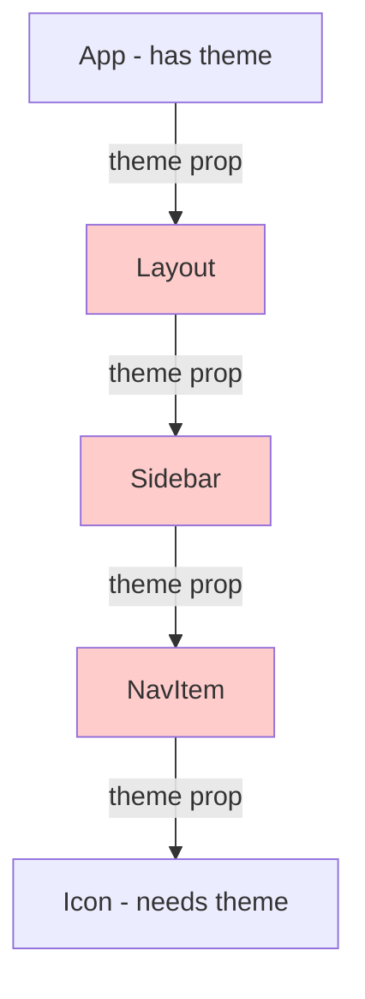

Layout, Sidebar, and NavItem don't need `theme` - they just pass it through!

### The Solution: Context

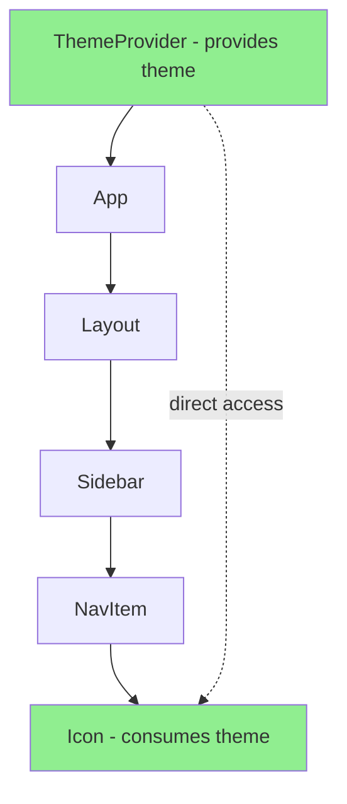

### Creating and Using Context

**Step 1: Create the Context**

```tsx
import { createContext, useContext, useState } from 'react';

// Create a context with a default value
const ThemeContext = createContext({
  theme: 'light',
  setTheme: () => {},
});
```

**Step 2: Create a Provider Component**

```tsx
function ThemeProvider({ children }) {
  const [theme, setTheme] = useState('light');

  // The value object contains everything we want to share
  const value = {
    theme,
    setTheme,
  };

  return (
    <ThemeContext.Provider value={value}>
      {children}
    </ThemeContext.Provider>
  );
}
```

**Step 3: Create a Custom Hook for Easy Access**

```tsx
function useTheme() {
  const context = useContext(ThemeContext);
  if (!context) {
    throw new Error('useTheme must be used within a ThemeProvider');
  }
  return context;
}
```

**Step 4: Wrap Your App**

```tsx
function App() {
  return (
    <ThemeProvider>
      <AppShell />
    </ThemeProvider>
  );
}
```

**Step 5: Use Anywhere in the Tree**

```tsx
function DeepNestedComponent() {
  const { theme, setTheme } = useTheme();

  return (
    <button onClick={() => setTheme(theme === 'light' ? 'dark' : 'light')}>
      Current theme: {theme}
    </button>
  );
}
```

### Real Example: JurisAI Theme System

From `frontend/src/hooks/use-theme.tsx`:

```tsx
import { createContext, useContext, useState, useEffect, ReactNode } from 'react';

// Available themes in JurisAI
const themes = [
  'slate-professional',
  'warm-neutral',
  'cool-indigo',
  'forest-green',
  'minimal-gray',
  'ocean-blue',
  'rose-pink',
] as const;

type Theme = typeof themes[number];

type ThemeContextType = {
  theme: Theme;
  setTheme: (theme: Theme) => void;
  themes: readonly string[];
};

const ThemeContext = createContext<ThemeContextType | undefined>(undefined);

export function ThemeProvider({ children }: { children: ReactNode }) {
  // Initialize from localStorage, fallback to default
  const [theme, setTheme] = useState<Theme>(() => {
    const saved = localStorage.getItem('jurisai-theme');
    return (saved as Theme) || 'slate-professional';
  });

  // Sync theme changes to DOM and localStorage
  useEffect(() => {
    document.documentElement.setAttribute('data-theme', theme);
    localStorage.setItem('jurisai-theme', theme);
  }, [theme]);

  return (
    <ThemeContext.Provider value={{ theme, setTheme, themes }}>
      {children}
    </ThemeContext.Provider>
  );
}

export function useTheme() {
  const context = useContext(ThemeContext);
  if (!context) {
    throw new Error('useTheme must be used within a ThemeProvider');
  }
  return context;
}
```

**Usage in ThemeSwitcher component:**

```tsx
function ThemeSwitcher() {
  const { theme, setTheme, themes } = useTheme();

  return (
    <Select value={theme} onValueChange={setTheme}>
      <SelectTrigger>
        <SelectValue placeholder="Select theme" />
      </SelectTrigger>
      <SelectContent>
        {themes.map(t => (
          <SelectItem key={t} value={t}>
            {t.replace('-', ' ')}
          </SelectItem>
        ))}
      </SelectContent>
    </Select>
  );
}
```

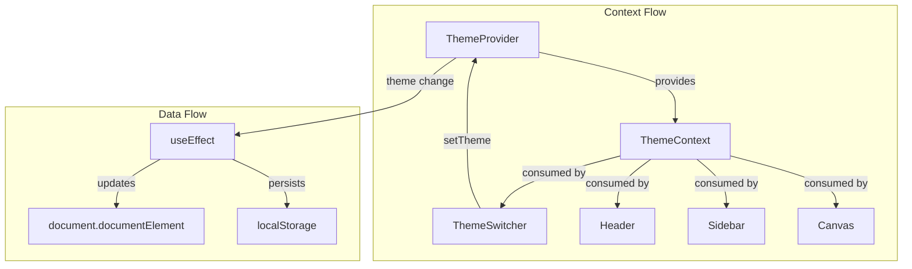

### When to Use Context

| Use Context For | Don't Use Context For |
|-----------------|----------------------|
| Theme/appearance settings | Frequently changing data (causes re-renders) |
| User authentication state | Local component state |
| Locale/language settings | Data that only one component needs |
| Feature flags | Complex state with many actions (use Redux/Zustand) |

### Context Performance Tips

Context updates re-render all consumers. To keep things fast:
- Split large contexts into smaller ones (theme vs auth vs UI).
- Avoid putting rapidly changing values in context (like input typing).
- Memoize provider values if you create objects/functions inside.

```tsx
const value = useMemo(() => ({ theme, setTheme }), [theme]);
```

---

## Custom Hooks - Reusable Logic

**Custom hooks** let you extract and reuse stateful logic across components.

### Rules of Hooks

1. Only call hooks at the **top level** (not in loops, conditions, or nested functions)
2. Only call hooks from **React functions** (components or other hooks)
3. Custom hook names must start with **`use`**

### Basic Custom Hook

```tsx
// A custom hook for managing a toggle
function useToggle(initialValue = false) {
  const [value, setValue] = useState(initialValue);

  const toggle = () => setValue(v => !v);
  const setTrue = () => setValue(true);
  const setFalse = () => setValue(false);

  return { value, toggle, setTrue, setFalse };
}

// Usage
function Sidebar() {
  const { value: isCollapsed, toggle } = useToggle(false);

  return (
    <aside className={isCollapsed ? 'collapsed' : 'expanded'}>
      <button onClick={toggle}>Toggle</button>
    </aside>
  );
}
```

### Custom Hook for Local Storage

```tsx
function useLocalStorage<T>(key: string, initialValue: T) {
  // Initialize state from localStorage
  const [storedValue, setStoredValue] = useState<T>(() => {
    try {
      const item = localStorage.getItem(key);
      return item ? JSON.parse(item) : initialValue;
    } catch {
      return initialValue;
    }
  });

  // Sync to localStorage when value changes
  const setValue = (value: T | ((prev: T) => T)) => {
    const valueToStore = value instanceof Function ? value(storedValue) : value;
    setStoredValue(valueToStore);
    localStorage.setItem(key, JSON.stringify(valueToStore));
  };

  return [storedValue, setValue] as const;
}

// Usage
function Settings() {
  const [notifications, setNotifications] = useLocalStorage('notifications', true);

  return (
    <label>
      <input
        type="checkbox"
        checked={notifications}
        onChange={(e) => setNotifications(e.target.checked)}
      />
      Enable notifications
    </label>
  );
}
```

### Custom Hook for Debounced Search

```tsx
function useDebounce<T>(value: T, delay: number): T {
  const [debouncedValue, setDebouncedValue] = useState(value);

  useEffect(() => {
    const timer = setTimeout(() => {
      setDebouncedValue(value);
    }, delay);

    return () => clearTimeout(timer);
  }, [value, delay]);

  return debouncedValue;
}

// Usage - search only fires 300ms after user stops typing
function SearchBox() {
  const [query, setQuery] = useState('');
  const debouncedQuery = useDebounce(query, 300);

  useEffect(() => {
    if (debouncedQuery) {
      searchAPI(debouncedQuery);
    }
  }, [debouncedQuery]);

  return (
    <input
      value={query}
      onChange={(e) => setQuery(e.target.value)}
      placeholder="Search..."
    />
  );
}
```

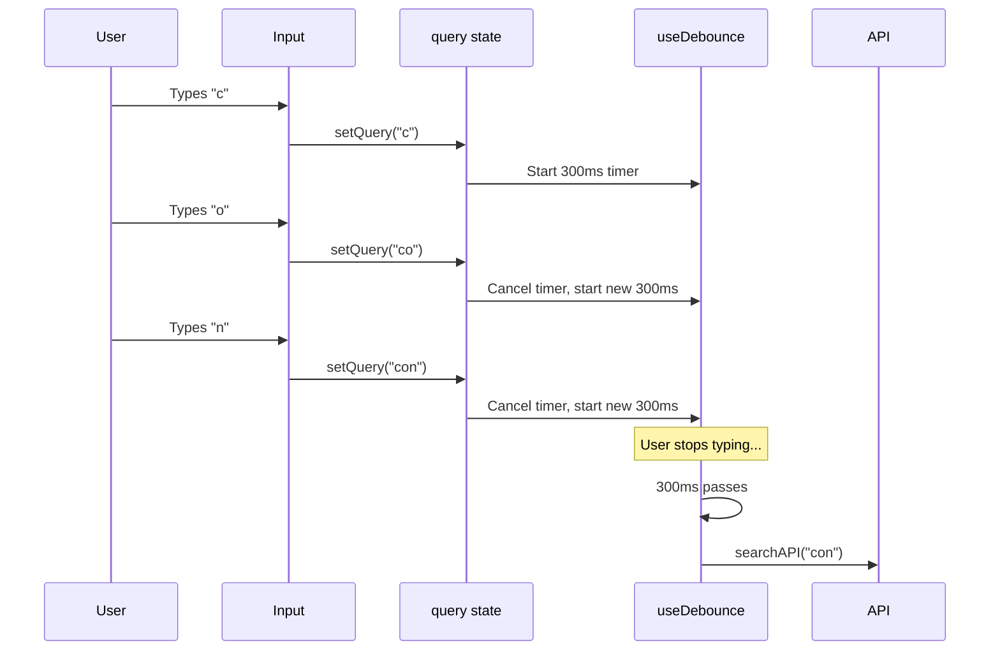

### Real Example: Window Size Hook

```tsx
function useWindowSize() {
  const [size, setSize] = useState({
    width: window.innerWidth,
    height: window.innerHeight,
  });

  useEffect(() => {
    const handleResize = () => {
      setSize({
        width: window.innerWidth,
        height: window.innerHeight,
      });
    };

    window.addEventListener('resize', handleResize);
    return () => window.removeEventListener('resize', handleResize);
  }, []);

  return size;
}

// Usage
function ResponsiveLayout() {
  const { width } = useWindowSize();

  if (width < 768) {
    return <MobileLayout />;
  }
  return <DesktopLayout />;
}
```

---

## useCallback - Optimizing Callbacks

`useCallback` returns a **memoized callback** that only changes when its dependencies change. This prevents unnecessary re-renders of child components.

### The Problem

```tsx
function Parent() {
  const [count, setCount] = useState(0);

  // This function is recreated on EVERY render
  const handleClick = () => {
    console.log('clicked');
  };

  return (
    <div>
      <p>Count: {count}</p>
      <button onClick={() => setCount(c => c + 1)}>Increment</button>
      {/* ExpensiveChild re-renders every time Parent renders */}
      {/* because handleClick is a new function reference */}
      <ExpensiveChild onClick={handleClick} />
    </div>
  );
}
```

### The Solution: useCallback

```tsx
function Parent() {
  const [count, setCount] = useState(0);

  // This function is only created once (empty dependency array)
  const handleClick = useCallback(() => {
    console.log('clicked');
  }, []);

  return (
    <div>
      <p>Count: {count}</p>
      <button onClick={() => setCount(c => c + 1)}>Increment</button>
      {/* ExpensiveChild won't re-render when count changes */}
      <ExpensiveChild onClick={handleClick} />
    </div>
  );
}
```

### Real Example: Node Event Handlers in Studio

From JurisAI's `Studio.tsx`:

```tsx
function Studio() {
  const [nodes, setNodes, onNodesChange] = useNodesState(initialNodes);
  const [edges, setEdges, onEdgesChange] = useEdgesState(initialEdges);
  const [selectedNode, setSelectedNode] = useState(null);

  // Memoized to prevent React Flow from re-rendering unnecessarily
  const onNodeClick = useCallback((event, node) => {
    setSelectedNode(node);
    setSelectedEdge(null);
  }, []);

  const onEdgeClick = useCallback((event, edge) => {
    setSelectedEdge(edge);
    setSelectedNode(null);
  }, []);

  const onPaneClick = useCallback(() => {
    setSelectedNode(null);
    setSelectedEdge(null);
  }, []);

  // This callback depends on edges state
  const onConnect = useCallback((params) => {
    const newEdge = {
      ...params,
      id: `edge-${Date.now()}`,
      type: 'smoothstep',
      style: { stroke: '#3b82f6' },
    };
    setEdges(eds => addEdge(newEdge, eds));
  }, [setEdges]);

  return (
    <ReactFlow
      nodes={nodes}
      edges={edges}
      onNodesChange={onNodesChange}
      onEdgesChange={onEdgesChange}
      onNodeClick={onNodeClick}
      onEdgeClick={onEdgeClick}
      onPaneClick={onPaneClick}
      onConnect={onConnect}
    />
  );
}
```

### useCallback with Dependencies

```tsx
function SearchableList({ items }) {
  const [query, setQuery] = useState('');

  // Re-created only when items changes
  const filterItems = useCallback((searchQuery) => {
    return items.filter(item =>
      item.name.toLowerCase().includes(searchQuery.toLowerCase())
    );
  }, [items]);

  const filteredItems = filterItems(query);

  return (
    <div>
      <input value={query} onChange={(e) => setQuery(e.target.value)} />
      <ul>
        {filteredItems.map(item => <li key={item.id}>{item.name}</li>)}
      </ul>
    </div>
  );
}
```

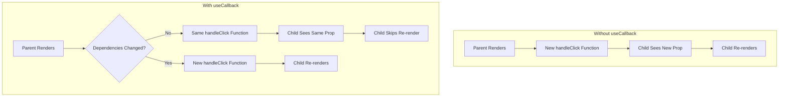

---

## useMemo - Expensive Computations

`useMemo` memoizes the **result** of an expensive computation, recalculating only when dependencies change.

### The Problem

```tsx
function ComponentList({ components, searchQuery, activeCategory }) {
  // This runs on EVERY render, even if inputs haven't changed
  const filteredComponents = components.filter(comp => {
    const matchesSearch = comp.name.toLowerCase().includes(searchQuery.toLowerCase());
    const matchesCategory = activeCategory === 'all' || comp.category === activeCategory;
    return matchesSearch && matchesCategory;
  });

  return <ul>{filteredComponents.map(...)}</ul>;
}
```

### The Solution: useMemo

```tsx
function ComponentList({ components, searchQuery, activeCategory }) {
  // Only recalculates when dependencies change
  const filteredComponents = useMemo(() => {
    return components.filter(comp => {
      const matchesSearch = comp.name.toLowerCase().includes(searchQuery.toLowerCase());
      const matchesCategory = activeCategory === 'all' || comp.category === activeCategory;
      return matchesSearch && matchesCategory;
    });
  }, [components, searchQuery, activeCategory]);

  return <ul>{filteredComponents.map(...)}</ul>;
}
```

### Real Example: Component Filtering in Studio

From JurisAI's `Studio.tsx`:

```tsx
function ComponentPalette() {
  const [searchQuery, setSearchQuery] = useState('');
  const [activeCategory, setActiveCategory] = useState('all');

  // Memoized filtering - only recalculates when inputs change
  const filteredComponents = useMemo(() => {
    return allComponents.filter(component => {
      const matchesSearch = component.name
        .toLowerCase()
        .includes(searchQuery.toLowerCase());
      const matchesCategory =
        activeCategory === 'all' || component.category === activeCategory;
      return matchesSearch && matchesCategory;
    });
  }, [searchQuery, activeCategory]);

  // Memoized grouping - depends on filtered results
  const groupedComponents = useMemo(() => {
    return filteredComponents.reduce((groups, component) => {
      const category = component.category;
      if (!groups[category]) {
        groups[category] = [];
      }
      groups[category].push(component);
      return groups;
    }, {} as Record<string, ComponentDefinition[]>);
  }, [filteredComponents]);

  return (
    <div className="component-palette">
      <input
        value={searchQuery}
        onChange={(e) => setSearchQuery(e.target.value)}
        placeholder="Search components..."
      />

      {Object.entries(groupedComponents).map(([category, comps]) => (
        <div key={category}>
          <h3>{category}</h3>
          {comps.map(comp => (
            <DraggableComponent key={comp.id} component={comp} />
          ))}
        </div>
      ))}
    </div>
  );
}
```

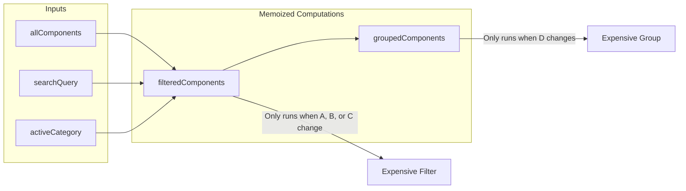

### useCallback vs useMemo

| Hook | Memoizes | Returns | Use For |
|------|----------|---------|---------|
| `useCallback` | Function definition | The function | Event handlers, callbacks passed to children |
| `useMemo` | Function result | Computed value | Expensive calculations, derived data |

```tsx
// useCallback: memoizes the function itself
const handleClick = useCallback(() => {
  doSomething(a, b);
}, [a, b]);

// useMemo: memoizes the return value
const expensiveValue = useMemo(() => {
  return computeExpensiveValue(a, b);
}, [a, b]);

// These are equivalent:
const memoizedFn = useCallback(fn, deps);
const memoizedFn = useMemo(() => fn, deps);
```

---

## Memoization Pitfalls

Memoization is powerful, but it can also make code harder to reason about.

### When Memoization Hurts

- If a component is cheap to render, memoization adds overhead without benefit.
- Memoizing too much can cause stale values if dependencies are wrong.
- Inline objects and arrays can defeat memoization if recreated every render.

### Practical Guidance

- Start without memoization, then measure and optimize.
- Use React DevTools Profiler to find real bottlenecks.
- Keep dependency arrays accurate; prefer ESLint hooks rules.

---

## useRef - DOM Access and Mutable Values

`useRef` provides two capabilities:
1. **Accessing DOM elements** directly
2. **Storing mutable values** that don't trigger re-renders

### Accessing DOM Elements

```tsx
function AutoFocusInput() {
  const inputRef = useRef<HTMLInputElement>(null);

  useEffect(() => {
    // Focus the input when component mounts
    inputRef.current?.focus();
  }, []);

  return <input ref={inputRef} type="text" />;
}
```

### Real Example: React Flow Wrapper Reference

From JurisAI's `Studio.tsx`:

```tsx
function Studio() {
  // Ref to the React Flow wrapper div
  const reactFlowWrapper = useRef<HTMLDivElement>(null);

  // Used for calculating drop position
  const onDrop = useCallback((event: React.DragEvent) => {
    event.preventDefault();

    // Get the wrapper's bounding rectangle
    const reactFlowBounds = reactFlowWrapper.current?.getBoundingClientRect();
    if (!reactFlowBounds) return;

    // Calculate position relative to the canvas
    const position = {
      x: event.clientX - reactFlowBounds.left,
      y: event.clientY - reactFlowBounds.top,
    };

    // Create node at calculated position
    const newNode = {
      id: `node-${Date.now()}`,
      position,
      data: JSON.parse(event.dataTransfer.getData('application/json')),
    };

    setNodes(nds => [...nds, newNode]);
  }, [setNodes]);

  return (
    <div ref={reactFlowWrapper} className="react-flow-wrapper">
      <ReactFlow
        nodes={nodes}
        edges={edges}
        onDrop={onDrop}
        onDragOver={(e) => e.preventDefault()}
      />
    </div>
  );
}
```

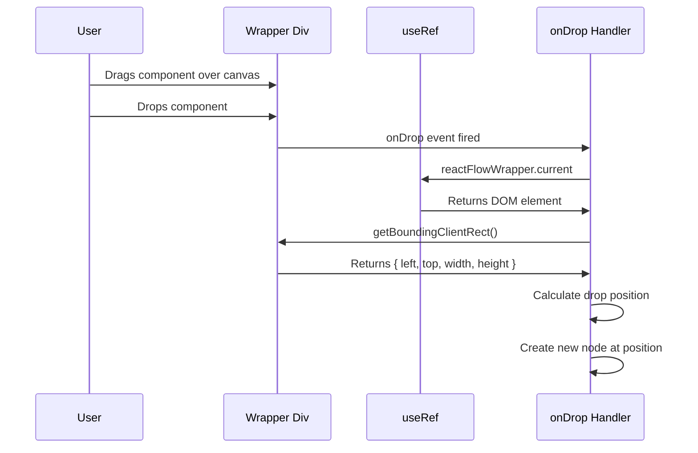

### Mutable Values (No Re-render)

```tsx
function StopwatchWithRef() {
  const [time, setTime] = useState(0);
  const [isRunning, setIsRunning] = useState(false);

  // Store interval ID without triggering re-renders
  const intervalRef = useRef<number | null>(null);

  const start = () => {
    setIsRunning(true);
    intervalRef.current = setInterval(() => {
      setTime(t => t + 1);
    }, 1000);
  };

  const stop = () => {
    setIsRunning(false);
    if (intervalRef.current) {
      clearInterval(intervalRef.current);
    }
  };

  return (
    <div>
      <p>Time: {time}s</p>
      <button onClick={isRunning ? stop : start}>
        {isRunning ? 'Stop' : 'Start'}
      </button>
    </div>
  );
}
```

### Storing Previous Values

```tsx
function usePrevious<T>(value: T): T | undefined {
  const ref = useRef<T>();

  useEffect(() => {
    ref.current = value;
  }, [value]);

  return ref.current;
}

// Usage
function Counter() {
  const [count, setCount] = useState(0);
  const prevCount = usePrevious(count);

  return (
    <div>
      <p>Current: {count}, Previous: {prevCount}</p>
      <button onClick={() => setCount(c => c + 1)}>Increment</button>
    </div>
  );
}
```

### useState vs useRef

| Feature | useState | useRef |
|---------|----------|--------|
| Triggers re-render on change | Yes | No |
| Persists between renders | Yes | Yes |
| Synchronous updates | No (batched) | Yes (immediate) |
| Use for | UI state | DOM refs, timers, previous values |

---

## React Flow Integration

JurisAI uses **React Flow** for building visual workflow editors. This is a powerful library for node-based UIs.

### Core Concepts

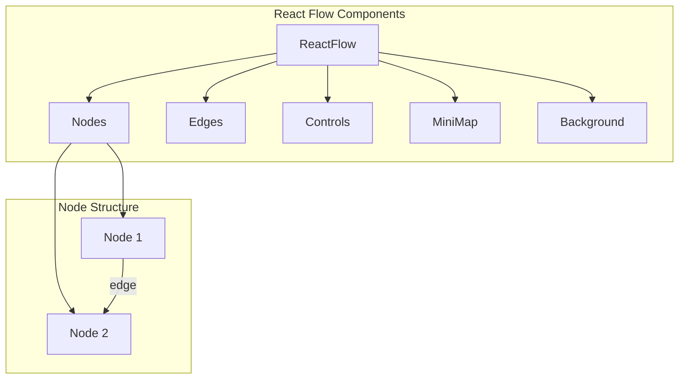

### Basic Setup

```tsx
import {
  ReactFlow,
  useNodesState,
  useEdgesState,
  addEdge,
  Controls,
  MiniMap,
  Background,
} from '@xyflow/react';
import '@xyflow/react/dist/style.css';

function WorkflowEditor() {
  const [nodes, setNodes, onNodesChange] = useNodesState(initialNodes);
  const [edges, setEdges, onEdgesChange] = useEdgesState(initialEdges);

  const onConnect = useCallback((params) => {
    setEdges(eds => addEdge(params, eds));
  }, [setEdges]);

  return (
    <div style={{ width: '100%', height: '100vh' }}>
      <ReactFlow
        nodes={nodes}
        edges={edges}
        onNodesChange={onNodesChange}
        onEdgesChange={onEdgesChange}
        onConnect={onConnect}
        fitView
      >
        <Controls />
        <MiniMap />
        <Background />
      </ReactFlow>
    </div>
  );
}
```

### Custom Nodes

```tsx
// Define custom node types
const nodeTypes = {
  workflow: WorkflowNode,
};

// Custom node component
function WorkflowNode({ data, selected }) {
  return (
    <div className={cn(
      "workflow-node rounded-lg border p-4",
      selected && "ring-2 ring-blue-500",
      `bg-${data.color}-100`
    )}>
      {/* Input handles (connection points) */}
      <Handle
        type="target"
        position={Position.Top}
        className="handle"
      />

      {/* Node content */}
      <div className="flex items-center gap-2">
        <data.icon className="w-4 h-4" />
        <span>{data.label}</span>
      </div>

      {/* Status indicator */}
      {data.status === 'running' && (
        <div className="absolute top-1 right-1 w-2 h-2 bg-blue-500 rounded-full animate-pulse" />
      )}

      {/* Output handles */}
      <Handle
        type="source"
        position={Position.Bottom}
        className="handle"
      />
    </div>
  );
}
```

### Real Example: JurisAI Workflow Node

From `Studio.tsx`:

```tsx
function WorkflowNode({ data }: { data: WorkflowNodeData }) {
  const IconComponent = getIcon(data.icon);

  // Determine output handles based on node type
  const outputs = data.kind === 'gate'
    ? [{ id: 'true', label: 'Yes' }, { id: 'false', label: 'No' }]
    : data.isAI
    ? [{ id: 'success', label: 'Success' }, { id: 'failure', label: 'Failure' }]
    : [{ id: 'output', label: 'Output' }];

  return (
    <div
      className={cn(
        "min-w-[180px] rounded-lg border shadow-lg",
        `bg-${data.color}-500/20 border-${data.color}-500/50`
      )}
    >
      {/* Input handle */}
      {data.kind !== 'trigger' && (
        <Handle
          type="target"
          position={Position.Top}
          id="input"
          className="!w-3 !h-3 !bg-slate-400"
        />
      )}

      {/* Header */}
      <div className={cn(
        "flex items-center gap-2 px-3 py-2 rounded-t-lg",
        `bg-${data.color}-500/30`
      )}>
        {IconComponent && <IconComponent className="w-4 h-4" />}
        <span className="font-medium text-sm">{data.label}</span>

        {/* Status indicator */}
        {data.status && (
          <div className={cn(
            "w-2 h-2 rounded-full ml-auto",
            data.status === 'running' && "bg-blue-500 animate-pulse",
            data.status === 'completed' && "bg-green-500",
            data.status === 'error' && "bg-red-500",
            data.status === 'waiting' && "bg-yellow-500"
          )} />
        )}
      </div>

      {/* Description */}
      <div className="px-3 py-2 text-xs text-slate-400">
        {data.description}
      </div>

      {/* Output handles */}
      {data.kind !== 'end' && (
        <div className="flex justify-around pb-2">
          {outputs.map((output, index) => (
            <div key={output.id} className="relative">
              <Handle
                type="source"
                position={Position.Bottom}
                id={output.id}
                className="!w-3 !h-3"
                style={{
                  left: `${(index + 1) * (100 / (outputs.length + 1))}%`,
                  background: output.id === 'false' || output.id === 'failure'
                    ? '#ef4444'
                    : '#22c55e'
                }}
              />
              <span className="absolute -bottom-4 text-[10px] text-slate-500">
                {output.label}
              </span>
            </div>
          ))}
        </div>
      )}
    </div>
  );
}
```

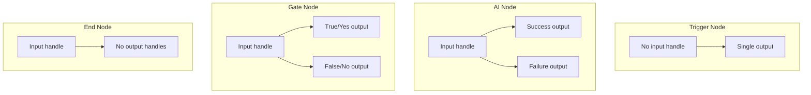

### Drag and Drop Implementation

```tsx
function Studio() {
  const reactFlowWrapper = useRef<HTMLDivElement>(null);

  // Handle drag start from component palette
  const onDragStart = (event: React.DragEvent, component: ComponentDefinition) => {
    event.dataTransfer.setData('application/json', JSON.stringify(component));
    event.dataTransfer.effectAllowed = 'move';
  };

  // Handle drag over (required to allow drop)
  const onDragOver = useCallback((event: React.DragEvent) => {
    event.preventDefault();
    event.dataTransfer.dropEffect = 'move';
  }, []);

  // Handle drop - create new node
  const onDrop = useCallback((event: React.DragEvent) => {
    event.preventDefault();

    const bounds = reactFlowWrapper.current?.getBoundingClientRect();
    if (!bounds) return;

    const component = JSON.parse(
      event.dataTransfer.getData('application/json')
    ) as ComponentDefinition;

    const position = {
      x: event.clientX - bounds.left,
      y: event.clientY - bounds.top,
    };

    const newNode: Node = {
      id: `${component.id}-${Date.now()}`,
      type: 'workflow',
      position,
      data: {
        label: component.name,
        description: component.description,
        icon: component.icon,
        color: component.color,
        kind: component.kind,
        isAI: component.isAI,
        status: 'idle',
      },
    };

    setNodes(nds => [...nds, newNode]);
  }, [setNodes]);

  return (
    <div className="flex h-screen">
      {/* Component Palette */}
      <div className="w-64 border-r p-4">
        {components.map(comp => (
          <div
            key={comp.id}
            draggable
            onDragStart={(e) => onDragStart(e, comp)}
            className="cursor-grab p-2 border rounded mb-2 hover:bg-slate-100"
          >
            {comp.name}
          </div>
        ))}
      </div>

      {/* Canvas */}
      <div ref={reactFlowWrapper} className="flex-1">
        <ReactFlow
          nodes={nodes}
          edges={edges}
          onDragOver={onDragOver}
          onDrop={onDrop}
          nodeTypes={nodeTypes}
        />
      </div>
    </div>
  );
}
```

---

## Responsive React Flow UIs

The workflow canvas should work on laptops, tablets, and large monitors. Tips:

- Make the canvas fill available space with flex layouts.
- Provide a compact sidebar on small screens.
- Use `fitView` to keep nodes visible when the viewport changes.

```tsx
function StudioLayout() {
  return (
    <div className="flex h-screen flex-col lg:flex-row">
      <aside className="order-2 border-t p-3 lg:order-1 lg:w-64 lg:border-r lg:border-t-0">
        Palette
      </aside>
      <main className="order-1 flex-1 lg:order-2">
        <ReactFlow fitView />
      </main>
    </div>
  );
}
```

For touch devices, make nodes larger and increase handle sizes for better dragging.

---

## Advanced Component Patterns

### Compound Components

Components designed to work together, sharing implicit state:

```tsx
import { createContext, useContext, useState, ReactNode } from 'react';

// Context for sharing state
const AccordionContext = createContext<{
  openItem: string | null;
  setOpenItem: (id: string | null) => void;
} | null>(null);

// Root component
function Accordion({ children }: { children: ReactNode }) {
  const [openItem, setOpenItem] = useState<string | null>(null);

  return (
    <AccordionContext.Provider value={{ openItem, setOpenItem }}>
      <div className="accordion">{children}</div>
    </AccordionContext.Provider>
  );
}

// Item component
function AccordionItem({ id, children }: { id: string; children: ReactNode }) {
  return <div className="accordion-item" data-id={id}>{children}</div>;
}

// Trigger component
function AccordionTrigger({ id, children }: { id: string; children: ReactNode }) {
  const context = useContext(AccordionContext);
  if (!context) throw new Error('Must be inside Accordion');

  const isOpen = context.openItem === id;

  return (
    <button
      className="accordion-trigger"
      onClick={() => context.setOpenItem(isOpen ? null : id)}
    >
      {children}
      <ChevronIcon className={isOpen ? 'rotate-180' : ''} />
    </button>
  );
}

// Content component
function AccordionContent({ id, children }: { id: string; children: ReactNode }) {
  const context = useContext(AccordionContext);
  if (!context) throw new Error('Must be inside Accordion');

  if (context.openItem !== id) return null;

  return <div className="accordion-content">{children}</div>;
}

// Attach sub-components
Accordion.Item = AccordionItem;
Accordion.Trigger = AccordionTrigger;
Accordion.Content = AccordionContent;

// Usage
<Accordion>
  <Accordion.Item id="1">
    <Accordion.Trigger id="1">Section 1</Accordion.Trigger>
    <Accordion.Content id="1">Content for section 1</Accordion.Content>
  </Accordion.Item>
  <Accordion.Item id="2">
    <Accordion.Trigger id="2">Section 2</Accordion.Trigger>
    <Accordion.Content id="2">Content for section 2</Accordion.Content>
  </Accordion.Item>
</Accordion>
```

### Render Props Pattern

Pass a function as a child to share behavior:

```tsx
function MouseTracker({ children }: { children: (pos: { x: number; y: number }) => ReactNode }) {
  const [position, setPosition] = useState({ x: 0, y: 0 });

  useEffect(() => {
    const handleMove = (e: MouseEvent) => {
      setPosition({ x: e.clientX, y: e.clientY });
    };
    window.addEventListener('mousemove', handleMove);
    return () => window.removeEventListener('mousemove', handleMove);
  }, []);

  return <>{children(position)}</>;
}

// Usage
<MouseTracker>
  {({ x, y }) => (
    <div style={{ position: 'fixed', left: x, top: y }}>
      Cursor follower!
    </div>
  )}
</MouseTracker>
```

### Higher-Order Components (HOC)

A function that takes a component and returns an enhanced component:

```tsx
function withLoading<P extends object>(
  Component: React.ComponentType<P>
) {
  return function WithLoading({ isLoading, ...props }: P & { isLoading: boolean }) {
    if (isLoading) {
      return <div className="loading-spinner">Loading...</div>;
    }
    return <Component {...(props as P)} />;
  };
}

// Usage
const UserProfileWithLoading = withLoading(UserProfile);

<UserProfileWithLoading isLoading={isLoading} user={user} />
```

### Forwarding Refs

Pass refs through components to access DOM elements:

```tsx
import { forwardRef } from 'react';

const FancyInput = forwardRef<HTMLInputElement, InputProps>((props, ref) => {
  return (
    <div className="fancy-input-wrapper">
      <input ref={ref} {...props} className="fancy-input" />
    </div>
  );
});

// Usage - parent can access the input element
function Form() {
  const inputRef = useRef<HTMLInputElement>(null);

  const focusInput = () => {
    inputRef.current?.focus();
  };

  return (
    <div>
      <FancyInput ref={inputRef} placeholder="Enter text..." />
      <button onClick={focusInput}>Focus Input</button>
    </div>
  );
}
```

---

## Performance Optimization

### React.memo - Preventing Re-renders

Wrap components to skip re-renders when props haven't changed:

```tsx
const ExpensiveComponent = React.memo(function ExpensiveComponent({ data }) {
  // Heavy computation or rendering
  return <div>{/* Complex UI */}</div>;
});

// Only re-renders if 'data' prop changes (shallow comparison)
```

### Custom Comparison Function

```tsx
const MyComponent = React.memo(
  function MyComponent({ item, onSelect }) {
    return <div onClick={() => onSelect(item.id)}>{item.name}</div>;
  },
  // Custom comparison: only re-render if item.id changes
  (prevProps, nextProps) => {
    return prevProps.item.id === nextProps.item.id;
  }
);
```

### Virtualization for Long Lists

For lists with hundreds/thousands of items, use virtualization:

```tsx
import { FixedSizeList } from 'react-window';

function VirtualizedList({ items }) {
  const Row = ({ index, style }) => (
    <div style={style}>
      {items[index].name}
    </div>
  );

  return (
    <FixedSizeList
      height={400}
      width="100%"
      itemCount={items.length}
      itemSize={50}
    >
      {Row}
    </FixedSizeList>
  );
}
```

### Code Splitting with lazy()

Load components only when needed:

```tsx
import { lazy, Suspense } from 'react';

// Component is loaded only when needed
const Studio = lazy(() => import('./routes/Studio'));
const Settings = lazy(() => import('./routes/Settings'));

function App() {
  return (
    <Suspense fallback={<LoadingSpinner />}>
      <Routes>
        <Route path="/studio" element={<Studio />} />
        <Route path="/settings" element={<Settings />} />
      </Routes>
    </Suspense>
  );
}
```

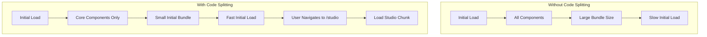

---

## Error Boundaries

Error boundaries catch JavaScript errors in child components and display fallback UI.

### Creating an Error Boundary

```tsx
import { Component, ReactNode } from 'react';

type Props = {
  children: ReactNode;
  fallback: ReactNode;
};

type State = {
  hasError: boolean;
  error: Error | null;
};

class ErrorBoundary extends Component<Props, State> {
  constructor(props: Props) {
    super(props);
    this.state = { hasError: false, error: null };
  }

  static getDerivedStateFromError(error: Error) {
    return { hasError: true, error };
  }

  componentDidCatch(error: Error, errorInfo: React.ErrorInfo) {
    console.error('Error caught by boundary:', error, errorInfo);
    // Log to error reporting service (Sentry, etc.)
  }

  render() {
    if (this.state.hasError) {
      return this.props.fallback;
    }

    return this.props.children;
  }
}

// Usage
function App() {
  return (
    <ErrorBoundary fallback={<ErrorPage />}>
      <MainContent />
    </ErrorBoundary>
  );
}
```

### Granular Error Boundaries

```tsx
function Dashboard() {
  return (
    <div className="grid grid-cols-3 gap-4">
      <ErrorBoundary fallback={<WidgetError />}>
        <RevenueWidget />
      </ErrorBoundary>

      <ErrorBoundary fallback={<WidgetError />}>
        <UsersWidget />
      </ErrorBoundary>

      <ErrorBoundary fallback={<WidgetError />}>
        <OrdersWidget />
      </ErrorBoundary>
    </div>
  );
}
```

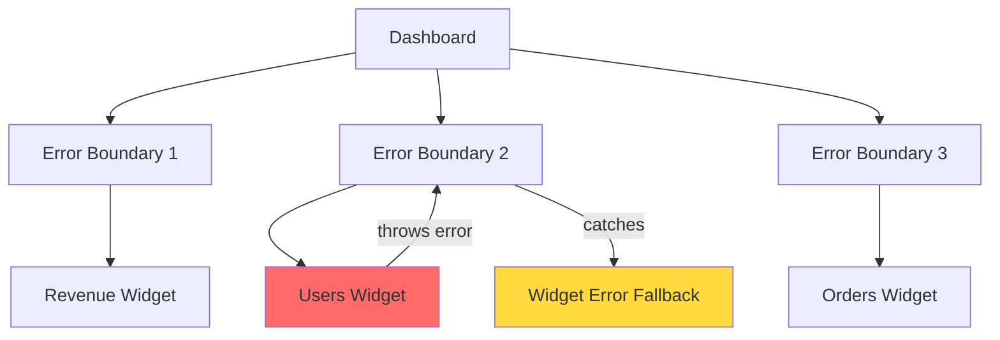

---

## Suspense and Loading Boundaries

`Suspense` lets you show a fallback while lazy-loaded components or data are loading.

```tsx
const Studio = lazy(() => import('./routes/Studio'));

function App() {
  return (
    <Suspense fallback={<LoadingSpinner />}>
      <Studio />
    </Suspense>
  );
}
```

**Rule of thumb:** use `ErrorBoundary` for failures and `Suspense` for loading.

---

## State Management Architecture

### When to Use What

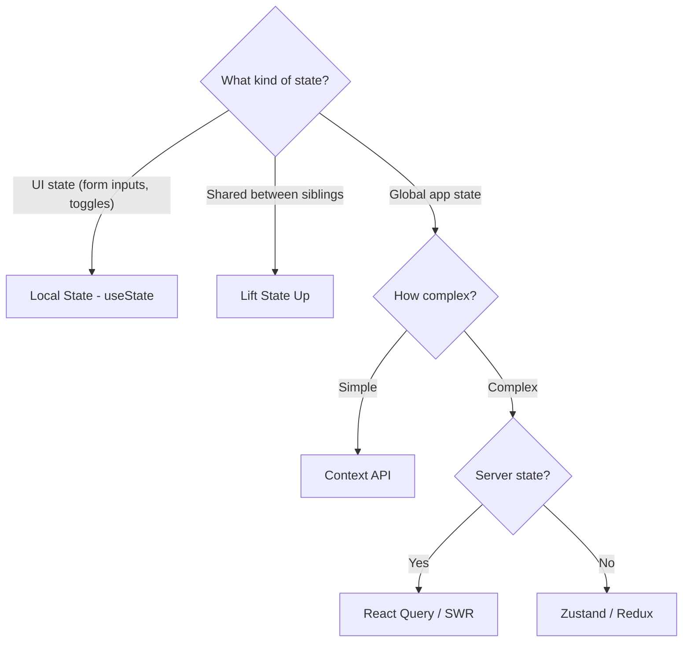

### JurisAI's State Architecture

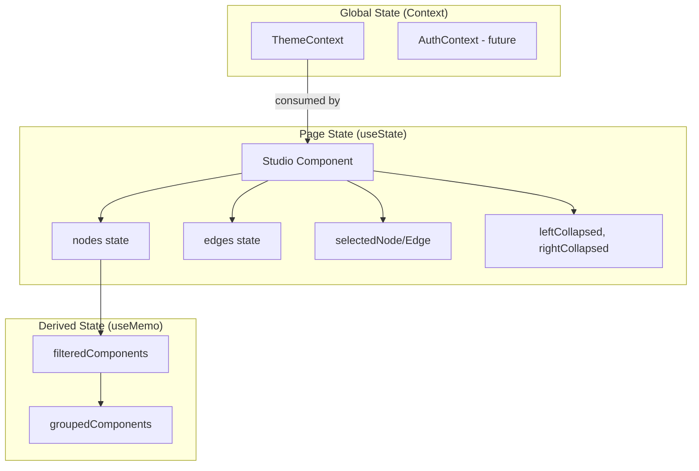

### State Colocation Principle

Keep state as close to where it's used as possible:

```tsx
// GOOD: State close to usage
function SearchBox() {
  const [query, setQuery] = useState('');
  return <input value={query} onChange={(e) => setQuery(e.target.value)} />;
}

// BAD: State too high up
function App() {
  const [searchQuery, setSearchQuery] = useState('');
  return (
    <Layout>
      <Header>
        <SearchBox query={searchQuery} setQuery={setSearchQuery} />
      </Header>
      {/* searchQuery not used anywhere else in App */}
    </Layout>
  );
}
```

---

## Testing and Debugging

Even advanced patterns should be verified:

- **Unit tests:** test custom hooks and reducers in isolation.
- **Component tests:** verify UI behavior for loading/error/empty states.
- **React DevTools:** inspect props, state, and re-renders.
- **Profiler:** measure which components are slow before optimizing.

### Debugging Tips

- Add temporary logs inside effects and callbacks to confirm when they run.
- Use strict types to catch mismatched props and event types early.
- If a component renders too often, check for new object/array props.

---

## Summary

You've mastered advanced React patterns:

| Concept | Purpose |
|---------|---------|
| **Context API** | Global state without prop drilling |
| **Custom Hooks** | Reusable stateful logic |
| **useCallback** | Memoize functions to prevent re-renders |
| **useMemo** | Memoize expensive computations |
| **useRef** | DOM access and mutable values |
| **React Flow** | Build visual node-based editors |
| **Compound Components** | Components that work together |
| **Error Boundaries** | Graceful error handling |
| **Performance** | React.memo, virtualization, code splitting |

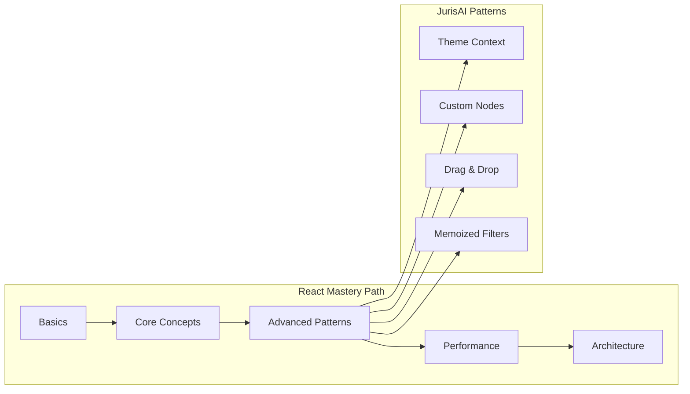

---

## Quick Reference

### Context

```tsx
const MyContext = createContext(defaultValue);
<MyContext.Provider value={value}>{children}</MyContext.Provider>
const value = useContext(MyContext);
```

### Custom Hook

```tsx
function useMyHook() {
  const [state, setState] = useState(initial);
  // ... logic
  return { state, actions };
}
```

### useCallback

```tsx
const memoizedFn = useCallback(() => {
  doSomething(a, b);
}, [a, b]);
```

### useMemo

```tsx
const memoizedValue = useMemo(() => {
  return expensiveComputation(a, b);
}, [a, b]);
```

### useRef

```tsx
const ref = useRef<HTMLDivElement>(null);
<div ref={ref} />
ref.current?.focus();
```

### React.memo

```tsx
const MemoizedComponent = React.memo(function MyComponent(props) {
  return <div>{props.value}</div>;
});
```

### Error Boundary

```tsx
<ErrorBoundary fallback={<FallbackUI />}>
  <RiskyComponent />
</ErrorBoundary>
```

---

*You've completed the React tutorial series! You now have the knowledge to understand and contribute to the JurisAI frontend codebase.*
