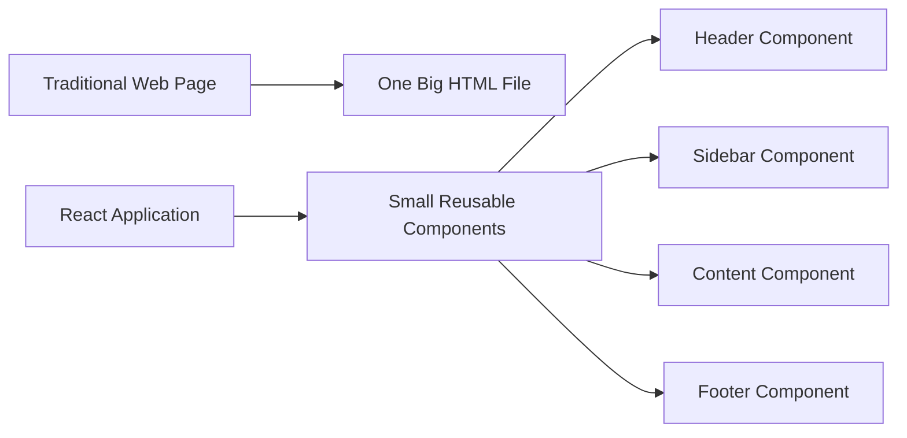
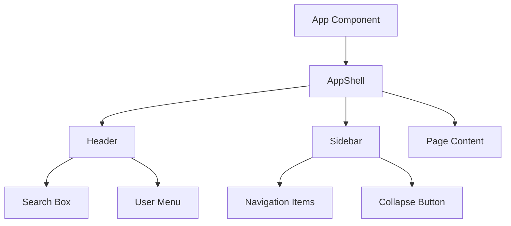
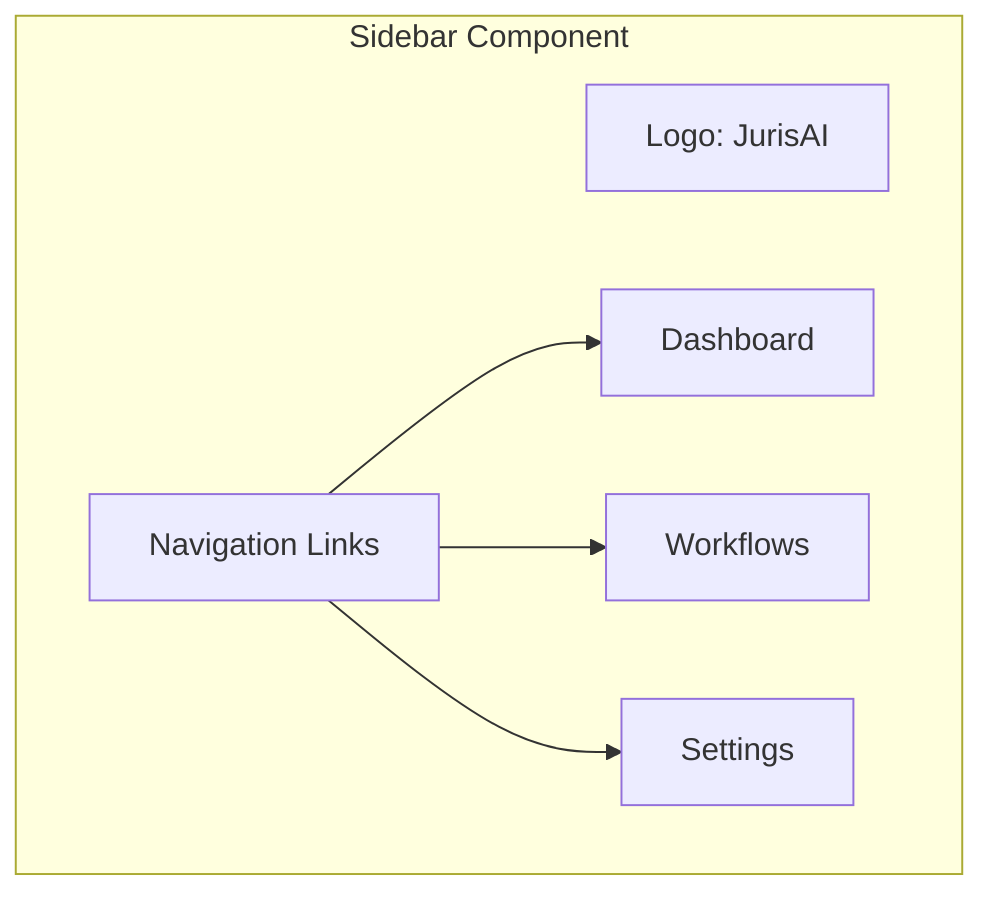
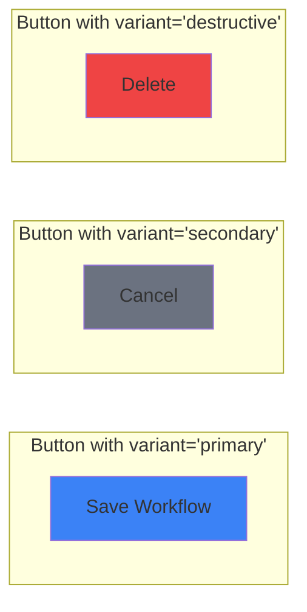
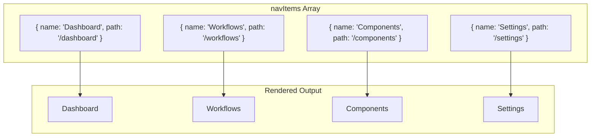
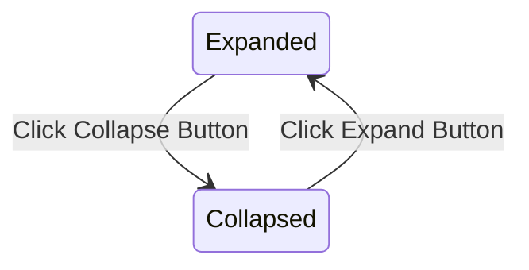
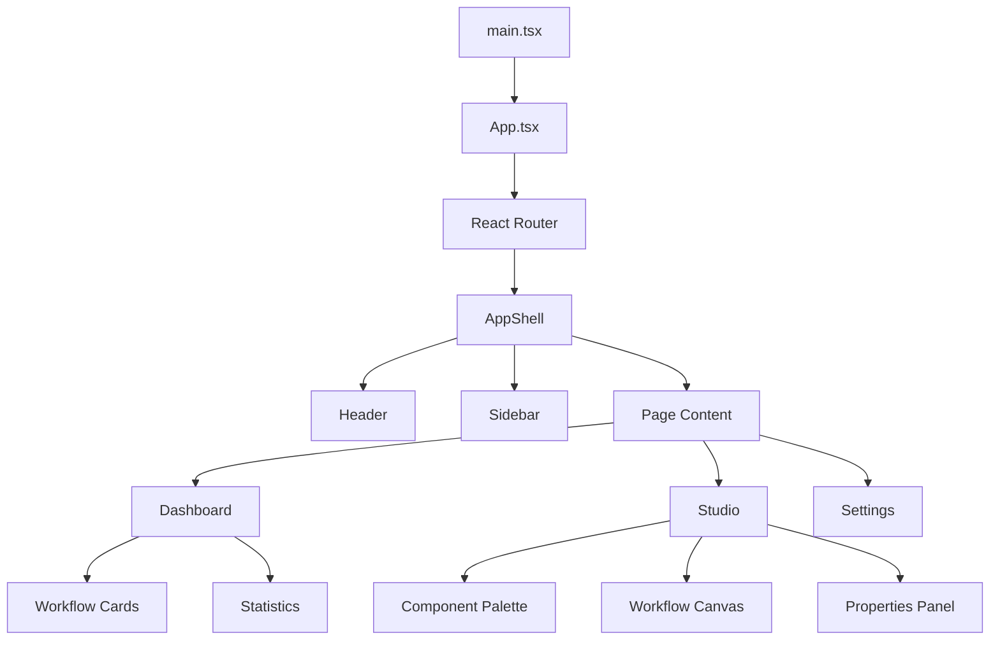
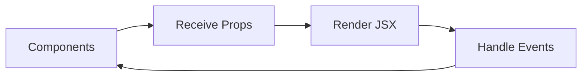

# React Basics - A Gentle Introduction

Welcome to React! This guide will take you from zero programming knowledge to understanding the fundamentals of React. We'll use real examples from the JurisAI CRM application to make concepts concrete.

## Table of Contents

1. [Learning Goals](#learning-goals)
2. [What is React?](#what-is-react)
3. [Understanding the Building Blocks](#understanding-the-building-blocks)
4. [Your First Component](#your-first-component)
5. [JSX - Writing HTML in JavaScript](#jsx---writing-html-in-javascript)
6. [Props - Passing Data to Components](#props---passing-data-to-components)
7. [Displaying Lists of Data](#displaying-lists-of-data)
8. [Handling User Interactions](#handling-user-interactions)
9. [Project Structure in JurisAI](#project-structure-in-jurisai)
10. [Common JSX Gotchas](#common-jsx-gotchas)
11. [Building Responsive UI Basics](#building-responsive-ui-basics)
12. [Practice Exercises](#practice-exercises)

---

## Learning Goals

By the end of this tutorial, you should be able to:
- Explain what a component is and how React renders it.
- Read and write basic JSX.
- Pass data with props and render lists with `map`.
- Handle user events like clicks and input changes.
- Recognize the file structure of the JurisAI frontend.

---

## What is React?

React is a **JavaScript library** for building user interfaces. Think of it like a set of LEGO blocks - you create small, reusable pieces (called **components**) and combine them to build complete applications.

### Why React?



**Traditional approach:** One massive file with everything mixed together.
**React approach:** Small, focused pieces that you can reuse and combine.

### Real World Analogy

Imagine building a house:
- **Traditional:** You build the entire house as one solid piece
- **React:** You build rooms separately (kitchen, bedroom, bathroom), then combine them

---

## Understanding the Building Blocks

Before we write any code, let's understand the key concepts.

### What is a Component?

A **component** is a reusable piece of your user interface. In JurisAI, we have many components:



Each box in this diagram is a **component** - a self-contained piece of UI.

### What is JavaScript/TypeScript?

**JavaScript** is a programming language that runs in web browsers. It makes websites interactive.

**TypeScript** is JavaScript with extra features that help prevent errors. JurisAI uses TypeScript (files ending in `.tsx` or `.ts`).

### Variables - Storing Information

Variables are like labeled boxes that store information:

```typescript
// This is how you create variables in JavaScript/TypeScript

// A text value (called a "string")
const userName = "Alice";

// A number
const userAge = 25;

// A true/false value (called a "boolean")
const isLoggedIn = true;

// A list of items (called an "array")
const colors = ["red", "green", "blue"];

// A collection of related data (called an "object")
const user = {
  name: "Alice",
  age: 25,
  email: "alice@example.com"
};
```

The word `const` means the variable won't change. We also use `let` for variables that will change.

---

## Your First Component

A React component is simply a **function that returns what should appear on screen**.

### The Simplest Component

```tsx
// This is a React component!
function Welcome() {
  return <h1>Hello, World!</h1>;
}
```

Let's break this down:

1. `function Welcome()` - We create a function named `Welcome`
2. `return` - We specify what to show on screen
3. `<h1>Hello, World!</h1>` - HTML-like code that displays a heading

### A Real Example from JurisAI

Here's a simplified version of our `Sidebar` component:

```tsx
function Sidebar() {
  return (
    <div className="sidebar">
      <div className="logo">
        JurisAI
      </div>
      <nav>
        <a href="/dashboard">Dashboard</a>
        <a href="/workflows">Workflows</a>
        <a href="/settings">Settings</a>
      </nav>
    </div>
  );
}
```



---

## JSX - Writing HTML in JavaScript

JSX is a special syntax that lets you write HTML-like code inside JavaScript. It looks like HTML but has some differences.

### HTML vs JSX

| HTML | JSX | Why? |
|------|-----|------|
| `class="container"` | `className="container"` | `class` is reserved in JavaScript |
| `<input type="text">` | `<input type="text" />` | All tags must be closed |
| `style="color: red"` | `style={{ color: 'red' }}` | Styles are objects in JSX |

### Using JavaScript Inside JSX

You can put JavaScript expressions inside curly braces `{}`:

```tsx
function Greeting() {
  const name = "Alice";
  const currentHour = 14; // 2 PM

  return (
    <div>
      <h1>Hello, {name}!</h1>
      <p>The time is {currentHour}:00</p>
      <p>2 + 2 = {2 + 2}</p>
    </div>
  );
}
```

This would display:
```
Hello, Alice!
The time is 14:00
2 + 2 = 4
```

### Tip: JSX is Just JavaScript

Remember: JSX compiles to JavaScript function calls. Anything you can do in JS, you can do inside `{}` as an expression. If you need multiple steps, compute them before `return`.

### Real Example: Displaying Workflow Status

From our JurisAI `Dashboard`:

```tsx
function WorkflowCard() {
  const workflowName = "Contract Review";
  const status = "active";
  const nodeCount = 12;

  return (
    <div className="card">
      <h3>{workflowName}</h3>
      <p>Status: {status}</p>
      <p>This workflow has {nodeCount} nodes</p>
    </div>
  );
}
```

---

## Props - Passing Data to Components

**Props** (short for "properties") let you pass data from a parent component to a child component. Think of props like arguments to a function.

### Without Props (Hardcoded)

```tsx
function WelcomeMessage() {
  return <h1>Hello, Alice!</h1>;
}

// What if we want to greet Bob? We'd need a different component!
```

### With Props (Flexible)

```tsx
function WelcomeMessage(props) {
  return <h1>Hello, {props.name}!</h1>;
}

// Now we can reuse it!
<WelcomeMessage name="Alice" />  // Shows: Hello, Alice!
<WelcomeMessage name="Bob" />    // Shows: Hello, Bob!
```

### Visual Representation

```mermaid
graph TD
    Parent[Parent Component] -->|name="Alice"| Child1[WelcomeMessage]
    Parent -->|name="Bob"| Child2[WelcomeMessage]
    Child1 --> Output1["Hello, Alice!"]
    Child2 --> Output2["Hello, Bob!"]
```

### Real Example: Button Component

Here's how our `Button` component in JurisAI uses props:

```tsx
// The Button component accepts different props
function Button(props) {
  return (
    <button className={props.variant}>
      {props.children}
    </button>
  );
}

// Using the Button component with different props:
<Button variant="primary">Save Workflow</Button>
<Button variant="secondary">Cancel</Button>
<Button variant="destructive">Delete</Button>
```



### Destructuring Props (Cleaner Syntax)

Instead of writing `props.name` everywhere, we can "destructure" the props:

```tsx
// Before: Using props.name
function WelcomeMessage(props) {
  return <h1>Hello, {props.name}!</h1>;
}

// After: Destructuring
function WelcomeMessage({ name }) {
  return <h1>Hello, {name}!</h1>;
}

// With multiple props
function UserCard({ name, email, age }) {
  return (
    <div>
      <h2>{name}</h2>
      <p>Email: {email}</p>
      <p>Age: {age}</p>
    </div>
  );
}
```

---

## Displaying Lists of Data

Often you need to display a list of items. React makes this easy with the `map` function.

### What is `map`?

`map` takes each item in a list and transforms it into something else:

```tsx
const numbers = [1, 2, 3];

// Transform each number by doubling it
const doubled = numbers.map(num => num * 2);
// Result: [2, 4, 6]
```

### Rendering Lists in React

```tsx
function FruitList() {
  const fruits = ["Apple", "Banana", "Orange"];

  return (
    <ul>
      {fruits.map(fruit => (
        <li key={fruit}>{fruit}</li>
      ))}
    </ul>
  );
}
```

This displays:
- Apple
- Banana
- Orange

### The `key` Prop

When rendering lists, React needs a unique `key` for each item to track changes efficiently:

```tsx
// Each item needs a unique key
{items.map(item => (
  <li key={item.id}>{item.name}</li>
))}
```

**Tip:** Avoid using array index as a `key` unless the list is static. If items are added/removed, React can mix up which item changed.

### Real Example: Navigation Items in Sidebar

From JurisAI's `Sidebar.tsx`:

```tsx
function Sidebar() {
  // Array of navigation items
  const navItems = [
    { name: "Dashboard", path: "/dashboard", icon: "Home" },
    { name: "Workflows", path: "/workflows", icon: "GitBranch" },
    { name: "Components", path: "/components", icon: "Puzzle" },
    { name: "Settings", path: "/settings", icon: "Settings" },
  ];

  return (
    <nav>
      {navItems.map(item => (
        <a key={item.path} href={item.path}>
          {item.name}
        </a>
      ))}
    </nav>
  );
}
```



---

## Handling User Interactions

React lets you respond to user actions like clicks, typing, and more.

### Basic Click Handler

```tsx
function ClickButton() {
  // This function runs when button is clicked
  function handleClick() {
    alert("Button was clicked!");
  }

  return (
    <button onClick={handleClick}>
      Click Me
    </button>
  );
}
```

### Arrow Function Syntax

A shorter way to write functions:

```tsx
// Regular function
function handleClick() {
  alert("Clicked!");
}

// Arrow function (same thing, shorter syntax)
const handleClick = () => {
  alert("Clicked!");
};
```

### Real Example: Collapsible Sidebar

From JurisAI's `Sidebar.tsx`:

```tsx
function Sidebar() {
  // We'll learn about useState in the next tutorial!
  const [collapsed, setCollapsed] = useState(false);

  // When the collapse button is clicked, toggle the collapsed state
  const handleCollapseClick = () => {
    setCollapsed(!collapsed);  // If true, make false. If false, make true.
  };

  return (
    <div className={collapsed ? "sidebar-collapsed" : "sidebar-expanded"}>
      <button onClick={handleCollapseClick}>
        {collapsed ? "Expand" : "Collapse"}
      </button>
      {/* Rest of sidebar */}
    </div>
  );
}
```



### Common Events

| Event | When it fires |
|-------|---------------|
| `onClick` | User clicks the element |
| `onChange` | Input value changes |
| `onSubmit` | Form is submitted |
| `onMouseEnter` | Mouse hovers over element |
| `onMouseLeave` | Mouse leaves element |
| `onKeyDown` | Key is pressed |

### Input Example

```tsx
function SearchBox() {
  function handleChange(event) {
    console.log("User typed:", event.target.value);
  }

  return (
    <input
      type="text"
      placeholder="Search..."
      onChange={handleChange}
    />
  );
}
```

### Tip: Make UIs Feel Dynamic

Even with basics, you can add small feedback:
- Show a character count as the user types.
- Disable a submit button until required fields are filled.
- Display a loading spinner when a task is running.

---

## Project Structure in JurisAI

Now that you understand the basics, let's look at how JurisAI is organized:

```
frontend/
├── src/
│   ├── main.tsx          # Entry point - where React starts
│   ├── App.tsx           # Main application component
│   ├── app/
│   │   ├── layout/       # Layout components (Header, Sidebar, etc.)
│   │   └── routes/       # Page components (Dashboard, Studio, etc.)
│   ├── components/
│   │   └── ui/           # Reusable UI components (Button, Card, etc.)
│   ├── hooks/            # Custom React hooks
│   ├── lib/              # Utility functions
│   └── mock-data/        # Sample data for testing
```

### Component Hierarchy



### Entry Point: main.tsx

This is where React starts:

```tsx
// frontend/src/main.tsx
import React from 'react';
import ReactDOM from 'react-dom/client';
import App from './App';

// Find the HTML element with id="root" and render our App inside it
ReactDOM.createRoot(document.getElementById('root')!).render(
  <React.StrictMode>
    <App />
  </React.StrictMode>
);
```

---

## Common JSX Gotchas

These trip up beginners often:

### 1) Returning multiple elements

JSX must return a single parent element. Use a wrapper or a fragment:

```tsx
// Wrong
return <h1>Title</h1><p>Paragraph</p>;

// Right
return (
  <>
    <h1>Title</h1>
    <p>Paragraph</p>
  </>
);
```

### 2) JavaScript expressions only

You can use expressions inside `{}`, but not statements:

```tsx
// Wrong: "if" is a statement
return <div>{if (isActive) "Active"}</div>;

// Right: use a ternary
return <div>{isActive ? "Active" : "Inactive"}</div>;
```

### 3) Inline styles are objects

```tsx
<div style={{ backgroundColor: "tomato", padding: 8 }}>
  Styled box
</div>
```

---

## Building Responsive UI Basics

Responsive UI means your layout adapts to screen size. In JurisAI, Tailwind CSS makes this easy.

### Tailwind Breakpoints (Most Common)

| Prefix | Screen Size |
|--------|-------------|
| `sm:`  | 640px+ |
| `md:`  | 768px+ |
| `lg:`  | 1024px+ |
| `xl:`  | 1280px+ |

### Example: Responsive Cards

```tsx
function StatsGrid() {
  return (
    <div className="grid grid-cols-1 gap-4 md:grid-cols-2 lg:grid-cols-4">
      <div className="rounded border p-4">Card 1</div>
      <div className="rounded border p-4">Card 2</div>
      <div className="rounded border p-4">Card 3</div>
      <div className="rounded border p-4">Card 4</div>
    </div>
  );
}
```

On small screens this becomes 1 column, then 2, then 4.

### Example: Responsive Sidebar

```tsx
function Layout({ children }) {
  return (
    <div className="flex flex-col md:flex-row">
      <aside className="md:w-64">Sidebar</aside>
      <main className="flex-1">{children}</main>
    </div>
  );
}
```

---

## Practice Exercises

1. Create a `ProfileCard` component that accepts `name`, `role`, and `email` props.
2. Render a list of 5 workflow names using `map` and unique keys.
3. Add a button that toggles a piece of text between "Open" and "Closed".
4. Make a two-column layout on desktop and single column on mobile.

---

## Summary

Congratulations! You've learned the fundamentals of React:

| Concept | What it is |
|---------|------------|
| **Component** | A reusable piece of UI (a function that returns JSX) |
| **JSX** | HTML-like syntax for describing UI in JavaScript |
| **Props** | Data passed from parent to child components |
| **Lists** | Using `map` to render arrays of data |
| **Events** | Responding to user interactions like clicks |



## What's Next?

In the next tutorial (**React.md**), you'll learn:

- **State** - How components remember and update data
- **useState Hook** - The most important React hook
- **Conditional Rendering** - Showing different content based on conditions
- **Component Composition** - Building complex UIs from simple parts
- **Styling with Tailwind CSS** - How JurisAI styles components
- **Forms and Controlled Components** - Handling user input properly

---

## Quick Reference

### Creating a Component

```tsx
function MyComponent() {
  return (
    <div>
      <h1>Hello!</h1>
    </div>
  );
}
```

### Using Props

```tsx
function Greeting({ name, age }) {
  return <p>{name} is {age} years old</p>;
}

// Usage
<Greeting name="Alice" age={25} />
```

### Rendering Lists

```tsx
{items.map(item => (
  <div key={item.id}>{item.name}</div>
))}
```

### Handling Clicks

```tsx
<button onClick={() => alert('Clicked!')}>
  Click Me
</button>
```

---

*Continue to [React.md](./React.md) for intermediate concepts!*
