# React - Core Concepts and Patterns

This intermediate guide builds on the basics from [React-BASIC.md](./React-BASIC.md). Here you'll learn how to build interactive, dynamic applications using React's core features, with real examples from JurisAI.

## Table of Contents

1. [State - Component Memory](#state---component-memory)
2. [The useState Hook](#the-usestate-hook)
3. [Conditional Rendering](#conditional-rendering)
4. [Controlled Components and Forms](#controlled-components-and-forms)
5. [Component Composition](#component-composition)
6. [The useEffect Hook](#the-useeffect-hook)
7. [Lifting State Up](#lifting-state-up)
8. [Styling with Tailwind CSS](#styling-with-tailwind-css)
9. [React Router - Navigation](#react-router---navigation)
10. [TypeScript with React](#typescript-with-react)
11. [Dynamic UI Patterns](#dynamic-ui-patterns)
12. [Responsive UI with Tailwind](#responsive-ui-with-tailwind)
13. [Accessibility Basics](#accessibility-basics)
14. [Common Pitfalls](#common-pitfalls)

---

## State - Component Memory

**State** is how React components "remember" information. Unlike props (which come from parents), state is managed within the component itself.

### Props vs State

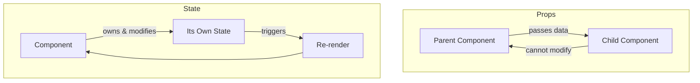

| Props | State |
|-------|-------|
| Passed from parent | Created within component |
| Read-only (cannot change) | Can be updated |
| Like function arguments | Like variables that trigger updates |

### When to Use State

Use state when your component needs to:
- Track user input (form fields)
- Toggle visibility (show/hide panels)
- Track selection (which item is selected)
- Store fetched data (API responses)
- Track loading/error states

---

## The useState Hook

**Hooks** are special functions that let you "hook into" React features. `useState` is the most important hook - it adds state to your components.

### Basic Syntax

```tsx
import { useState } from 'react';

function Counter() {
  // useState returns an array with 2 items:
  // 1. The current value
  // 2. A function to update the value
  const [count, setCount] = useState(0);  // 0 is the initial value

  return (
    <div>
      <p>Count: {count}</p>
      <button onClick={() => setCount(count + 1)}>
        Increment
      </button>
    </div>
  );
}
```

### Tip: Use the "Updater" Form When New State Depends on Old

React may batch state updates. If you rely on the previous value, use a function:

```tsx
setCount(prev => prev + 1);
```

This avoids bugs when multiple updates happen quickly.

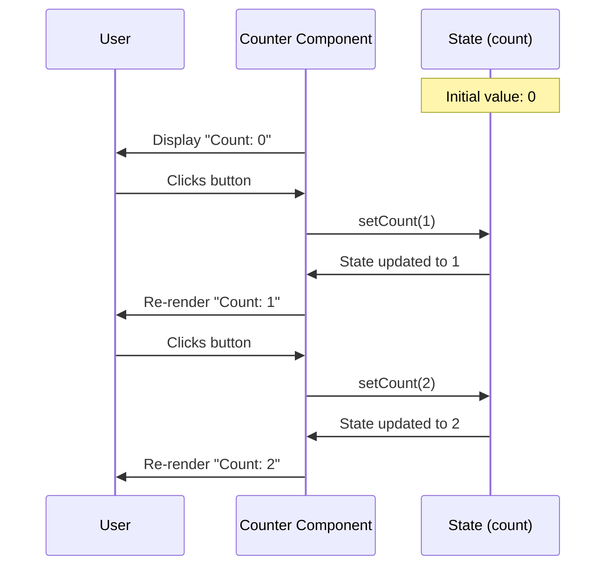

### Array Destructuring Explained

```tsx
// useState returns an array: [currentValue, updateFunction]
const stateArray = useState(0);
const count = stateArray[0];      // The value
const setCount = stateArray[1];   // The updater function

// Destructuring is a shortcut for the same thing:
const [count, setCount] = useState(0);
```

### Real Example: Collapsible Sidebar

From JurisAI's `Sidebar.tsx`:

```tsx
import { useState } from 'react';

function Sidebar() {
  // collapsed starts as false (sidebar is expanded)
  const [collapsed, setCollapsed] = useState(false);

  return (
    <aside className={collapsed ? 'w-16' : 'w-64'}>
      {/* Logo section */}
      <div className="logo-area">
        {!collapsed && <span>JurisAI</span>}
      </div>

      {/* Navigation items */}
      <nav>
        {navItems.map(item => (
          <a key={item.path} href={item.path}>
            <item.icon />
            {!collapsed && <span>{item.name}</span>}
          </a>
        ))}
      </nav>

      {/* Toggle button */}
      <button onClick={() => setCollapsed(!collapsed)}>
        {collapsed ? <ChevronRight /> : <ChevronLeft />}
      </button>
    </aside>
  );
}
```

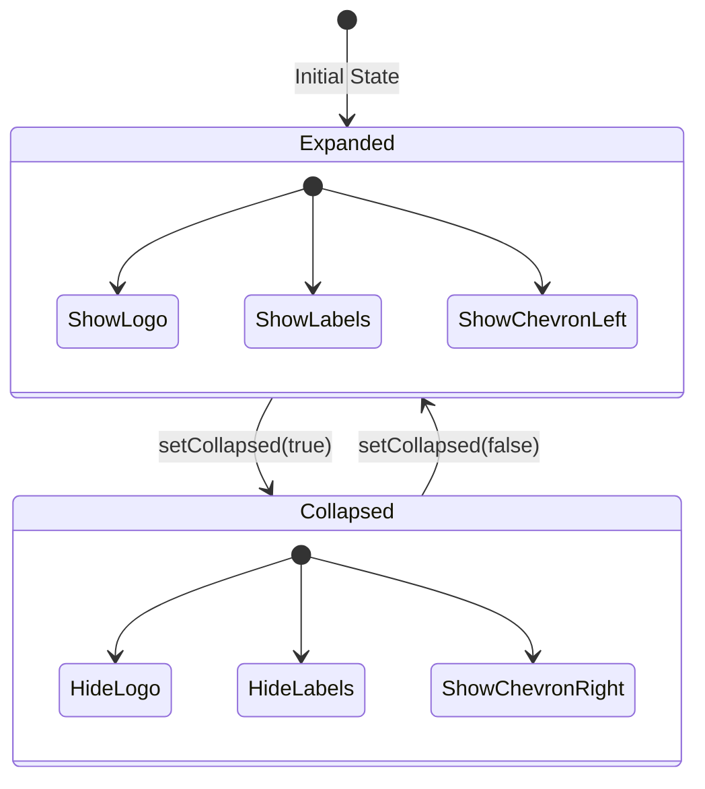

### Multiple State Variables

Components can have multiple state variables:

```tsx
function SearchPanel() {
  const [searchQuery, setSearchQuery] = useState('');
  const [selectedCategory, setSelectedCategory] = useState('all');
  const [isLoading, setIsLoading] = useState(false);
  const [results, setResults] = useState([]);

  // Each piece of state is independent
  return (
    <div>
      <input
        value={searchQuery}
        onChange={(e) => setSearchQuery(e.target.value)}
      />
      <select
        value={selectedCategory}
        onChange={(e) => setSelectedCategory(e.target.value)}
      >
        <option value="all">All</option>
        <option value="triggers">Triggers</option>
        <option value="actions">Actions</option>
      </select>
      {isLoading ? <Spinner /> : <ResultsList results={results} />}
    </div>
  );
}
```

### State with Objects

When state is an object, always create a new object when updating:

```tsx
function UserForm() {
  const [user, setUser] = useState({
    name: '',
    email: '',
    role: 'viewer'
  });

  const handleNameChange = (e) => {
    // Create a NEW object with the spread operator
    setUser({
      ...user,           // Copy all existing properties
      name: e.target.value  // Override just the name
    });
  };

  return (
    <input
      value={user.name}
      onChange={handleNameChange}
    />
  );
}
```

**Why?** React compares the old and new state to decide if it should re-render. If you mutate the existing object, React won't notice the change.

### Avoid Derived State When Possible

If you can calculate a value from props or state during render, you usually should. Example: instead of storing `fullName` in state, compute it from `firstName` and `lastName` in the JSX.

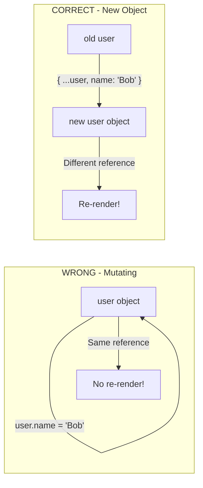

---

## Conditional Rendering

Show different content based on conditions.

### Using && (AND Operator)

Show content only when condition is true:

```tsx
function Notification({ message, showIcon }) {
  return (
    <div className="notification">
      {showIcon && <AlertIcon />}  {/* Only show if showIcon is true */}
      <span>{message}</span>
    </div>
  );
}
```

### Using Ternary Operator (? :)

Choose between two options:

```tsx
function StatusBadge({ isActive }) {
  return (
    <span className={isActive ? 'badge-green' : 'badge-gray'}>
      {isActive ? 'Active' : 'Inactive'}
    </span>
  );
}
```

### Real Example: Node Status in Studio

From JurisAI's `Studio.tsx`:

```tsx
function WorkflowNode({ data }) {
  const { status } = data;

  // Different status indicators based on node state
  return (
    <div className="node">
      {/* Status indicator */}
      {status === 'running' && (
        <div className="status-indicator animate-pulse bg-blue-500" />
      )}
      {status === 'completed' && (
        <div className="status-indicator bg-green-500" />
      )}
      {status === 'error' && (
        <div className="status-indicator bg-red-500" />
      )}
      {status === 'idle' && (
        <div className="status-indicator bg-gray-500" />
      )}

      {/* Node content */}
      <span>{data.label}</span>
    </div>
  );
}
```

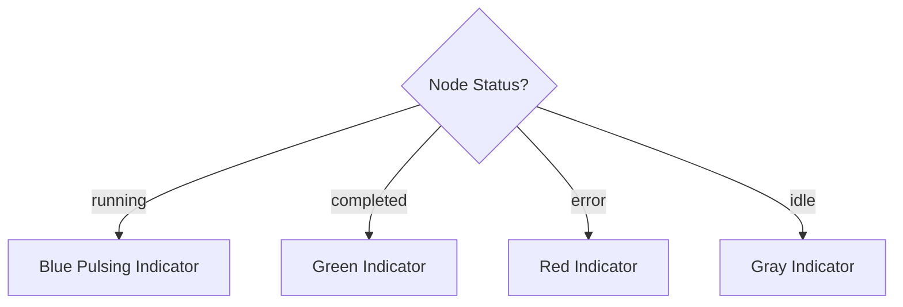

### Using Early Returns

For complex conditions, return early:

```tsx
function UserProfile({ user, isLoading, error }) {
  // Handle loading state
  if (isLoading) {
    return <LoadingSpinner />;
  }

  // Handle error state
  if (error) {
    return <ErrorMessage message={error} />;
  }

  // Handle no user
  if (!user) {
    return <p>No user found</p>;
  }

  // Happy path - we have a user!
  return (
    <div className="profile">
      <h1>{user.name}</h1>
      <p>{user.email}</p>
    </div>
  );
}
```

### Form UX Tip

Always handle these states:
- **Loading:** disable submit button while saving.
- **Errors:** show a clear message near the field or at the top.
- **Success:** give immediate confirmation.

---

## Controlled Components and Forms

In React, form inputs should be "controlled" by state.

### Uncontrolled vs Controlled

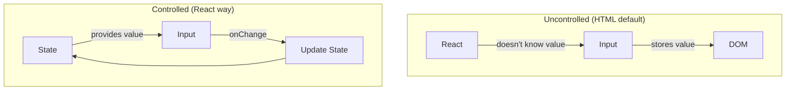

### Basic Controlled Input

```tsx
function SearchBox() {
  const [query, setQuery] = useState('');

  return (
    <input
      type="text"
      value={query}          // Value comes FROM state
      onChange={(e) => setQuery(e.target.value)}  // State updates ON change
      placeholder="Search..."
    />
  );
}
```

### Real Example: Component Palette Search

From JurisAI's `Studio.tsx`:

```tsx
function ComponentPalette() {
  const [searchQuery, setSearchQuery] = useState('');
  const [activeCategory, setActiveCategory] = useState('all');

  // Filter components based on search and category
  const filteredComponents = components.filter(component => {
    const matchesSearch = component.name
      .toLowerCase()
      .includes(searchQuery.toLowerCase());
    const matchesCategory =
      activeCategory === 'all' || component.category === activeCategory;
    return matchesSearch && matchesCategory;
  });

  return (
    <div className="component-palette">
      {/* Search Input */}
      <input
        type="text"
        value={searchQuery}
        onChange={(e) => setSearchQuery(e.target.value)}
        placeholder="Search components..."
      />

      {/* Category Tabs */}
      <div className="tabs">
        {categories.map(cat => (
          <button
            key={cat}
            className={activeCategory === cat ? 'active' : ''}
            onClick={() => setActiveCategory(cat)}
          >
            {cat}
          </button>
        ))}
      </div>

      {/* Filtered Results */}
      <div className="components-list">
        {filteredComponents.map(comp => (
          <ComponentCard key={comp.id} component={comp} />
        ))}
      </div>
    </div>
  );
}
```

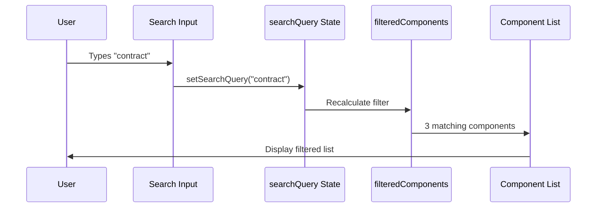

### Form with Multiple Fields

```tsx
function WorkflowSettingsForm() {
  const [settings, setSettings] = useState({
    name: '',
    description: '',
    isPublic: false,
    timeout: 30
  });

  const handleChange = (e) => {
    const { name, value, type, checked } = e.target;
    setSettings({
      ...settings,
      [name]: type === 'checkbox' ? checked : value
    });
  };

  const handleSubmit = (e) => {
    e.preventDefault();  // Prevent page reload
    console.log('Saving settings:', settings);
    // API call would go here
  };

  return (
    <form onSubmit={handleSubmit}>
      <input
        name="name"
        value={settings.name}
        onChange={handleChange}
        placeholder="Workflow Name"
      />

      <textarea
        name="description"
        value={settings.description}
        onChange={handleChange}
        placeholder="Description"
      />

      <label>
        <input
          name="isPublic"
          type="checkbox"
          checked={settings.isPublic}
          onChange={handleChange}
        />
        Make Public
      </label>

      <input
        name="timeout"
        type="number"
        value={settings.timeout}
        onChange={handleChange}
      />

      <button type="submit">Save</button>
    </form>
  );
}
```

---

## Component Composition

Build complex UIs by combining simple components together.

### Children Prop

The special `children` prop represents whatever is between the opening and closing tags:

```tsx
function Card({ children }) {
  return (
    <div className="card border rounded-lg p-4">
      {children}
    </div>
  );
}

// Usage
<Card>
  <h2>Title</h2>
  <p>Some content goes here</p>
</Card>
```

### Real Example: Card Components in JurisAI

From `frontend/src/components/ui/card.tsx`:

```tsx
function Card({ className, children, ...props }) {
  return (
    <div
      className={cn(
        "rounded-xl border bg-card text-card-foreground shadow",
        className
      )}
      {...props}
    >
      {children}
    </div>
  );
}

function CardHeader({ className, children, ...props }) {
  return (
    <div className={cn("flex flex-col space-y-1.5 p-6", className)} {...props}>
      {children}
    </div>
  );
}

function CardTitle({ className, children, ...props }) {
  return (
    <h3 className={cn("font-semibold leading-none tracking-tight", className)} {...props}>
      {children}
    </h3>
  );
}

function CardContent({ className, children, ...props }) {
  return (
    <div className={cn("p-6 pt-0", className)} {...props}>
      {children}
    </div>
  );
}
```

**Usage:**

```tsx
<Card>
  <CardHeader>
    <CardTitle>Contract Review Workflow</CardTitle>
    <CardDescription>Automated contract analysis</CardDescription>
  </CardHeader>
  <CardContent>
    <p>12 nodes, last modified 2 hours ago</p>
  </CardContent>
</Card>
```

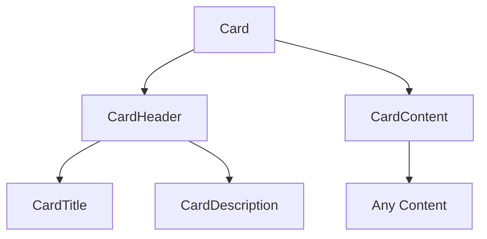

### Compound Components Pattern

Components designed to work together:

```tsx
// Tabs compound component pattern
<Tabs defaultValue="overview">
  <TabsList>
    <TabsTrigger value="overview">Overview</TabsTrigger>
    <TabsTrigger value="settings">Settings</TabsTrigger>
    <TabsTrigger value="analytics">Analytics</TabsTrigger>
  </TabsList>
  <TabsContent value="overview">
    <OverviewPanel />
  </TabsContent>
  <TabsContent value="settings">
    <SettingsPanel />
  </TabsContent>
  <TabsContent value="analytics">
    <AnalyticsPanel />
  </TabsContent>
</Tabs>
```

---

## The useEffect Hook

`useEffect` lets you perform "side effects" - operations that happen outside of rendering, like:
- Fetching data from an API
- Setting up subscriptions
- Manually changing the DOM
- Setting timers

### Basic Syntax

```tsx
import { useState, useEffect } from 'react';

function DataFetcher() {
  const [data, setData] = useState(null);

  useEffect(() => {
    // This code runs AFTER the component renders
    fetch('/api/data')
      .then(response => response.json())
      .then(data => setData(data));
  }, []); // Empty array = run only once, on mount

  return <div>{data ? data.message : 'Loading...'}</div>;
}
```

### Dependency Array

The second argument controls when the effect runs:

```tsx
// Runs after EVERY render
useEffect(() => {
  console.log('Rendered!');
});

// Runs ONCE after initial render
useEffect(() => {
  console.log('Component mounted!');
}, []);

// Runs when 'count' changes
useEffect(() => {
  console.log('Count changed to:', count);
}, [count]);

// Runs when 'userId' OR 'page' changes
useEffect(() => {
  fetchUserData(userId, page);
}, [userId, page]);
```

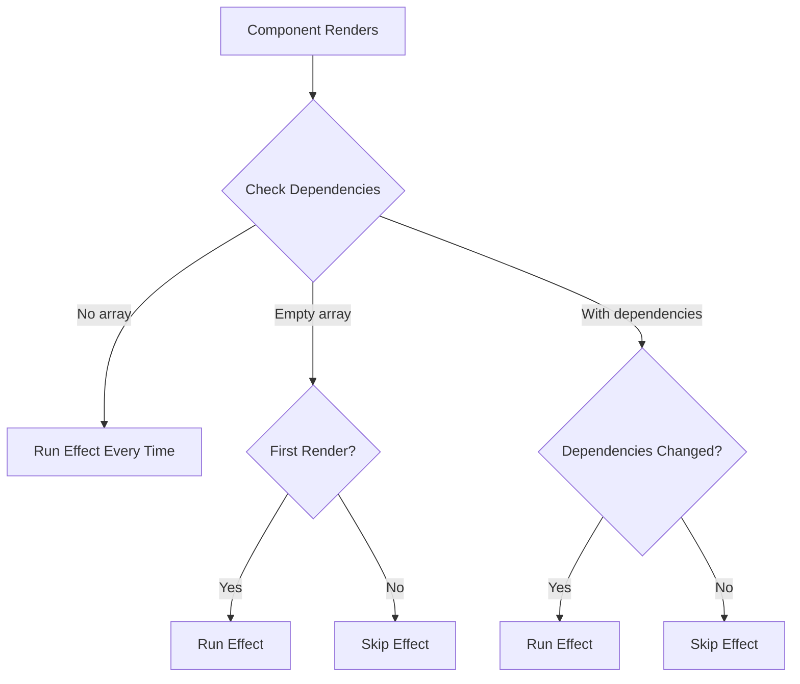

### Real Example: Theme Effect

From JurisAI's `use-theme.tsx`:

```tsx
function ThemeProvider({ children }) {
  const [theme, setTheme] = useState(() => {
    // Initialize from localStorage
    return localStorage.getItem('jurisai-theme') || 'slate-professional';
  });

  // Effect runs whenever theme changes
  useEffect(() => {
    // Update the document's data-theme attribute
    document.documentElement.setAttribute('data-theme', theme);
    // Persist to localStorage
    localStorage.setItem('jurisai-theme', theme);
  }, [theme]);

  return (
    <ThemeContext.Provider value={{ theme, setTheme }}>
      {children}
    </ThemeContext.Provider>
  );
}
```

### Cleanup Function

Effects can return a cleanup function that runs before the next effect or when component unmounts:

```tsx
function Timer() {
  const [seconds, setSeconds] = useState(0);

  useEffect(() => {
    // Set up interval
    const intervalId = setInterval(() => {
      setSeconds(s => s + 1);
    }, 1000);

    // Cleanup function - runs when component unmounts
    return () => {
      clearInterval(intervalId);
    };
  }, []);

  return <p>Seconds: {seconds}</p>;
}
```

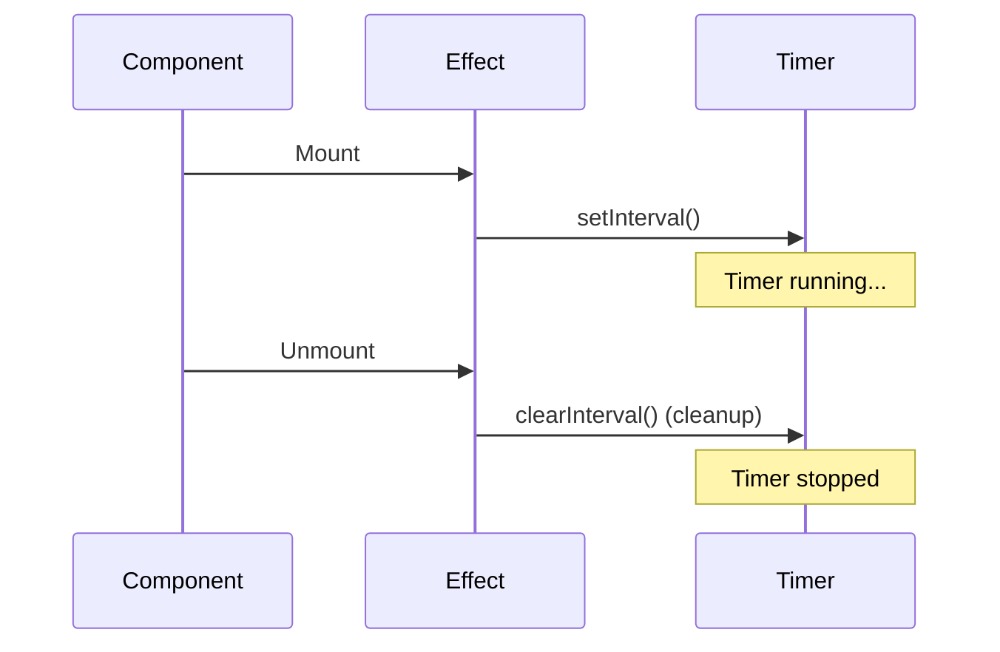

### Data Fetching Tips

When fetching data inside `useEffect`, handle unmounts to avoid setting state after a component is gone:

```tsx
useEffect(() => {
  let isActive = true;

  fetch('/api/data')
    .then(res => res.json())
    .then(data => {
      if (isActive) setData(data);
    });

  return () => {
    isActive = false;
  };
}, []);
```

This pattern prevents "state update on unmounted component" warnings.

---

## Lifting State Up

When multiple components need to share state, "lift" it to their closest common ancestor.

### The Problem

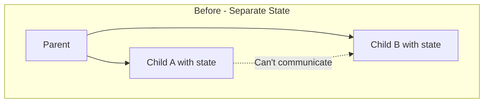

### The Solution

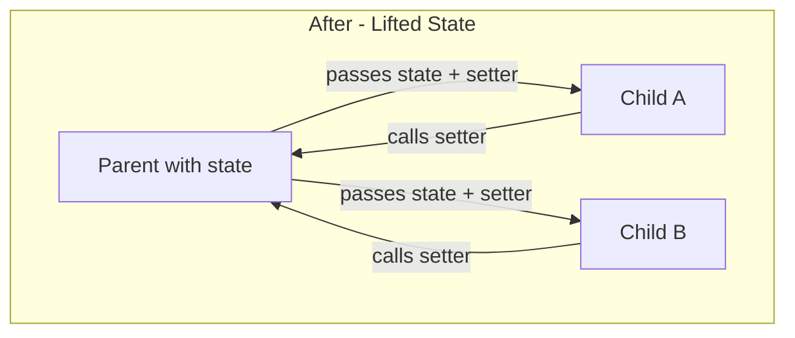

### Real Example: Sidebar Selection in AppShell

```tsx
// Parent component holds the state
function AppShell() {
  const [selectedWorkflow, setSelectedWorkflow] = useState(null);

  return (
    <div className="app-shell">
      {/* Sidebar receives state and setter */}
      <Sidebar
        selectedWorkflow={selectedWorkflow}
        onSelectWorkflow={setSelectedWorkflow}
      />

      {/* Main content also receives state */}
      <main>
        <WorkflowEditor workflow={selectedWorkflow} />
      </main>
    </div>
  );
}

function Sidebar({ selectedWorkflow, onSelectWorkflow }) {
  const workflows = [...]; // list of workflows

  return (
    <nav>
      {workflows.map(wf => (
        <button
          key={wf.id}
          className={selectedWorkflow?.id === wf.id ? 'active' : ''}
          onClick={() => onSelectWorkflow(wf)}
        >
          {wf.name}
        </button>
      ))}
    </nav>
  );
}

function WorkflowEditor({ workflow }) {
  if (!workflow) {
    return <p>Select a workflow</p>;
  }

  return (
    <div>
      <h1>{workflow.name}</h1>
      {/* Editor content */}
    </div>
  );
}
```

---

## Styling with Tailwind CSS

JurisAI uses **Tailwind CSS** - a utility-first CSS framework where you apply small, single-purpose classes.

### Traditional CSS vs Tailwind

```css
/* Traditional CSS */
.button {
  background-color: blue;
  color: white;
  padding: 8px 16px;
  border-radius: 4px;
  font-weight: bold;
}
```

```tsx
{/* Tailwind CSS - classes directly on element */}
<button className="bg-blue-500 text-white px-4 py-2 rounded font-bold">
  Click Me
</button>
```

### Common Tailwind Classes

| Category | Examples |
|----------|----------|
| **Spacing** | `p-4` (padding), `m-2` (margin), `px-4` (horizontal padding) |
| **Sizing** | `w-full` (width), `h-64` (height), `max-w-md` |
| **Colors** | `bg-blue-500`, `text-white`, `border-gray-300` |
| **Flexbox** | `flex`, `items-center`, `justify-between`, `gap-4` |
| **Grid** | `grid`, `grid-cols-3`, `col-span-2` |
| **Typography** | `text-xl`, `font-bold`, `text-center` |
| **Borders** | `border`, `rounded-lg`, `border-2` |
| **Effects** | `shadow-lg`, `opacity-50`, `blur-sm` |

### Real Example: Button Component

From JurisAI's `frontend/src/components/ui/button.tsx`:

```tsx
import { cva } from 'class-variance-authority';

// cva creates variant-based class combinations
const buttonVariants = cva(
  // Base classes applied to all buttons
  "inline-flex items-center justify-center rounded-md text-sm font-medium transition-colors",
  {
    variants: {
      variant: {
        default: "bg-primary text-primary-foreground hover:bg-primary/90",
        destructive: "bg-destructive text-destructive-foreground hover:bg-destructive/90",
        outline: "border border-input bg-background hover:bg-accent",
        secondary: "bg-secondary text-secondary-foreground hover:bg-secondary/80",
        ghost: "hover:bg-accent hover:text-accent-foreground",
        link: "text-primary underline-offset-4 hover:underline",
      },
      size: {
        default: "h-10 px-4 py-2",
        sm: "h-9 rounded-md px-3",
        lg: "h-11 rounded-md px-8",
        icon: "h-10 w-10",
      },
    },
    defaultVariants: {
      variant: "default",
      size: "default",
    },
  }
);

function Button({ className, variant, size, ...props }) {
  return (
    <button
      className={cn(buttonVariants({ variant, size }), className)}
      {...props}
    />
  );
}
```

**Usage:**

```tsx
<Button>Default Button</Button>
<Button variant="destructive">Delete</Button>
<Button variant="outline" size="sm">Small Outline</Button>
<Button variant="ghost" size="icon"><Settings /></Button>
```

### The cn() Utility

JurisAI uses `cn()` to merge classes conditionally:

```tsx
// From frontend/src/lib/utils.ts
import { clsx } from 'clsx';
import { twMerge } from 'tailwind-merge';

export function cn(...inputs) {
  return twMerge(clsx(inputs));
}
```

**Usage:**

```tsx
<div className={cn(
  "base-class",
  isActive && "active-class",
  isError ? "error-class" : "normal-class",
  className // Allow overrides from props
)}>
```

---

## React Router - Navigation

JurisAI uses **React Router** for client-side navigation without page reloads.

### Basic Setup

From JurisAI's `App.tsx`:

```tsx
import { BrowserRouter, Routes, Route } from 'react-router-dom';

function App() {
  return (
    <BrowserRouter>
      <Routes>
        {/* Routes with shared layout */}
        <Route path="/" element={<AppShell />}>
          <Route index element={<Dashboard />} />
          <Route path="workflows" element={<WorkflowList />} />
          <Route path="workflows/:id" element={<WorkflowEditor />} />
          <Route path="studio" element={<Studio />} />
          <Route path="studio/:id" element={<Studio />} />
          <Route path="components" element={<ComponentLibrary />} />
          <Route path="settings" element={<WorkflowSettings />} />
        </Route>
      </Routes>
    </BrowserRouter>
  );
}
```

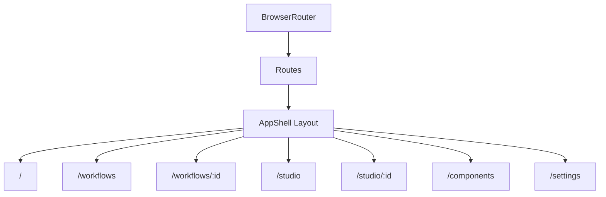

### Navigation with Link

```tsx
import { Link } from 'react-router-dom';

function Sidebar() {
  return (
    <nav>
      <Link to="/">Dashboard</Link>
      <Link to="/workflows">Workflows</Link>
      <Link to="/studio">Studio</Link>
      <Link to="/settings">Settings</Link>
    </nav>
  );
}
```

### URL Parameters

Access dynamic parts of the URL:

```tsx
import { useParams } from 'react-router-dom';

function WorkflowEditor() {
  // If URL is /workflows/123, id will be "123"
  const { id } = useParams();

  return (
    <div>
      <h1>Editing Workflow: {id}</h1>
    </div>
  );
}
```

### Programmatic Navigation

Navigate from code (not user clicking a link):

```tsx
import { useNavigate } from 'react-router-dom';

function CreateWorkflowButton() {
  const navigate = useNavigate();

  const handleCreate = async () => {
    const newWorkflow = await createWorkflow();
    // Navigate to the new workflow's page
    navigate(`/workflows/${newWorkflow.id}`);
  };

  return (
    <button onClick={handleCreate}>
      Create Workflow
    </button>
  );
}
```

### Outlet for Nested Routes

The `<Outlet />` component renders child routes:

```tsx
function AppShell() {
  return (
    <div className="flex">
      <Sidebar />
      <main className="flex-1">
        {/* Child routes render here */}
        <Outlet />
      </main>
    </div>
  );
}
```

---

## TypeScript with React

JurisAI uses TypeScript for type safety. Here's what you need to know.

### Typing Props

```tsx
// Define a type for your props
type ButtonProps = {
  variant: 'primary' | 'secondary' | 'danger';
  size?: 'sm' | 'md' | 'lg';  // ? means optional
  children: React.ReactNode;
  onClick?: () => void;
};

function Button({ variant, size = 'md', children, onClick }: ButtonProps) {
  return (
    <button className={`btn-${variant} btn-${size}`} onClick={onClick}>
      {children}
    </button>
  );
}
```

### Typing State

```tsx
// TypeScript infers the type from initial value
const [count, setCount] = useState(0);  // number

// Explicitly type when needed
const [user, setUser] = useState<User | null>(null);

// Type for complex objects
type Workflow = {
  id: string;
  name: string;
  nodes: WorkflowNode[];
};

const [workflow, setWorkflow] = useState<Workflow | null>(null);
```

### Real Example: Component Definition Type

From JurisAI's `mock-data/components.ts`:

```tsx
// Define types for component definitions
type ComponentPort = {
  name: string;
  type: string;
  required?: boolean;
};

type ComponentDefinition = {
  id: string;
  name: string;
  category: string;
  description: string;
  icon: string;
  color: string;
  inputs: ComponentPort[];
  outputs: ComponentPort[];
  isAI?: boolean;
};

// Now TypeScript will catch errors!
const components: ComponentDefinition[] = [
  {
    id: 'contract-analyzer',
    name: 'Contract Analyzer',
    category: 'Legal / Analysis',
    description: 'AI-powered contract analysis',
    icon: 'FileSearch',
    color: 'blue',
    inputs: [{ name: 'document', type: 'file', required: true }],
    outputs: [{ name: 'analysis', type: 'json' }],
    isAI: true,
  },
  // ... more components
];
```

### Event Types

```tsx
function SearchInput() {
  // Type the event parameter
  const handleChange = (e: React.ChangeEvent<HTMLInputElement>) => {
    console.log(e.target.value);
  };

  const handleSubmit = (e: React.FormEvent<HTMLFormElement>) => {
    e.preventDefault();
  };

  const handleClick = (e: React.MouseEvent<HTMLButtonElement>) => {
    console.log('Button clicked');
  };

  return (
    <form onSubmit={handleSubmit}>
      <input onChange={handleChange} />
      <button onClick={handleClick}>Search</button>
    </form>
  );
}
```

---

## Dynamic UI Patterns

Dynamic UIs respond to user actions, network status, and data changes. These patterns are common in real apps:

### Loading / Error / Empty States

```tsx
function ResultsPanel({ isLoading, error, results }) {
  if (isLoading) return <Spinner />;
  if (error) return <ErrorMessage message={error} />;
  if (!results.length) return <p>No results found.</p>;
  return <ResultsList results={results} />;
}
```

### Optimistic UI

Show an update immediately while a server request is in flight:

```tsx
const handleStar = async () => {
  setIsStarred(true); // optimistic
  try {
    await api.starWorkflow(id);
  } catch {
    setIsStarred(false); // revert on error
  }
};
```

### Debounced Search

Use a debounced value to avoid firing on every keystroke:

```tsx
const debouncedQuery = useDebounce(query, 300);
useEffect(() => {
  if (debouncedQuery) fetchResults(debouncedQuery);
}, [debouncedQuery]);
```

---

## Responsive UI with Tailwind

Use breakpoint prefixes to adapt layouts:

```tsx
<div className="grid grid-cols-1 gap-4 md:grid-cols-2 xl:grid-cols-4">
  {/* cards */}
</div>
```

### Responsive Navigation

```tsx
function Header() {
  return (
    <header className="flex items-center justify-between px-4 py-3">
      <h1 className="text-lg font-semibold">JurisAI</h1>
      <nav className="hidden gap-4 md:flex">
        <a href="/workflows">Workflows</a>
        <a href="/studio">Studio</a>
        <a href="/settings">Settings</a>
      </nav>
      <button className="md:hidden">Menu</button>
    </header>
  );
}
```

---

## Accessibility Basics

Small changes make your app easier to use:
- Use semantic elements (`<button>`, `<label>`, `<nav>`).
- Add `aria-label` for icon-only buttons.
- Associate inputs with labels.
- Ensure focus styles remain visible.

```tsx
<label htmlFor="search">Search</label>
<input id="search" type="text" />

<button aria-label="Open settings">
  <SettingsIcon />
</button>
```

---

## Common Pitfalls

1. **Mutating state**: always create new arrays/objects.
2. **Missing keys**: add a stable `key` when rendering lists.
3. **Effects with wrong deps**: stale data or too many re-renders.
4. **Derived state**: compute in render when possible.
5. **Inline objects/functions**: can cause child re-renders; use `useMemo`/`useCallback` if needed.

---

## Summary

You've now learned the core concepts of React:

| Concept | Purpose |
|---------|---------|
| **useState** | Add memory/state to components |
| **Conditional Rendering** | Show different UI based on conditions |
| **Controlled Components** | Manage form inputs with state |
| **Component Composition** | Build complex UIs from simple parts |
| **useEffect** | Perform side effects (data fetching, subscriptions) |
| **Lifting State** | Share state between sibling components |
| **Tailwind CSS** | Style components with utility classes |
| **React Router** | Handle navigation and routing |
| **TypeScript** | Add type safety to your components |

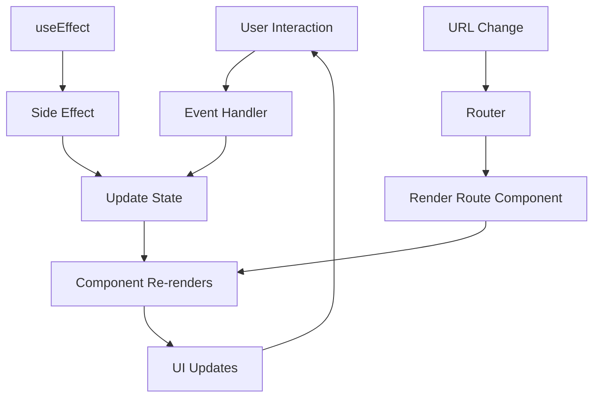

## What's Next?

In the advanced tutorial (**React-ADVANCED.md**), you'll learn:

- **Context API** - Global state management
- **Custom Hooks** - Reusable logic
- **useCallback & useMemo** - Performance optimization
- **useRef** - DOM references and mutable values
- **React Flow Integration** - Building visual workflow editors
- **Advanced Patterns** - Compound components, render props, HOCs
- **Error Boundaries** - Graceful error handling

---

## Quick Reference

### useState

```tsx
const [value, setValue] = useState(initialValue);
```

### useEffect

```tsx
useEffect(() => {
  // Effect code
  return () => {
    // Cleanup code
  };
}, [dependencies]);
```

### Conditional Rendering

```tsx
{condition && <Component />}
{condition ? <A /> : <B />}
```

### Controlled Input

```tsx
<input value={state} onChange={(e) => setState(e.target.value)} />
```

### React Router

```tsx
<Route path="/users/:id" element={<UserProfile />} />
const { id } = useParams();
const navigate = useNavigate();
```

---

*Continue to [React-ADVANCED.md](./React-ADVANCED.md) for advanced concepts!*
