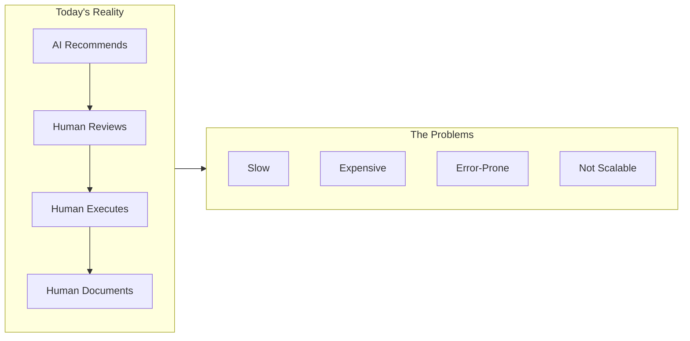
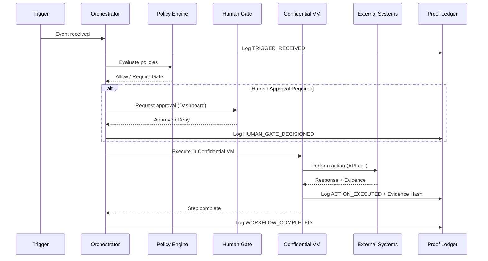
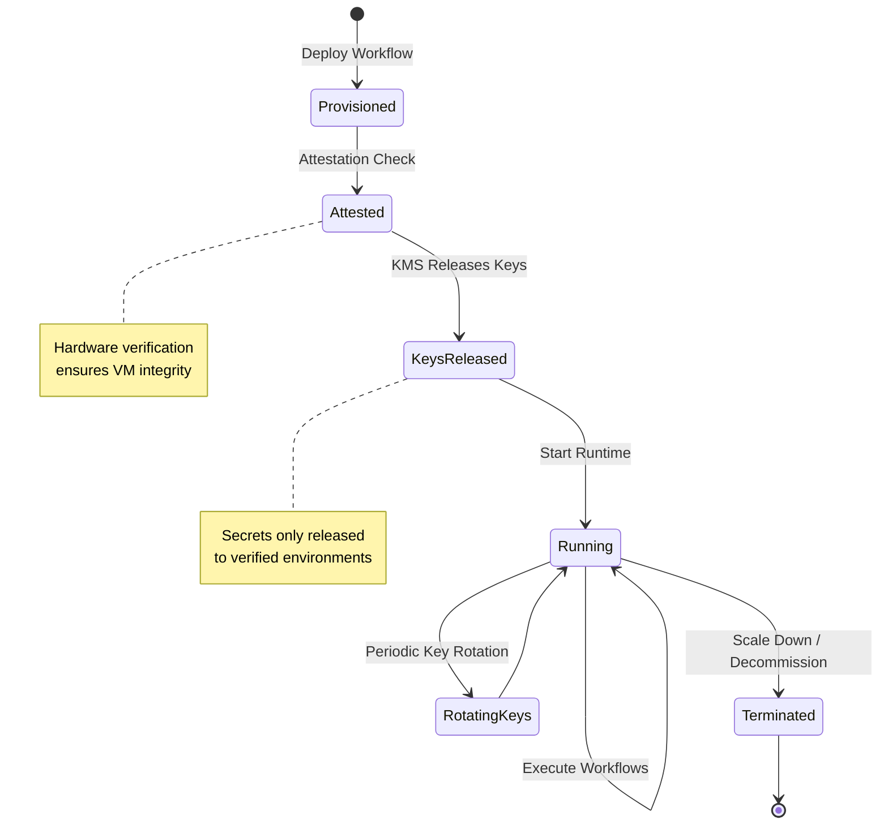
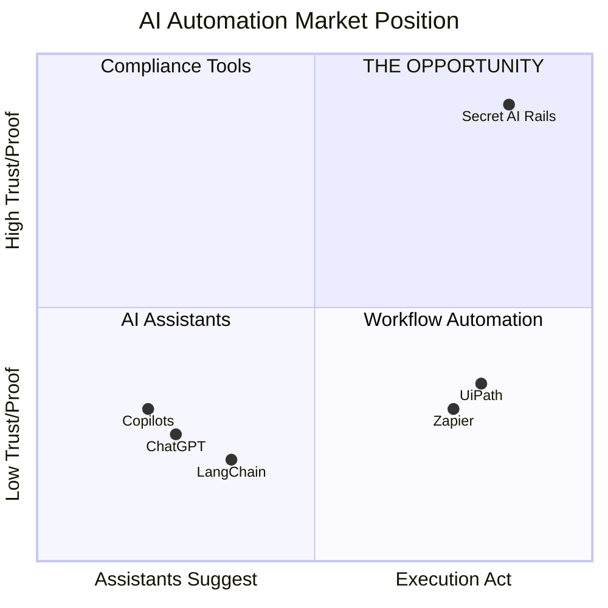

# Secret AI Rails

## The Execution Layer for AI That Enterprises Can Trust

---

## Executive Summary

**Secret AI Rails is the infrastructure that allows AI to act — not just assist.**

We are building the execution layer that enables businesses to deploy AI automation with three non-negotiable guarantees:

1. **Trust** — Every AI action is policy-governed and controlled
2. **Proof** — Every action is verifiable, auditable, and cryptographically proven
3. **Confidentiality** — Data is protected even while being processed

Unlike AI copilots that stop at suggestions, Secret AI Rails enables AI to **execute real business operations** — sending communications, processing documents, updating systems, making decisions — inside a controlled, verifiable, and confidential runtime.

> **"Trust — not intelligence — is the bottleneck to AI adoption. We remove that bottleneck."**

---

## The Problem We Solve

### AI Can Think, But Enterprises Won't Let It Act

Modern AI is capable of reasoning, drafting, and deciding. Yet enterprises still do not let AI **execute**.

**Why?**

| Barrier | Impact |
|---------|--------|
| AI actions cannot be trusted | Humans must review everything |
| No proof that actions occurred correctly | Compliance and audit impossible |
| Errors are costly and risky | Conservative, manual processes remain |
| Data confidentiality not guaranteed | Sensitive workflows excluded from AI |

**The Result:**
- Humans remain in the execution loop
- AI adoption stalls at "assistive" use cases
- Operational costs stay high
- AI ROI remains unrealized

---

## Our Solution: Secret AI Rails

### The Missing Layer Between AI Reasoning and Business Outcomes

```mermaid
flowchart TB
    subgraph Input["Triggers"]
        E1[Email Received]
        E2[Slack Message]
        E3[Document Uploaded]
        E4[API Request]
    end

    subgraph Rails["Secret AI Rails"]
        direction TB
        Policy[Policy Engine<br/>Thresholds & Gates]
        AI[AI Reasoning<br/>Classify, Extract, Decide]
        Exec[Confidential Execution<br/>Encrypted VM Runtime]
        Proof[Proof Ledger<br/>Append-Only Record]
    end

    subgraph Output["Outcomes"]
        O1[Email Sent]
        O2[Ticket Created]
        O3[Document Processed]
        O4[System Updated]
    end

    Input --> Policy
    Policy --> AI
    AI --> Exec
    Exec --> Proof
    Exec --> Output

    style Rails fill:#1a1a2e,stroke:#00d4ff,stroke-width:2px
    style Exec fill:#0d7377,stroke:#14ffec,stroke-width:2px
    style Proof fill:#212121,stroke:#00d4ff,stroke-width:2px
```

### What Secret AI Rails Does

| Capability | Description |
|------------|-------------|
| **Policy Enforcement** | Define what AI can and cannot do. Set thresholds, require approvals, enforce compliance rules. |
| **Confidential Execution** | Every workflow runs in its own encrypted VM. Data protected in memory, in storage, everywhere. |
| **Proof Generation** | Every action produces cryptographic proof — what happened, when, why, and who authorized it. |
| **Human Gates** | Insert approval checkpoints for high-risk actions. AI proposes, humans approve when needed. |
| **Audit Trail** | Complete, tamper-evident record of all AI actions. Export for compliance, replay for debugging. |

### The Mental Model

> **AI decides *what* to do. Secret AI Rails controls *whether*, *how*, and *with what proof* it happens.**

---

## Why We Are Uniquely Positioned

### We Already Own the Infrastructure

We are not starting from zero. We operate a **production confidential cloud platform** today.

```mermaid
flowchart TB
    subgraph Existing["What We Have Today (Production)"]
        Portal[Web Portal<br/>AWS/Azure-like Experience]
        CVM[Confidential VMs<br/>Intel TDX / AMD SEV]
        GPU[NVIDIA H100 CC<br/>Confidential GPU]
        KMS[Blockchain KMS<br/>Attestation-Gated Keys]
        Customers[Production Customers<br/>Docker Compose Deployments]
    end

    subgraph New["What We're Adding (AI Rails)"]
        Studio[Workflow Studio<br/>Visual Builder]
        Components[Component Packs<br/>Email, Slack, Voice, etc.]
        Dashboard[Operations Dashboard<br/>Approvals & Audit]
        Ledger[Proof-of-Work Ledger<br/>Cryptographic Evidence]
        PolicyEng[Policy Engine<br/>Gates & Thresholds]
    end

    Existing --> New

    style Existing fill:#1a1a2e,stroke:#00d4ff,stroke-width:2px
    style New fill:#0d7377,stroke:#14ffec,stroke-width:2px
```

### The Vertical Integration Advantage

| Layer | Our Position | Competitors |
|-------|--------------|-------------|
| **Infrastructure** | ✅ Owned — our portal, our hardware | Rent from AWS/Azure/GCP |
| **Confidential Compute** | ✅ Native — TDX, SEV, H100 CC expertise | Bolted on, if available at all |
| **Key Management** | ✅ Blockchain KMS — attestation-gated | Third-party dependency |
| **AI Execution** | ✅ Secret AI Rails — building now | Non-existent |
| **Proof Layer** | ✅ Native ledger — our expertise | Non-existent or afterthought |

**We control the entire trust chain. No third-party dependencies. No margin leakage.**

### Technical Moat

| Capability | Competitive Implication |
|------------|------------------------|
| Intel TDX / AMD SEV expertise | 12-18 month head start on competitors |
| NVIDIA H100 Confidential Compute | Ready for GPU inference when others are still figuring out CPU isolation |
| Blockchain-based KMS | Attestation-gated key release is solved — others must build or buy |
| Ledger/proof systems | Audit trail is native to our thinking, not bolted on |

---

## Why NOW Is the Time

### Five Forces Converging

```mermaid
flowchart TB
    subgraph Forces["Market Forces Converging NOW"]
        F1[AI Capability<br/>LLMs can execute operational tasks]
        F2[CC Maturity<br/>TDX/SEV production-ready]
        F3[Market Demand<br/>Copilot fatigue, want execution]
        F4[Cost Pressure<br/>CFOs want AI to replace, not assist]
        F5[Regulation<br/>Auditability becoming mandatory]
    end

    Forces --> Window[Optimal Window<br/>2025-2026]
    Window --> Opportunity[Category Definition<br/>Opportunity]

    style Window fill:#0d7377,stroke:#14ffec,stroke-width:3px
    style Opportunity fill:#1a1a2e,stroke:#00d4ff,stroke-width:2px
```

### The Timing Analysis

| Factor | Status | Implication |
|--------|--------|-------------|
| **AI Capability** | LLMs reliably execute operational tasks | "Can AI do this?" is answered |
| **Confidential Compute** | TDX/SEV/H100 CC production-ready | Infrastructure to build trusted execution exists |
| **Enterprise Sentiment** | Copilot fatigue setting in | Buyers want AI that **acts**, not just suggests |
| **Economic Pressure** | Efficiency mandates, headcount pressure | CFOs asking "where can AI replace work?" |
| **Regulatory Environment** | EU AI Act, SEC guidance, industry rules | Auditability shifting from optional to mandatory |

### Why Not Wait?

- Hyperscalers will eventually build this (they're slow, but they'll come)
- Category definition happens now — latecomers become "also-rans"
- Our infrastructure advantage compounds with time — but only if we move
- First-mover in "trusted AI execution" can own the category

---

## The Platform Architecture

### Three Planes of Operation

```mermaid
flowchart TB
    subgraph Build["BUILD PLANE"]
        Studio[Workflow Studio<br/>AI-Assisted Visual Designer]
        Packs[Component Packs<br/>Domain Capabilities]
        Registry[Workflow Registry<br/>Versioned Artifacts]
    end

    subgraph Operate["OPERATE PLANE"]
        Dash[Dashboard<br/>Status & Metrics]
        Policy[Policy Configuration<br/>Thresholds & Gates]
        Audit[Audit Explorer<br/>Proofs & Evidence]
        Alerts[Alerts & SLOs<br/>Monitoring]
    end

    subgraph Execute["EXECUTE PLANE"]
        Orch[Workflow Orchestrator]
        subgraph CC["Confidential Computing Layer"]
            CVM[Per-Workflow CVM<br/>Encrypted Memory & Disk]
            GPU[H100 Confidential GPU<br/>When Needed]
            Ledger[Proof-of-Work Ledger<br/>Append-Only]
        end
        Conn[Connector Runtime<br/>Integrations]
        Keys[Key Management<br/>Attestation-Gated]
    end

    Studio --> Packs
    Studio --> Registry
    Dash --> Policy
    Dash --> Audit
    Dash --> Alerts

    Registry --> Orch
    Policy --> Orch
    Orch --> CVM
    CVM --> Ledger
    CVM --> Conn
    CVM --> GPU
    CVM --> Keys
    Audit --> Ledger

    style Build fill:#2d3436,stroke:#00d4ff,stroke-width:2px
    style Operate fill:#2d3436,stroke:#00d4ff,stroke-width:2px
    style Execute fill:#1a1a2e,stroke:#14ffec,stroke-width:2px
    style CC fill:#0d7377,stroke:#14ffec,stroke-width:2px
```

### Workflow Execution Model

### Confidential VM Lifecycle

---

## V1 Product Scope

### Target Use Case

**Trusted business communications automation** — starting with email, messaging, and customer-facing workflows.

### Platform Core (Must Ship)

| Area | Components |
|------|------------|
| **Build** | Basic workflow studio, visual graph editor, compiler, versioning |
| **Execute** | Confidential VM runtime (CPU-only initially), proof ledger, policy engine |
| **Operate** | Dashboard with status, approvals, and audit views |
| **Trust** | Attestation-gated KMS, encrypted storage, idempotency framework, evidence hashing |

### V1 Component Pack

| Component | Capabilities |
|-----------|--------------|
| **Email Automation** | Classify intent, extract fields, draft response, send with verification |
| **Slack Integration** | Handle requests, approvals in-channel, notifications |
| **Web Search** | Factual lookup, citation capture |
| **Social Sentiment** | Monitor mentions, analyze sentiment, alert on issues |
| **Product Q&A Bot** | Knowledge-grounded answers, escalation gates |
| **Scheduler** | Calendar coordination, booking automation |
| **Voice (Basic)** | STT transcription, intent detection, escalation |

### Explicitly NOT in V1

- GPU-dependent large-scale inference
- Fully autonomous financial transactions
- Open-ended agent tool use
- Third-party component marketplace

---

## Business Value Proposition

### Quantifiable Outcomes

| Metric | Without AI Rails | With AI Rails |
|--------|------------------|---------------|
| **Time to Resolution** | Hours/days (human queues) | Seconds/minutes |
| **Cost per Operation** | $5-50 (human labor) | $0.10-1.00 |
| **Availability** | Business hours | 24/7/365 |
| **Error Rate** | 2-5% (human inconsistency) | <1% (deterministic) |
| **Audit Preparation** | Days/weeks (manual) | Minutes (ledger export) |
| **Compliance Risk** | High (undocumented) | Low (100% coverage) |

### Value by Stakeholder

| Stakeholder | Value Delivered |
|-------------|-----------------|
| **Operations** | Remove humans from execution paths. 24/7 automation. |
| **Finance** | Reduce cost per operation. Predictable, scalable costs. |
| **Compliance** | Audit-ready from day one. Cryptographic proof of all actions. |
| **Security** | Data never leaves confidential environment. Zero-trust by design. |
| **IT** | Managed infrastructure. No ML expertise required. |
| **Executive** | Actual AI ROI. Competitive advantage through automation. |

---

## Competitive Positioning

### Market Landscape

### Competitive Analysis

| Competitor Type | What They Offer | What We Offer |
|-----------------|-----------------|---------------|
| **Hyperscalers** (AWS, Azure, GCP) | General cloud + fragmented AI services | Integrated confidential AI execution platform |
| **AI Platforms** (OpenAI, Anthropic) | Models via API, no execution layer | Complete execution infrastructure, model-agnostic |
| **Workflow Tools** (Zapier, n8n) | Automation without trust guarantees | Automation with proof, policy, confidentiality |
| **RPA** (UiPath, Automation Anywhere) | Legacy automation, not AI-native | AI-native, confidential, auditable |
| **Agent Frameworks** (LangChain, CrewAI) | Developer tools, no runtime | Production runtime with trust guarantees |

### Why We Win

| Dimension | Our Advantage |
|-----------|---------------|
| **Integration** | Only platform combining execution + trust + proof + confidentiality |
| **Infrastructure** | We own the stack — no dependencies, no margin leakage |
| **Expertise** | Deep CC experience (TDX/SEV/H100) others don't have |
| **Focus** | Purpose-built for trusted AI execution, not retrofitted |
| **Timing** | Production platform ready, category is undefined |

---

## Go-to-Market Strategy

### Phase 1: Prove (Current → 6 months)

**Goal**: Prove AI can safely replace humans in execution

- 2-3 SMB pilots on trusted communications automation
- MIT pilot partnership
- Establish success metrics and case studies
- Refine v1 component pack based on real usage

### Phase 2: Expand (6-18 months)

**Goal**: Horizontal expansion across workflows and customers

- Additional workflow types (document processing, customer ops)
- Expand customer base (SMB → mid-market)
- Add component packs (legal, finance, IT ops)
- Self-serve onboarding for standard use cases

### Phase 3: Platform (18+ months)

**Goal**: Become the default execution layer for enterprise AI

- Enterprise sales motion
- Partner ecosystem (SI, ISV integrations)
- Component marketplace
- Cross-industry expansion

### Target Customers

| Segment | Why They Buy | Entry Point |
|---------|--------------|-------------|
| **SMBs** | Need automation, can't afford complexity | Pre-built templates, self-serve |
| **Regulated SMBs** | Serve enterprise customers, need compliance | Audit-ready automation |
| **Mid-Market** | Cost pressure, scaling operations | Department-level automation |
| **Enterprise** | Compliance mandate, AI governance | Platform for AI operations |

---

## Revenue Model

### Pricing Dimensions

| Dimension | Model |
|-----------|-------|
| **Infrastructure** | Compute usage (VM hours, storage) |
| **Execution** | Workflow runs, API calls |
| **Platform** | Tier-based access to Studio, Dashboard, Components |

### Tier Structure (Conceptual)

| Tier | Includes | Target |
|------|----------|--------|
| **Starter** | VM Portal + 2 workflow templates + basic dashboard | Testing, micro-business |
| **Growth** | Full Studio + core component packs + policy engine | SMB automating operations |
| **Scale** | Everything + custom components + priority support + SLAs | Growing SMB, regulated industries |
| **Enterprise** | Custom deployment, dedicated support, advanced compliance | Mid-market and enterprise |

### Revenue Amplification

Every AI Rails workflow drives additional infrastructure revenue:
- More VM compute hours
- More storage for evidence and logs
- More KMS operations
- Higher customer lifetime value

---

## Risk Analysis & Mitigation

| Risk | Likelihood | Impact | Mitigation |
|------|------------|--------|------------|
| **Engineering Complexity** | Medium | High | Team has proven CC expertise; narrow v1 scope |
| **Sales Cycle Length** | Medium | Medium | Start with SMB (faster cycles); land-and-expand |
| **Hyperscaler Competition** | Medium | High | 18-month head start; vertical integration; category ownership |
| **Scope Creep** | Medium | Medium | Disciplined v1 definition; prove wedge before expanding |
| **Market Timing** | Low | High | Multiple signals confirm timing is right |

---

## The Moat

### Why This Is Defensible

```mermaid
flowchart TB
    subgraph Moat["Compounding Defensibility"]
        Tech[Technical Moat<br/>CC Expertise, Vertical Stack]
        Product[Product Moat<br/>Only Integrated Trust Platform]
        Data[Data Moat<br/>Workflows + Proof Ledgers]
        Switch[Switching Cost<br/>Audit History, Integrations]
        Brand[Brand Moat<br/>Category Definition]
    end

    Tech --> Product
    Product --> Data
    Data --> Switch
    Switch --> Brand
    Brand --> Tech

    style Moat fill:#1a1a2e,stroke:#00d4ff,stroke-width:2px
```

| Moat Type | How It Works |
|-----------|--------------|
| **Technical** | 12-18 months of CC expertise competitors don't have |
| **Product** | Only platform combining execution + trust + proof + confidentiality |
| **Data** | Customer workflows and proof ledgers create lock-in over time |
| **Switching Cost** | Audit trails, compliance history, workflow dependencies |
| **Category** | First to define "trusted AI execution" — we set the terms |

---

## Team Readiness

### Relevant Expertise

| Capability | Team Status |
|------------|-------------|
| Intel TDX / AMD SEV | ✅ Production experience |
| NVIDIA H100 Confidential Compute | ✅ Ready for deployment |
| Encrypted filesystems | ✅ Implemented |
| Blockchain-based KMS | ✅ In production |
| Ledger / proof systems | ✅ Core competency |
| Cloud platform operations | ✅ Currently operating |

### Current Traction

| Asset | Status |
|-------|--------|
| Web portal (VM provisioning) | ✅ Production |
| Confidential VM infrastructure | ✅ Production |
| Production customers | ✅ SMBs deploying Docker apps |
| Pilot commitments | ✅ 2-3 SMBs + MIT connection |

---

## Investment Ask & Use of Funds

### What We Need

| Category | Purpose |
|----------|---------|
| **Engineering** | Build Workflow Studio, policy engine, dashboard, component packs |
| **Infrastructure** | Scale confidential compute capacity for pilot growth |
| **Go-to-Market** | Sales, marketing, customer success for SMB expansion |
| **Operations** | Support, documentation, compliance certifications |

### Milestones

| Milestone | Deliverable |
|-----------|-------------|
| **M1** | V1 platform complete (Studio, Dashboard, Core Components) |
| **M2** | 3-5 paying pilot customers |
| **M3** | First case studies published |
| **M4** | Self-serve onboarding for standard workflows |
| **M5** | 20+ active customers |

---

## The Big Picture

### Where We're Going

```mermaid
flowchart LR
    subgraph Today["TODAY"]
        T1[AI Assists]
        T2[Humans Execute]
        T3[Trust Unclear]
    end

    subgraph Tomorrow["WITH AI RAILS"]
        W1[AI Executes]
        W2[Humans Govern]
        W3[Trust Proven]
    end

    Today -->|Secret AI Rails| Tomorrow

    style Today fill:#2d3436,stroke:#636e72,stroke-width:2px
    style Tomorrow fill:#0d7377,stroke:#14ffec,stroke-width:2px
```

### The Transformation We Enable

| From | To |
|------|-----|
| AI as Assistant | AI as Operator |
| Suggestions | Actions |
| Opaque | Auditable |
| Risky | Trusted |
| Human-in-the-loop | Human-on-the-loop |

---

## Call to Action

### Why Back This Now

1. **The market is ready** — Enterprises hit the trust wall; they want AI that acts
2. **The technology is ready** — Confidential compute is mature; AI is capable
3. **We are ready** — Production platform, proven expertise, pilot customers
4. **The window is open** — Category definition happening now; first-mover advantage is real

### What Success Looks Like

> **"When any business asks 'Can AI do this safely?' — the answer is 'Yes, on Secret AI Rails.'"**

We become the infrastructure layer that allows AI to finally do the work — trusted, proven, and confidential.

---

## Summary

**Secret AI Rails is not about making AI smarter. It's about making AI trusted enough to do the work.**

We have:
- ✅ Production infrastructure (confidential cloud platform)
- ✅ Technical expertise (TDX, SEV, H100 CC, blockchain KMS)
- ✅ Pilot customers ready
- ✅ Clear product vision and disciplined scope
- ✅ Unique market position (only integrated trust + execution platform)

We need:
- Investment to build v1 and scale go-to-market
- Partners who believe AI execution requires trust infrastructure

**The time is now. The team is ready. The platform exists. Let's build the future of trusted AI execution.**

---

> *"AI Rails is the execution layer that allows enterprises to finally let AI do the work."*

---

**Contact**: alex@scrtlabs.com

**Confidential** — For Stakeholder Review Only
