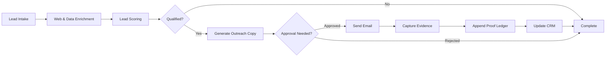

# AI Rails vs. n8n-Style Sales Automation  

# Successful AI Automation Business Cases  
## (Derived from a Real n8n / Node.js / Python Sales Automation Agency)

## Why This Matters

This company, CegTec GmbH Germany, is not hypothetical.  
They are:
- Selling AI automation
- Delivering revenue impact
- Scaling through reusable workflows

This proves:
> **AI automation of outbound and sales ops already works.**  
The remaining gap is **trust, operability, and enterprise-grade guarantees** — which is exactly what AI Rails provides.

---

## Business Case 1: Scalable Outbound Infrastructure for B2B SaaS

### Problem Being Solved
B2B SaaS companies need outbound systems that:
- Scale across thousands of leads
- Personalize messaging
- Coordinate across multiple tools
- Avoid manual execution overhead

### What They Built (Today)
- n8n workflows orchestrating:
  - Lead intake
  - Enrichment
  - Copy generation
  - Campaign enrollment
- API integrations with Clay, HubSpot, Lemlist, Instantly
- Custom glue logic in Node.js / Python

### Business Outcome
- Faster outbound launch
- Higher throughput without adding headcount
- Repeatable GTM infrastructure sold to multiple clients

### AI Rails Justification
AI Rails formalizes this into **trusted outbound workflows** with:
- Deterministic execution
- Idempotent enrollment
- Verifiable send proofs
- Centralized operational control

**Relevant Component Pack:** Outbound / Sales Ops Pack

---

## Business Case 2: Automated Lead Enrichment & Qualification

### Problem Being Solved
Sales teams waste time on:
- Poorly qualified leads
- Manual research
- Inconsistent scoring logic

### What They Built
- Data enrichment pipelines pulling from multiple sources
- AI-based lead scoring
- Qualification logic embedded in workflows

### Business Outcome
- Higher-quality leads entering campaigns
- Improved conversion rates
- Reduced SDR time per lead

### AI Rails Justification
AI Rails improves this with:
- Explainable, auditable scoring decisions
- PII-aware enrichment
- Proof of why a lead was qualified or rejected

**Relevant Component Pack:** Data Enrichment & Scoring Pack

---

## Business Case 3: Personalized Outreach at Scale

### Problem Being Solved
Personalization improves response rates but does not scale manually.

### What They Built
- OpenAI-powered copy generation
- Prompt engineering for tone and structure
- Automated insertion of enrichment data

### Business Outcome
- Personalized emails at scale
- Better engagement vs templates
- Faster campaign iteration

### AI Rails Justification
AI Rails adds:
- Brand and claims guards
- Approval gates for risky messaging
- Evidence of exactly what was sent and why

**Relevant Component Pack:** Content Generation & Brand Safety Pack

---

## Business Case 4: Reply Parsing & Intent Detection

### Problem Being Solved
Inbound replies require fast, correct classification:
- Interested
- Not now
- Unsubscribe
- Objection
- Pricing request

### What They Built
- Webhook handlers
- AI-based reply classification
- Logic to trigger CRM updates and follow-ups

### Business Outcome
- Faster response times
- Reduced manual triage
- Better lead routing

### AI Rails Justification
AI Rails provides:
- Structured intent classification
- Confidence thresholds
- Proof-linked decisions for audit and QA

**Relevant Component Pack:** Reply Intelligence & Routing Pack

---

## Business Case 5: Reliable CRM Synchronization

### Problem Being Solved
CRMs must stay consistent with outbound tools:
- Lead status
- Campaign enrollment
- Reply outcomes

### What They Built
- Custom API integrations
- Sync logic across HubSpot and outreach tools
- Manual fixes when things drift

### Business Outcome
- CRM remains usable as system of record
- Sales teams trust the data (mostly)

### AI Rails Justification
AI Rails guarantees:
- Verifiable CRM mutations
- Rollback on partial failure
- Full lineage of every field change

**Relevant Component Pack:** CRM Execution & Proof Pack

---

## Business Case 6: Multi-Tool Orchestration Without Human Glue

### Problem Being Solved
Outbound flows span:
- Enrichment tools
- CRMs
- Email platforms
- Analytics
- Notifications

### What They Built
- n8n as orchestration glue
- Custom error handling
- Ad hoc retry logic

### Business Outcome
- End-to-end automation
- Reduced manual ops
- Fragility under scale

### AI Rails Justification
AI Rails replaces glue with:
- Deterministic orchestration
- Compensation steps
- Observable, auditable execution

**Relevant Component Pack:** Workflow Orchestration Core Pack

---

## Business Case 7: Rapid Productization of Client-Specific Workflows

### Problem Being Solved
Clients want:
- Custom outbound logic
- Fast iteration
- Reuse across accounts

### What They Built
- Modular workflows
- Reusable components
- Lightweight SaaS tooling

### Business Outcome
- Faster client onboarding
- Higher margins per engagement
- Repeatable delivery model

### AI Rails Justification
AI Rails enables:
- Versioned workflow artifacts
- Controlled rollout
- Policy-safe reuse across tenants

**Relevant Component Pack:** Workflow Studio & Versioning Pack

---

## Business Case 8: Founder-Led Automation Without Specs

### Problem Being Solved
Requirements are often:
- High-level
- Ambiguous
- Iterative

### What They Built
- Systems that tolerate change
- Fast prototyping with AI + workflows

### Business Outcome
- Speed over perfection
- Real-world revenue impact

### AI Rails Justification
AI Rails preserves speed while adding:
- Safety rails
- Observability
- Trust guarantees

**Relevant Component Pack:** AI-Assisted Workflow Design Pack

---

## Summary: What These Business Cases Prove

These use cases prove that:

- AI automation already drives revenue
- Businesses will pay for execution, not demos
- The remaining bottleneck is **trust and operational robustness**

AI Rails exists to turn:
- Working automations → **trusted infrastructure**
- Agency-grade solutions → **enterprise-grade platforms**
- Scripts and workflows → **auditable systems of record**

---

# AI Automation Business Use Cases  
## (Derived from an Agentic Advertising Platform – Message Polly)

## Context: What This Company Actually Does

Message Polly is not building analytics or dashboards.  
They are building **AI systems that directly operate revenue-critical advertising workflows**.

Their AI:
- Manages Meta (Facebook/Instagram) ad campaigns
- Interacts with users via WhatsApp
- Learns from conversations
- Optimizes ROAS automatically
- Executes multi-step decisions continuously

This is **AI as an operator**, not an assistant.

---

## Business Case 1: Autonomous Meta Ads Campaign Management

### Problem Being Solved
Running Meta ad campaigns requires constant:
- Budget adjustments
- Creative testing
- Audience optimization
- Performance monitoring

Manual management does not scale and reacts too slowly.

### What the AI Does
- Monitors campaign performance in real time
- Decides when to adjust bids, budgets, or targeting
- Launches, pauses, or modifies campaigns automatically

### Business Outcome
- Improved ROAS
- Faster reaction to performance changes
- Reduced dependency on human media buyers

### Why This Matters for AI Rails
This is **direct financial execution**:
- Money is being spent
- Decisions must be correct
- Errors are costly

AI Rails provides:
- Deterministic execution of campaign changes
- Proof of what was changed, when, and why
- Policy limits on spend and risk

---

## Business Case 2: Conversation-Driven Ad Optimization (WhatsApp)

### Problem Being Solved
Ads drive conversations, but insights from conversations are rarely fed back into ad optimization.

### What the AI Does
- Engages users via WhatsApp
- Interprets intent, sentiment, objections
- Feeds learnings back into ad targeting and messaging

### Business Outcome
- Higher conversion rates
- Better message-market fit
- Ads improve automatically based on real conversations

### Why This Matters for AI Rails
This creates a **closed execution loop**:
Conversation → Decision → Ad change

AI Rails strengthens this loop with:
- Evidence-backed interpretation of messages
- Auditable reasoning-to-action paths
- Safeguards against misclassification driving spend

---

## Business Case 3: Multi-Agent Orchestration of Advertising Tasks

### Problem Being Solved
Advertising requires coordination across:
- Analytics
- Creative generation
- Audience management
- Messaging
- Budget control

Monolithic systems are brittle.

### What the AI Does
- Decomposes work into multiple agents
- Coordinates state and handoffs
- Executes multi-step workflows continuously

### Business Outcome
- Scalable ad operations
- Faster iteration cycles
- Reduced operational complexity

### Why This Matters for AI Rails
AI Rails provides:
- Structured, versioned workflows instead of ad hoc agent loops
- Deterministic state transitions
- Replayable execution for debugging and audits

---

## Business Case 4: Real-Time Performance Analytics → Action

### Problem Being Solved
Analytics tools show performance but do not act.

### What the AI Does
- Continuously evaluates campaign metrics
- Detects regressions or opportunities
- Takes immediate corrective actions

### Business Outcome
- Lower wasted spend
- Faster optimization
- Always-on performance tuning

### Why This Matters for AI Rails
AI Rails ensures:
- Analytics-driven actions are policy-checked
- Changes are logged and explainable
- Rollbacks are possible if actions degrade performance

---

## Business Case 5: Prompt Engineering at Production Scale

### Problem Being Solved
Prompts that work in testing often fail at scale.

### What the AI Does
- Uses carefully designed prompts for:
  - Decision making
  - Tool calling
  - Message generation
- Continuously refines prompts based on outcomes

### Business Outcome
- Stable AI behavior under real-world load
- Reduced hallucinations and drift

### Why This Matters for AI Rails
AI Rails adds:
- Guardrails around AI outputs
- Structured inputs/outputs
- Enforcement of invariants before execution

---

## Business Case 6: Cost, Latency, and Model Routing Optimization

### Problem Being Solved
Advertising systems must be:
- Fast
- Cheap
- Reliable

Using the wrong model can destroy margins.

### What the AI Does
- Routes tasks across frontier and cheaper models
- Balances latency vs. quality
- Optimizes inference cost

### Business Outcome
- Sustainable unit economics
- Predictable performance

### Why This Matters for AI Rails
AI Rails enables:
- Policy-based model routing
- Cost caps per workflow
- Ledgered cost attribution per action

---

## Business Case 7: Regression Detection & Observability

### Problem Being Solved
Agentic systems fail in subtle, delayed ways.

### What the AI Does
- Uses eval suites to detect behavior regressions
- Monitors agent loops and outcomes
- Surfaces anomalies before customers notice

### Business Outcome
- Fewer production incidents
- Faster recovery
- Higher customer trust

### Why This Matters for AI Rails
AI Rails bakes in:
- Execution observability
- Proof-based debugging
- Replayable workflows for postmortems

---

## Business Case 8: Debugging “Weird Agent Behavior”

### Problem Being Solved
Agents behave unpredictably under edge cases.

### What the AI Does
- Engineers debug agent loops
- Trace state transitions
- Patch logic reactively

### Business Outcome
- System stability
- Reduced firefighting over time

### Why This Matters for AI Rails
AI Rails:
- Makes execution explicit
- Records every decision and action
- Turns “weird behavior” into inspectable facts

---

## Business Case 9: AI That Directly Drives Revenue

### Problem Being Solved
Most AI tools assist humans; they do not own outcomes.

### What the AI Does
- Directly influences ad spend
- Directly affects conversions
- Learns from outcomes

### Business Outcome
- Measurable revenue lift
- Clear ROI attribution to AI actions

### Why This Matters for AI Rails
AI Rails is designed for **outcome ownership**:
- AI actions are first-class business events
- Revenue impact is traceable
- Accountability is built in

---

## Business Case 10: From Dashboard Software to Autonomous Execution

### Problem Being Solved
Dashboards require humans to act.

### What the AI Does
- Eliminates the dashboard
- Replaces it with autonomous decision-making

### Business Outcome
- Fewer operators
- Faster execution
- Lower cognitive load

### Why This Matters for AI Rails
AI Rails is the infrastructure shift that supports:
- AI as operator
- Humans as supervisors
- Execution as a trusted system

---

## Summary: What These Use Cases Prove

This company demonstrates that:

- AI can manage **money-moving systems**
- AI can operate continuously
- AI can outperform human reaction times
- The hard part is not intelligence—it is **execution trust**

---

## Why This Validates AI Rails

Message Polly is building:
- Agentic execution
- Multi-step workflows
- Revenue-critical automation

AI Rails generalizes this into:
- A reusable execution layer
- Verifiable, auditable AI actions
- Enterprise-grade safety and governance

These business cases already exist.  
AI Rails is the infrastructure that lets them scale safely across industries.

---

## One-Line Takeaway

If AI can run ads and conversations,  
it needs rails.

AI Rails is those rails.

---

## Why This Validates AI Rails

This company succeeds **despite**:
- Fragile orchestration
- Limited auditability
- Manual recovery
- Trust gaps

AI Rails succeeds by **designing those problems out**.

The business cases already exist.  
AI Rails is how they scale safely.

---

## Use Cases, Advantages, and a Minimal Outbound v1

This document reframes the job description’s responsibilities into **concrete outbound automation use cases**, explains **why AI Rails solves them better than n8n + Node.js + Python**, and defines a **minimal “Outbound Component Pack”** plus a **v1 workflow** that delivers ROI in 2–4 weeks with verifiable, auditable execution.

---

## 1. What the Company Is Actually Solving Today (with n8n / Node.js / Python)

Based on the job description, the company is building and maintaining a **custom outbound automation stack** that covers:

### A. End-to-End Outbound Sequences
- Select leads
- Enrich data (company, role, tech stack)
- Generate personalized copy
- Enroll leads into email/LinkedIn sequences
- Send follow-ups

### B. Lead Enrichment & Scoring
- Pull data from multiple APIs (Clay-like)
- Normalize and score leads
- Decide which leads qualify for outreach

### C. Reply Parsing & CRM Sync
- Parse inbound replies
- Detect intent (interested, unsubscribe, objection)
- Update CRM records
- Trigger follow-ups or tasks

### D. Copy Generation & Personalization
- Prompt OpenAI for email copy
- Generate variants
- Tune prompts for conversion

### E. Webhooks & Integrations
- Handle inbound webhooks
- Sync state across HubSpot, Lemlist, Instantly, etc.
- Keep systems consistent despite partial failures

### F. Operational Glue
- Retry logic
- Throttling
- Error handling
- Manual fixes when things break

**Key observation:**  
This is not “sales work.”  
This is **execution-heavy, risk-prone automation work** that requires correctness, consistency, and trust.

---

## 2. Why AI Rails Does This Better (10 Core Advantages)

AI Rails is purpose-built for **trusted execution**, which directly addresses the pain points implicit in the role.

### 1. Verified End-to-End Execution
Every outbound workflow produces a **proof trail**:
- What lead was contacted
- What message was sent
- When and through which system
- With which approval (if required)

n8n provides logs; AI Rails provides **verifiable proof**.

---

### 2. Deterministic Orchestration
AI Rails enforces:
- Idempotent sends
- No duplicate enrollments
- Replay-safe execution

No more “did this run twice?” or silent partial failures.

---

### 3. Built-In Human Approval Gates
High-risk steps (claims, enterprise accounts, regulated language) can require:
- Explicit approval
- Logged decisions
- Reviewer identity + timestamp

This is manual and ad hoc in n8n.

---

### 4. Compliance-Grade Unsubscribe Handling
Opt-outs propagate **provably** across all systems:
- Email tools
- CRMs
- Suppression lists

Ledger entries show exactly when and where suppression occurred.

---

### 5. PII-Aware Data Handling
AI Rails:
- Classifies PII on ingress
- Minimizes what reaches AI models
- Hashes evidence instead of storing raw payloads

This is extremely difficult to guarantee with custom scripts.

---

### 6. Transactional Multi-System Consistency
If one step fails (e.g., CRM update), AI Rails:
- Applies compensation steps
- Prevents inconsistent state
- Records the failure and recovery path

n8n workflows often fail “halfway.”

---

### 7. Evidence-Backed Reply Parsing
Reply classification decisions are:
- Structured
- Explainable
- Tied to source evidence (message IDs, hashes)

This matters when sales ops asks *why* a lead was marked uninterested.

---

### 8. Confidential Execution of GTM Data
All workflows run inside **per-workflow confidential VMs**:
- Encrypted memory and disk
- Attestation-gated secrets

Protects lead lists, prompts, and messaging strategies.

---

### 9. Operational Control Plane
A single dashboard for:
- Live workflows
- Approval queues
- Exceptions
- Audit trails

Replaces scattered logs and tribal knowledge.

---

### 10. Replace Humans in Execution, Not Just Assist Them
AI Rails is designed to **remove humans from repetitive outbound execution**, leaving them only for:
- Policy definition
- Exception handling
- Strategic decisions

This is where real ROI comes from.

---

## 3. Outbound Component Pack (AI Rails)

### 3.1 Core Components

#### Input & Data
- Lead Intake (CSV, CRM, webhook)
- Web Search & Company Research
- Contact & Account Normalization
- PII Classifier & Redactor

#### Intelligence
- Lead Qualification & Scoring
- Persona & ICP Matching
- Intent & Reply Classification
- Sentiment Analysis

#### Content
- Outreach Copy Generator (email / DM)
- Variant Generator
- Brand & Claims Guard
- Tone & Risk Validator

#### Execution
- Email Send (verified)
- Sequence Enrollment
- CRM Update (create/update fields)
- Task Creation (follow-ups)

#### Compliance & Safety
- Unsubscribe Detector
- Global Suppression Propagation
- Rate Limiting & Throttling
- Cost & Volume Guards

#### Proof & Trust
- Evidence Capture (IDs, timestamps)
- Hashing & Ledger Append
- Approval Gate
- Audit Export

---

### 3.2 Connectors (Initial)
- Gmail / IMAP
- HubSpot (or generic CRM API)
- Lemlist / Instantly / HeyReach
- Slack (approvals + notifications)
- Web Search APIs
- Calendar (optional)

---

### 3.3 Gates (Where Humans Intervene)
- First message to enterprise accounts
- Claims or comparative statements
- High-value lead segments
- Manual override on reply classification

All gates are logged and auditable.

---

## 4. Minimal v1 Workflow (ROI in 2–4 Weeks)

### Use Case
**Automated outbound email with verification and compliance**

### Workflow Steps

 ---

Why This Delivers Fast ROI
	•	Replaces manual outbound ops work
	•	Reduces errors and rework
	•	Enforces compliance automatically
	•	Produces audit-ready records from day one
	•	Scales without adding headcount

Outcome after 2–4 weeks:
	•	One outbound workflow fully automated
	•	Humans removed from execution
	•	Clear cost and time savings
	•	Trust established with proofs

 ---

5. Strategic Takeaway

The job description describes building automation that enterprises do not fully trust.

AI Rails turns the same automation into:
	•	Trusted execution
	•	Provable outcomes
	•	Audit-ready workflows
	•	Enterprise-grade automation

This is the difference between “we built automations” and
“we replaced execution.”

That difference is the product.

