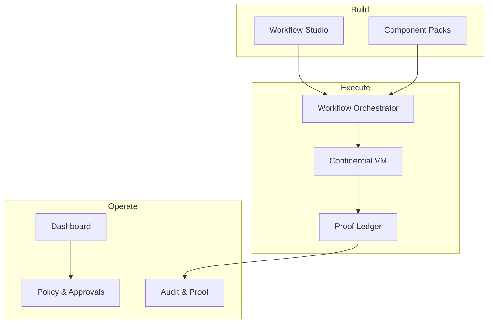

# Secret AI Rails — Project Introduction & Context

## Purpose of This Document
This document is the **first context** for anyone joining or collaborating on the Secret AI Rails project.  
It explains **what we are building, why it matters, how it works at a high level, and how to think about decisions** across product, engineering, security, and business.

If you understand this document, you understand the project.

---

## What Is Secret AI Rails (In One Paragraph)

**Secret AI Rails is an execution layer for AI that enterprises can trust.**

It enables AI systems to perform real business actions—sending communications, updating systems, making decisions—inside a **controlled, verifiable, auditable, and confidential runtime**. Unlike AI copilots or agent frameworks that stop at reasoning, Secret AI Rails ensures that **actions actually happen, are correct, and can be proven after the fact**.

Secret AI Rails exists to make AI safe enough to **replace human execution** in operational workflows.

---

## The Core Problem We Are Solving

Modern AI is capable of reasoning, drafting, and deciding—but enterprises still do not let AI **act**.

Why?
- AI actions cannot be trusted
- There is no proof that actions occurred
- Errors are costly and risky
- Compliance and audits are impossible
- Data confidentiality is not guaranteed

As a result:
- Humans remain in the execution loop
- AI adoption stalls at “assistive” use cases
- Operational costs stay high

**Trust—not intelligence—is the bottleneck.**

---

## Our Core Thesis

> AI adoption unlocks real value only when AI can execute work autonomously **with guarantees**.

Secret AI Rails is built on three non-negotiable guarantees:

1. **Trust** – AI actions are policy-governed and controlled  
2. **Proof** – Every action is verifiable and auditable  
3. **Confidentiality** – Data is protected even while in use  

Without all three, AI cannot replace human execution.

---

## What Secret AI Rails Is (and Is Not)

### Secret AI Rails *Is*
- An **execution infrastructure** for AI
- A **runtime** where AI workflows safely operate
- A **trust layer** between AI reasoning and business systems
- A platform for **AI automation with accountability**

### Secret AI Rails *Is Not*
- Not an agent framework
- Not a generic workflow tool
- Not a CRM, ERP, or ticketing system
- Not a chatbot platform

We do not compete on intelligence—we enable **safe execution**.

---

## The Mental Model

Think of Secret AI Rails as **“guard rails for AI actions”**:

- AI decides *what* to do
- Secret AI Rails controls *whether*, *how*, and *with what proof* it happens

Or more concretely:

> **If AI can reason, Secret AI Rails lets it act—safely.**

---

## High-Level System Overview

Secret AI Rails has three planes:

1. **Build Plane** – design workflows  
2. **Operate Plane** – observe, approve, audit  
3. **Execution Plane** – run workflows securely  

---

## Key Product Pieces *(Conceptual)*

1. Workflow Studio
	•	AI-assisted design of workflows
	•	Graph-based, versioned, deterministic
	•	Uses component packs instead of free-form code
	•	Outputs immutable workflow artifacts

2. Component Packs

Reusable building blocks for common domains:
	•	Business communications (email, Slack, social, voice)
	•	Document processing
	•	Scheduling and coordination
	•	Later: legal, finance, IT, HR

Components declare:
	•	Inputs / outputs
	•	Risk level
	•	Evidence to capture
	•	Retry and rollback behavior

3. Confidential Execution

Each workflow runs inside its own confidential virtual machine:
	•	Encrypted memory and disk
	•	Strong isolation
	•	Attestation-gated secrets
	•	Optional confidential GPUs for AI inference

4. Proof-of-Work Ledger

Every workflow produces an append-only record:
	•	What happened
	•	When it happened
	•	Why it was allowed
	•	Who/what approved it
	•	Evidence references

This ledger is the foundation of trust.

5. Dashboard
	•	See running workflows
	•	Approve or reject gated actions
	•	Inspect proofs and execution history
	•	Support audits and compliance reviews

---

## What We Care About *(Guiding Principles)*

Every decision should reinforce these principles:
	1.	Trust over Autonomy
Autonomy is earned, not assumed.
	2.	Execution over Intelligence
Outcomes matter more than reasoning quality.
	3.	Determinism where Possible
Predictable behavior enables trust and audit.
	4.	Isolation by Default
Blast radius must always be minimal.
	5.	Replace Work, Don’t Assist It
Secret AI Rails exists to remove humans from execution paths.

---

## Initial Focus *(Phase 1)*

We start with business operations automation, where:
	•	Volume is high
	•	ROI is immediate
	•	Trust requirements are clear

Initial domains:
	•	Email and messaging automation
	•	Slack and collaboration workflows
	•	Social media monitoring and response
	•	Scheduling and coordination
	•	Voice (STT-TTS) with escalation gates
	•	Product Q&A chatbots (knowledge-grounded)

This phase proves that Secret AI Rails can:
	•	Safely execute real work
	•	Produce verifiable outcomes
	•	Deliver measurable business value

---

## How We Measure Success

Secret AI Rails succeeds when customers can say:
	•	“We removed humans from this workflow.”
	•	“We trust AI to run this 24/7.”
	•	“We can prove what happened.”
	•	“Audits are trivial now.”

Key metrics:
	•	Time-to-resolution
	•	Cost per operation
	•	Error and rework rates
	•	Audit and compliance effort

---

## How to Think When Working on Secret AI Rails

When designing or building anything, ask:
	•	Does this increase or reduce trust?
	•	Can this action be proven later?
	•	What happens when it fails?
	•	Who audits this?
	•	What is the blast radius?

If a feature increases intelligence but weakens trust, we do not build it.

---

## The Big Picture

Secret AI Rails is building the infrastructure that allows AI to move from:
	•	Assistant → Operator
	•	Suggestion → Action
	•	Opaque → Auditable
	•	Risky → Trusted

If successful, Secret AI Rails becomes the place where enterprises allow AI to act.

---

## Final Statement

Secret AI Rails is not about making AI smarter.
It is about making AI trusted enough to do the work.

Everything we build should move us closer to that goal.

