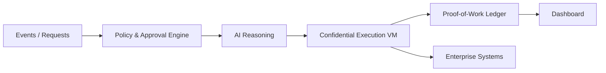

# AI Rails — Sequoia Diligence Memo (Condensed)

## Company
**Secret AI**

## Product
**Secret AI Rails**

## Category
Enterprise AI Infrastructure / AI Automation / Trusted Execution Layer

---

## One-Sentence Description
**Secret AI Rails enables AI actions enterprises can trust** by providing a verifiable, auditable, and confidential execution layer that allows AI to safely replace human operational work.

---

## Problem
Enterprises want AI to execute real work — not just assist — but cannot trust AI to:
- act correctly in customer- or money-impacting workflows
- prove that actions actually occurred
- meet compliance, audit, and security requirements

As a result, AI adoption stalls at copilots and recommendations, leaving high-cost human execution in place.

---

## Solution
**Secret AI Rails** is the **execution infrastructure** that makes AI automation trustworthy.

It provides:
- Deterministic workflow execution
- Policy enforcement and human approval gates
- Proof-of-work ledgers for every AI action
- Confidential computing for data-in-use protection

AI Rails is not an agent framework.  
It is the missing layer between AI reasoning and real-world business outcomes.

---

## Why Now
- LLM capability is sufficient to automate large portions of enterprise ops
- Confidential computing and secure enclaves are production-ready
- Enterprises are under pressure to reduce operational costs
- Regulators demand auditability for automated decisions

Trust, not intelligence, is the bottleneck.

---

## Product
### Core Platform
- AI-assisted Workflow Studio
- Policy & approval engine
- Per-workflow confidential VMs (TDX/SEV; GPU optional)
- Proof-of-work execution ledger
- Operations & audit dashboard

### v1 Focus
**Business operations automation**
- Email and messaging workflows (Gmail, Slack, Telegram)
- Social media monitoring and response
- Product Q&A chatbot
- Scheduling and coordination
- Voice STT-TTS with escalation gates

---

## Differentiation
AI Rails uniquely combines:
- **Execution guarantees** (determinism, idempotency)
- **Trust primitives** (proof, audit, replay)
- **Confidential execution** (data-in-use protection)
- **Enterprise governance** (policies, approvals, RBAC)

Most competitors offer intelligence or automation—but not provable execution.

---

## Architecture (High-Level)

---

**Security & Trust Model (Summary)**
	•	Per-workflow confidential VMs with encrypted memory and disk
	•	Attestation-gated key release
	•	Scoped connectors and allowlisted egress
	•	Append-only, tamper-evident execution ledger
	•	PII classification, redaction, and minimal retention by default

**Explicitly out of scope**:
	•	Malicious users with valid approval authority
	•	Errors in downstream third-party systems

---

**Business Value**

AI Rails directly improves enterprise KPIs:
	•	Faster resolution times
	•	24/7 operation
	•	Lower cost per transaction
	•	Reduced error rates
	•	Audit-ready automation

Enables real replacement of human execution in repeatable workflows.

---

**Go-To-Market**
	•	Target buyer: Head of Customer Ops / Operations / IT Automation
	•	Start with one high-volume workflow
	•	Expand horizontally via reusable component packs
	•	Land-and-expand enterprise motion

---

**Market Opportunity**
	•	Initial wedge: customer and business operations automation
	•	Expansion into legal, finance, IT, HR, and RevOps
	•	Large, horizontal infrastructure opportunity as AI execution layer

---

**Risks**
	•	Engineering complexity of deterministic, auditable execution
	•	Enterprise sales cycles
	•	Scope creep before wedge dominance

Mitigated by narrow v1 scope and ROI-driven use cases.

---

**Why This Wins**

AI adoption fails where trust is required.
AI Rails makes trust the default.

Once enterprises trust AI to act, AI Rails becomes embedded infrastructure with high switching costs.

---

**Bottom Line**

AI Rails is the execution layer that allows enterprises to finally let AI do the work.

